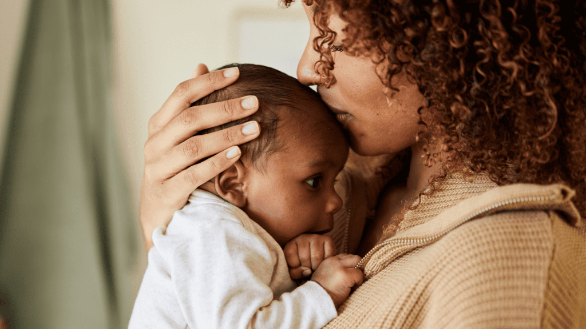

Even though not all babies develop at the same rate, you can use the guide below to identify developmental characteristics during the first 12 months of their life. At each stage you will find suggestions of what can be done within your home and sphere of influence to intentionally foster character growth and spiritual development.

{"style": {"text": {"size": "sm"}}}
_The development stages are taken from the parameters of the American Psychological Association of the ACT Raising Safe Kids Program and the Description Children’s Hospital of Orange County affiliated with the University of California._

{"style": {"text": {"color": "#bf9648"}}}
Babies often have these characteristics during their first 9–12 months of life:

{"style":{"text":{"color": "#bf9648", "typeface": "BaskervilleBT-BoldItalic"}}}
**Physical and Motor Skills**

+ They can sit without help.
+ They get up by holding on to something.
+ They walk with help.
+ They may stand by themselves and even walk a few steps.

{"style":{"text":{"color": "#bf9648", "typeface": "BaskervilleBT-BoldItalic"}}}
**Learning, Reasoning, and Problem-solving**

+ They explore objects: kick them, shake them, and throw them.
+ They easily find hidden objects.
+ They can name an object and look into that direction.
+ They copy gestures.
+ They start using things properly: they comb their hair, drink from a cup, etc.
+ They hit objects.
+ They put objects in and out of a container.
+ They drop things without help.
+ They touch things and people with their index finger.
+ They follow simple instructions: “Take the toy.” “Sit down.”

{"style":{"text":{"color": "#bf9648", "typeface": "BaskervilleBT-BoldItalic"}}}
**Speech, Communication, and Music**

+ They understand when asked to do something simple.
+ They use simple gestures: turn their head to say “No,” wave their hand to say “Goodbye.”
+ They make sounds with different intonation (as if they were speaking or reading).
+ They say “mama” and “dada.”
+ They try to imitate the words they hear.

{"style":{"text":{"color": "#bf9648", "typeface": "BaskervilleBT-BoldItalic"}}}
**Social and Emotional**

+ They are shy with strangers.
+ They cry when Mom or Dad walk away.
+ They have favorite people or objects.
+ They show fear in situations that scare them.
+ They reach for a book when they want you to read it to them.
+ They repeat sounds to get someone’s attention.
+ They raise an arm or a leg to help get dressed.
+ They play hide-and- seek and high-five.

{"style": {"text": {"color": "#a65726", "size": "xl", "typeface": "BaskervilleBT-Bold"}}}
Character Development Ideas

+ **Talk, read, sing, and play together every day**.
+ **Give your baby time to feel comfortable with strangers**. If appropriate for your culture, don’t force them to be with strangers or engage with them if they are not comfortable doing so. Put their emotional needs before the needs of the unfamiliar adult.
+ **When your baby does something they shouldn’t do, say “No” firmly**. Do not shout or give them long explanations. Use praise and encouragement often when they do something well.
+ **Spend more time encouraging things your baby does** well instead of reprimanding them for doing things you do not want them to do.
+ **Talk to your baby about what you are doing**: “Mommy is bathing you so you can be fresh and clean.”
+ **When reading age-appropriate books, let them turn the pages**.
+ **Ask your baby to point out the details in the picture books**, or find the puppy in the picture, etc. Show them the characteristics of the illustrations—colors, sizes, people’s emotions, etc.
+ **Add details to your baby’s attempts to speak**. If they ask for an apple by saying, “a-a,” you can say, “Yes, a red apple.”
+ **Let your little one draw with big crayons and paper**. Encourage them to play with blocks to sort colors and shapes.
+ **Teach your baby songs** that can be rhythmically accompanied by rattles, bells, or music sticks.
+ **Provide safe places to explore**—be aware of plugs, medications, cleaning products, door locks, and anything that threatens their safety.
+ **Play with your baby** to name their body parts or things they see when going for a walk with you.
+ **Clearly tell your little one what is allowed** and what is not allowed. Be consistent.
+ **Make sure everyone in the family understands** what the baby is allowed to touch or not touch and do or not do.
+ **It can be helpful to limit the number of toys your child can play with each week**. Try offering them a few toys rather than everything they own. Put the rest away. They will play with a few toys in a more focused way, as they will be less distracted, and they can learn to put their own toys away more easily when they are a little older. Plus, it will make tidying up even easier for you.
+ **Try to always be consistent with your baby**, with yourself, and with the rest of your family.

{"style": {"block":{"padding":{"start":"none","end":"none"},"rounded":false},"wrapper":{"padding":{"start":"none","end":"none"}}}}

{"style": {"text": {"color": "#a65726", "size": "xl", "typeface": "BaskervilleBT-Bold"}}}
Ideas for Growing in Jesus

In addition to what has been identified in earlier stages, your baby can now learn to pray when waking up, eating, and going to sleep.

+ **Keep family worship to a fixed schedule**. Create the expectation of worship as a beautiful moment of enjoyment.
+ **Encourage your little one to hold objects** that relate to the story shared during worship.
+ **Encourage your baby to put their hands together to pray**.
+ **Have them follow the rhythms of the songs with rattles or actions with their hands**.
+ **Get your baby to touch a picture of Jesus as a sign of love**.
+ **Encourage them to participate in family worship on your lap**, so they can learn reverence and enjoy family time. They can participate as much as possible with Bible stories, especially if they have older siblings.
+ **Take your little one to their Sabbath School**.

{"style": {"block":{"padding":{"start":"none","end":"none"},"rounded":false},"wrapper":{"padding":{"start":"none","end":"none"}}}}

+ **Read your baby age-appropriate Bible books** with colorful illustrations and explain what each picture shows. Ask them to point to different objects on the pages.
+ **Take your baby to church**. Encourage reverence and worship even from this early age.
+ **Use Sabbath afternoons to enjoy nature**. Your baby can smell the flowers, touch pets, crawl on the grass, and taste fruit. Tell them that everything they see and touch in nature is a gift from Jesus, who made everything because He loves us.

{"style":{"text":{"color": "#a65726", "align": "center"},"wrapper": { "backgroundImage": "https://sabbath-school-resources-assets.adventech.io/en/aij/2025-00-bb-pb/assets/prayer-background.png", "backgroundPosition": { "x": "center", "y": "top" }}}}
^[Prayer Prompt]({"style":{"text":{"size": "xl", "typeface": "BaskervilleBT-Bold"}}})\
Help (_your baby’s name_) to trust in You with\
all their heart, and lean not on (his/her) own\
understanding. I pray that in all (your baby’s\
name’s) ways (he/she) will acknowledge You and\
allow You to direct (his/her) paths\
(see Proverbs 3:5, 6).