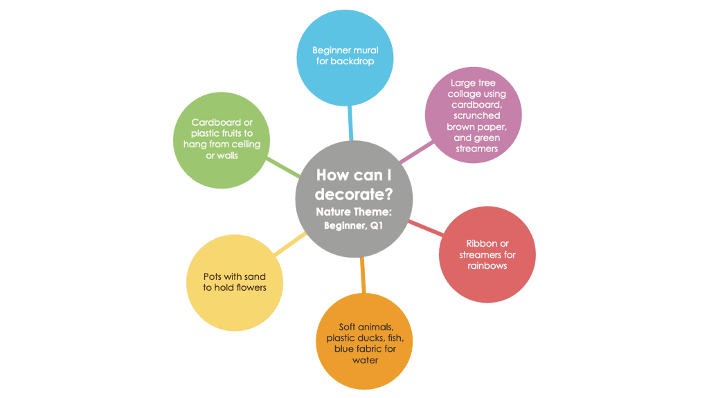

{"style": {"text": {"color": "#58b0e3"}}}
**Bible Reference: Genesis 1-2**

---

**Fundamental Beliefs**

1\. God’s Word\
6\. Creation\
7\. The Nature of Humanity\
20\. The Sabbath

---

**Fundamental Beliefs Beginner Memory Verse**

“In the beginning God created the heavens and the earth” (Genesis 1:1).

---

**Learning Goals**

The children will:

- **Know** that God created our world.
- **Feel** loved by God because He made the world, them, and the Sabbath.
- **Respond** by thanking God for the things He made.

---

**Beginner Sabbath School Teaching Style**

- Predictable and repetitive quarterly program
- Simple music with actions and props
- Interactive, multisensory tactile play
- Learning by active involvement and imitation
- Seating on the floor in a circle at child’s eye level, or on chairs with children
- Strengthening bonds between parent/child and Jesus
- Inclusiveness for special needs
- Using hand actions and expressive tones

---

**Beginner Sabbath School Environment**

- Age-appropriate decorations at child’s eye level
- A welcoming and organized space
- Resources easily on hand to keep the child’s engagement
- Small reachable tables for use in sensory time
- Keep safety in mind with all decorations, furnishings, and props
- Create zones for each activity
- Large mat for sitting on the floor together
- Select simple items, being mindful to not overstimulate

---

**How to Use This Program**

- Follow the program flow pattern each week
- Use the weekly interactive story suggestions and props as a guide
- Find all music at www.aliveinjesus.info

