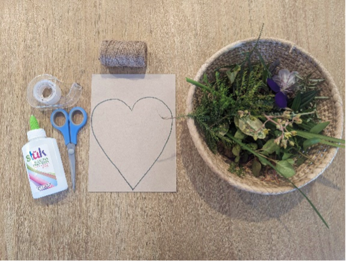
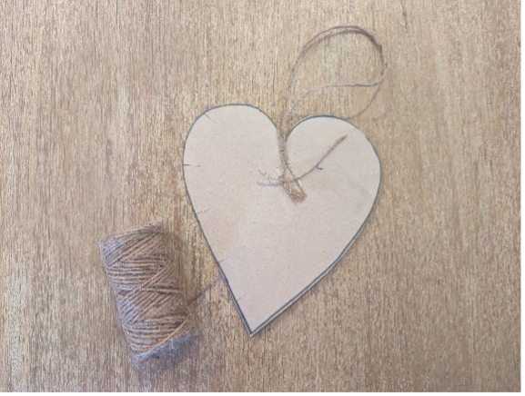
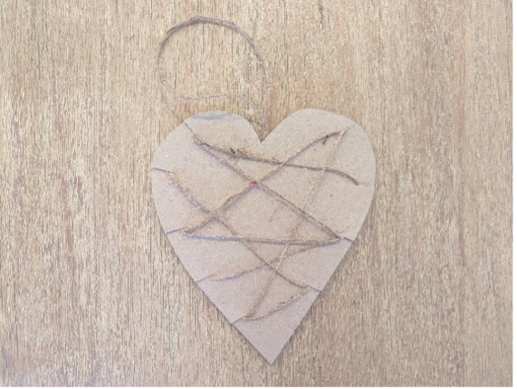
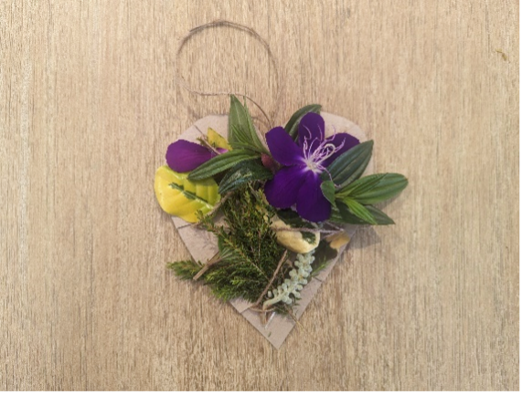

{"style": {"text": {"color": "#58B0E3", "size": "lg"}}}
**Hanging Nature Heart Mobile**

**What you need:**

Cardboard heart shape, string, a variety of nature items you have collected, tape, scissors, and craft glue (optional) (1).

**Preparation Instructions:**

- Cut out a large heart shape from the cardboard.
- Collect nature items that are easy to glue or weave.

**Create it together:**

- Secure a string loop at the top of the heart and tape securely (2).
- Make small cuts around the heart shape.
- Thread the end of the string through one of the cuts and tape to the back (3).
- Continue to wind the string around the heart from one side to the other, then tape the other end of the string to the back (3).
- Children will use the nature items you have collected to glue and/or weave onto their cardboard hearts (4).
- The nature heart can be hung up in their home as a reminder of their amazing Creator.

