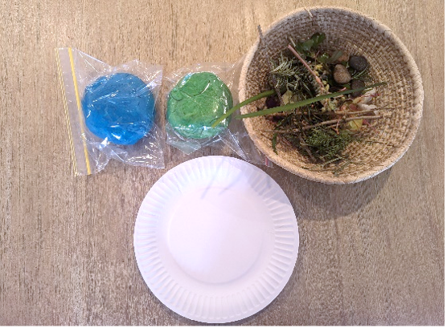
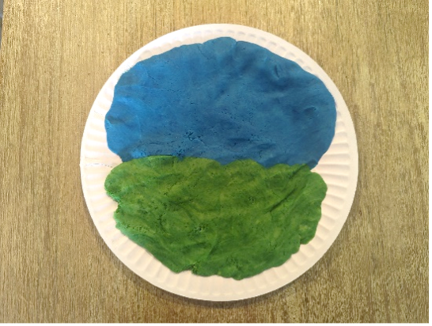
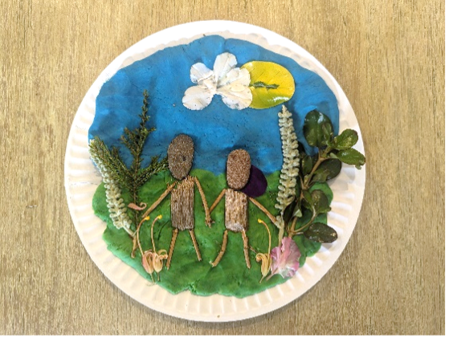

{"style": {"text": {"color": "#58B0E3", "size": "lg"}}}
**Play-dough Garden Scene With Adam and Eve**

**What you need:**

Blue and green play-dough, paper or plastic plates and nature items (e.g., small sticks, tree nuts, small stones, leaves, flowers). If unable to access nature items, use such craft supplies as craft sticks, felt, pipe cleaners, and paper (1).

**Preparation Instructions:**

- Make blue and/or green play-dough (see play-dough recipe).
- Collect nature items/craft supplies as suggested above.
- Make a sample of the craft beforehand for inspiration!

**Create it together:**

- Pat down and roll out the play-dough onto the plate (2).
- Create Adam and Eve in the Garden with the nature/craft items, pressing them into the play-dough to create the scene (3).

