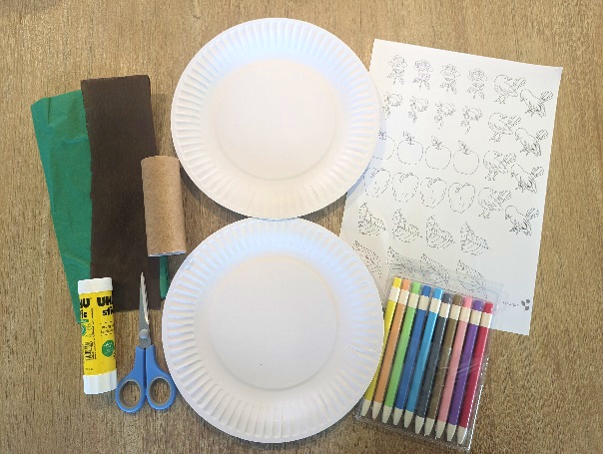
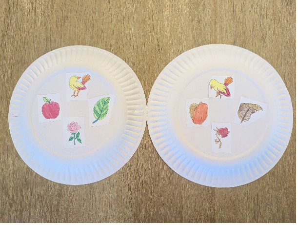
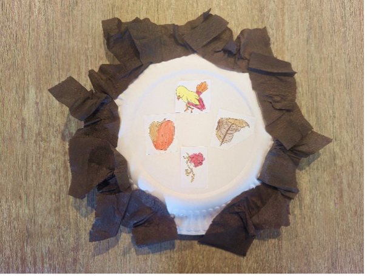
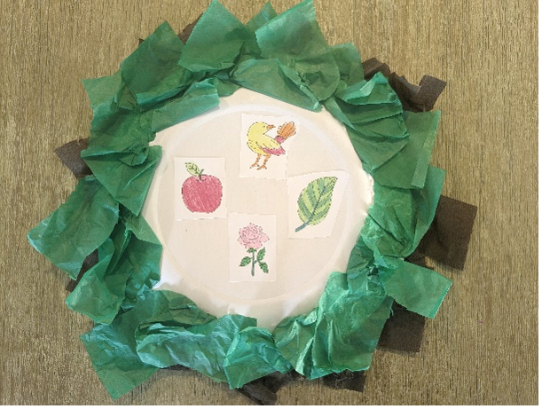
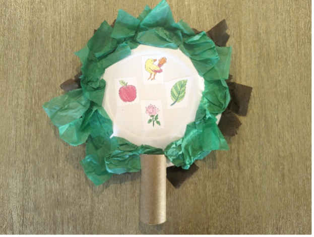

{"style": {"text": {"color": "#58B0E3", "size": "lg"}}}
**Standing Trees** (Before Sin/After Sin)

**What you need:**

Week 5 craft template, cardboard tube, two small paper plates, green and brown crepe/tissue paper, colored pencils, scissors, and glue/stapler (1).

**Preparation Instructions:**

- Cut out the pictures from the week 5 craft template.
- Cut pieces of green and brown crepe/tissue paper.

**Create it together:**

- Color and glue pictures onto the back of each paper plate for “before sin” and “after sin” (2).
- Scrunch the green and brown paper and glue around the edge of each plate (3).
- Secure the two plates together with glue or staples (4).
- Make a small cut on either side of the cardboard tube.
- Slide the secured plates in to create the tree (5).

