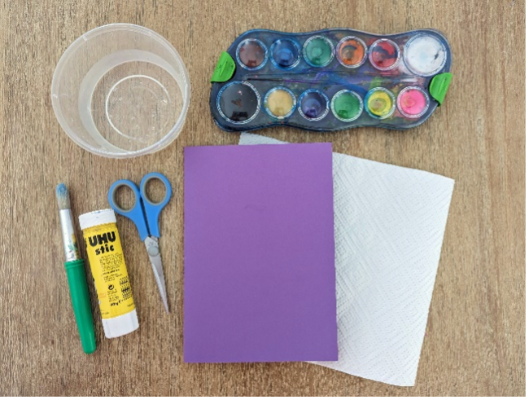
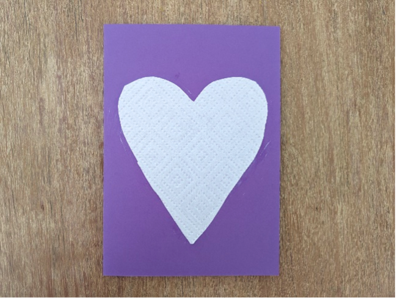
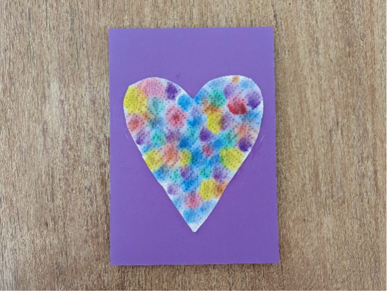

{"style": {"text": {"color": "#58B0E3", "size": "lg"}}}
**Card**

**What you need:**

Lettersize (A4) cardstock, watercolor paints or markers, paper towel or napkin squares, and paintbrush (1).

**Preparation Instructions:**

- Fold the cardstock sheet in half to make a card.
- Cut out a shape of choice (e.g., heart, flower, circle) from the paper towel or napkin.
- Have a small instruction note for parents on what the card is for, so they can talk to their child about who they might like to give it to.

**Create it together:**

- Glue the paper towel shape onto the front of the card (2).
- Use a brush to dot different colored paints onto the paper towel shape (3).
- While the children are painting, talk about things that can help to keep us calm, pointing to Jesus as our helper.
- Alternatively, if you do not want to use paints, use colored markers, and other decorative craft items.

