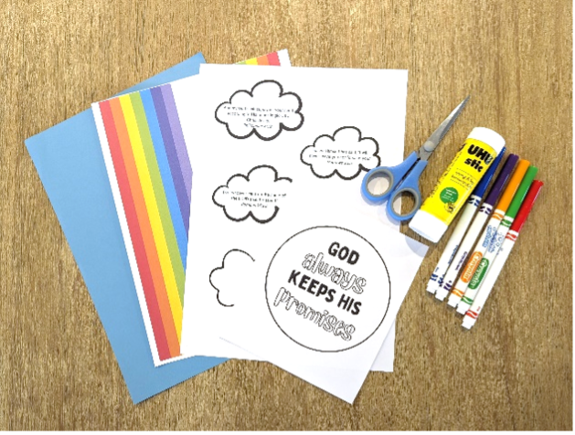
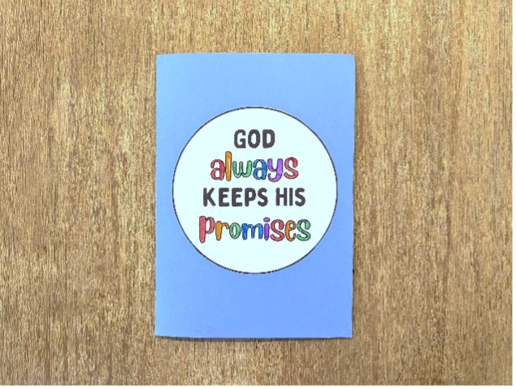
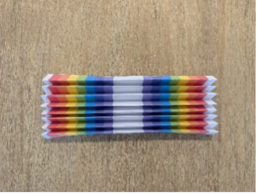
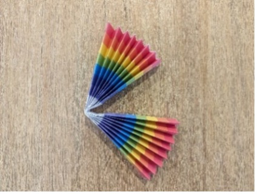
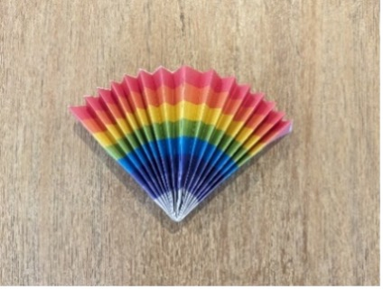
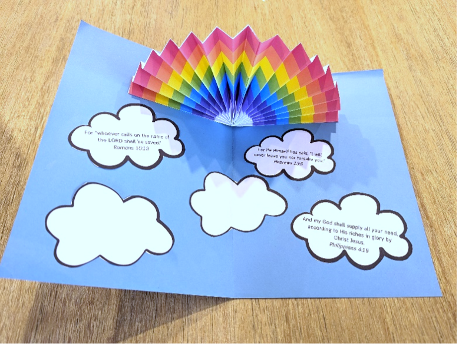

{"style": {"text": {"color": "#58B0E3", "size": "lg"}}}
**Rainbow Pop-up**

**What you need:**

Week 8 craft templates, sheet of blue cardstock, colored markers, scissors, and glue (1).

**Preparation Instructions:**

- Cut out the templates.
- Fold the blue cardstock in half.

**Create it together:**

- Color the circle and glue onto the front (2).
- Fold the rainbow template in half (vertically) and repeat another three times (3).
- Unfold and then refold along each crease, accordion-style (4).
- Fold in half lengthwise and glue together to make a fan (5).
- Open the card and glue the ends of the rainbow fan to either side of the card (6).
- Glue the promise clouds inside the card (6).

