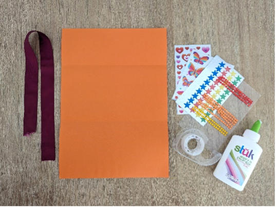
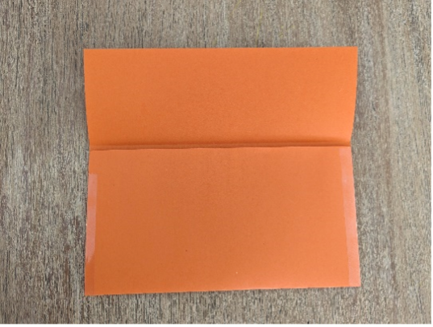
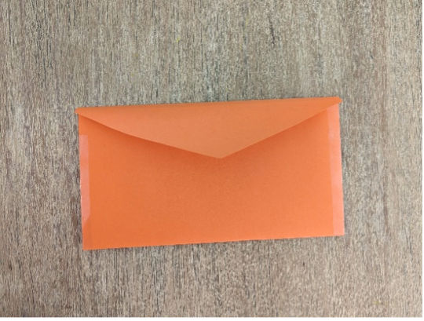
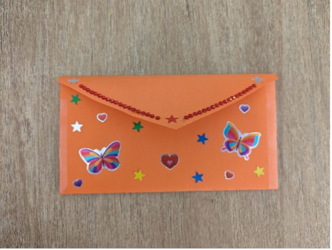
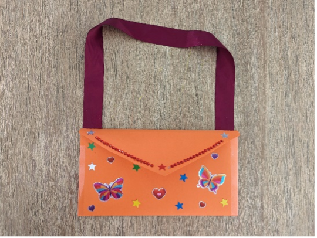

{"style": {"text": {"color": "#58B0E3", "size": "lg"}}}
**Create and Decorate a Tithe Envelope**

**What you need:**

Sheet of colored paper, stickers and colored shapes, markers, tape, scissors and ribbon or string (1).

**Preparation Instructions:**

- Pre-fold the paper so it’s ready to be made into an envelope.
- Cut lengths of ribbon or string.

**Create it together:**

- Fold the paper along the creases and tape the sides together, as shown (2).
- Fold the top flap down and cut a V shape to complete the envelope (3).
- Decorate the tithe envelope using stickers, colored shapes, and markers (4).
- Tape a ribbon to the top of the envelope so it can be hung in a special place (5).
- While the children are making the envelopes, talk to them about why we give.

