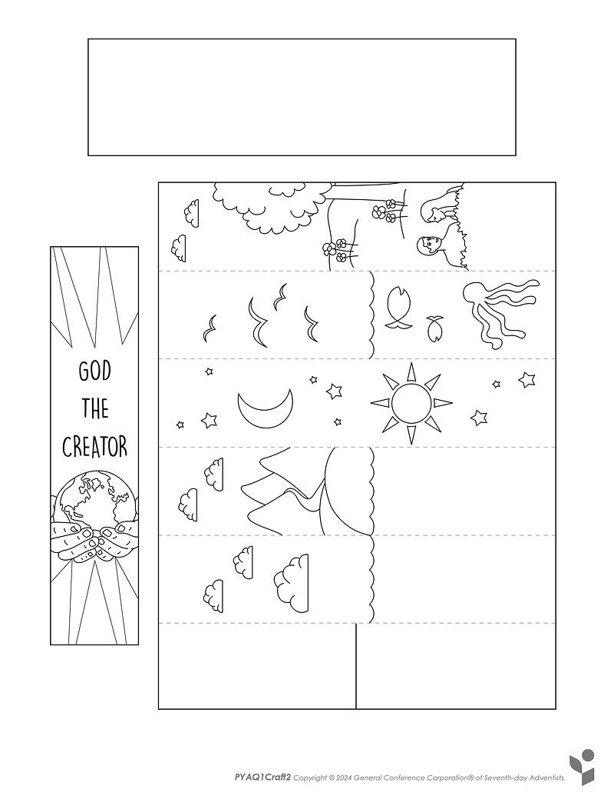
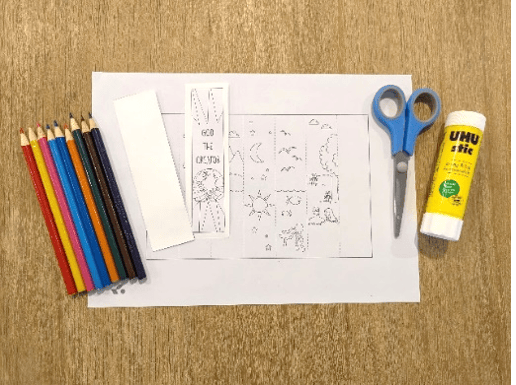
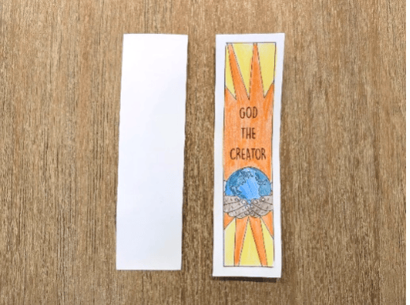
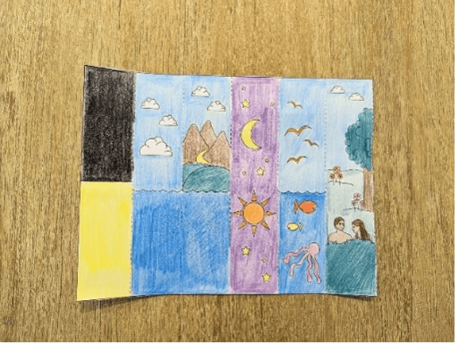
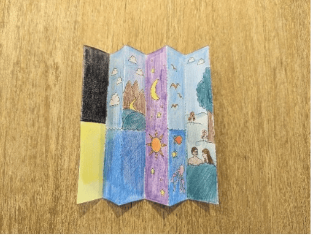
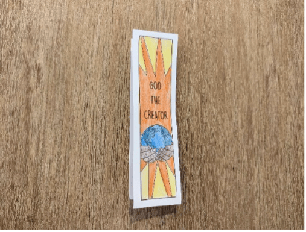
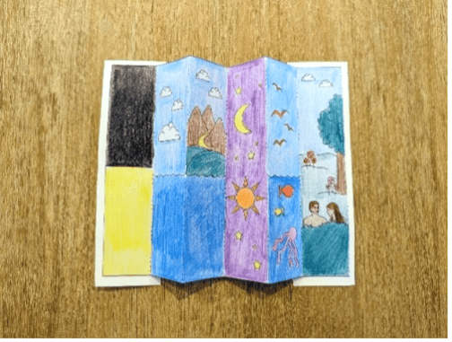

{"style": {"text": {"color": "#58B0E3", "size": "lg"}}}
Creation Bookmark

**What you need:** Week 2 craft template on white cardstock, colored pencils, scissors, glue (1).

```=Craft Template



```

**Instructions:**

- Cut out two rectangles from cardstock, then glue “God the Creator” onto one of the rectangles and color (2).
- Color the rest of your Creation bookmark and cut it out (3).
- Fold along the dotted lines, flipping it over each time (4).
- Glue each end on the bookmark onto each rectangle (5).
- Use it as a bookmark, or unfold it to tell the story of Creation (6).

Alternatively, have the children use play-dough or modeling clay to sculpt something (object or scene) to represent each of the six days of Creation.











