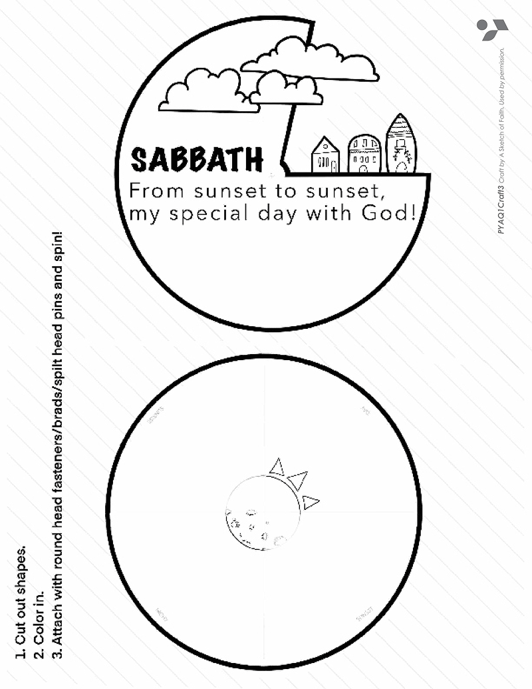
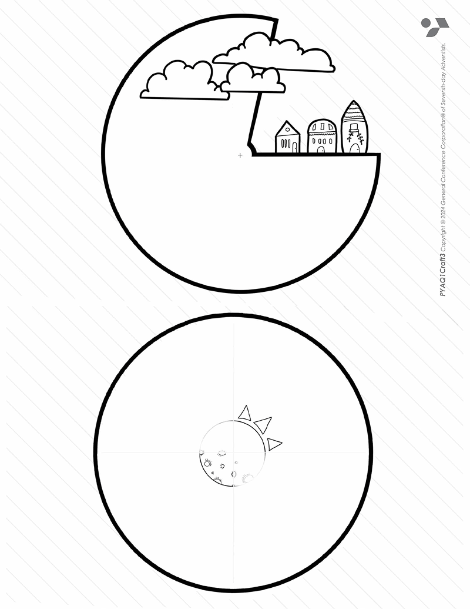
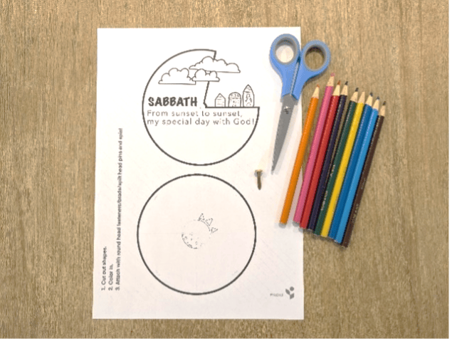
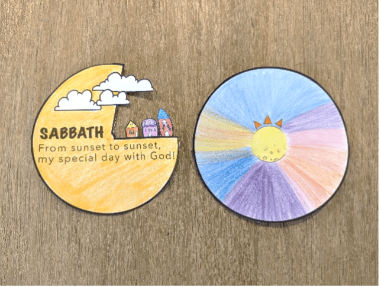
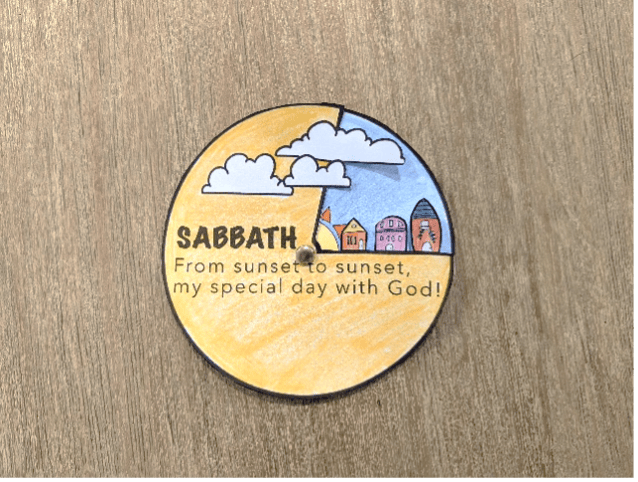
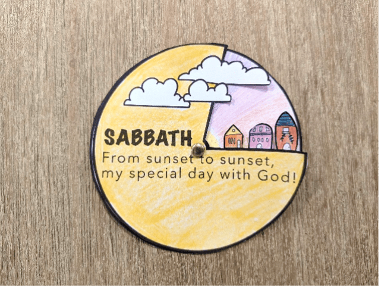
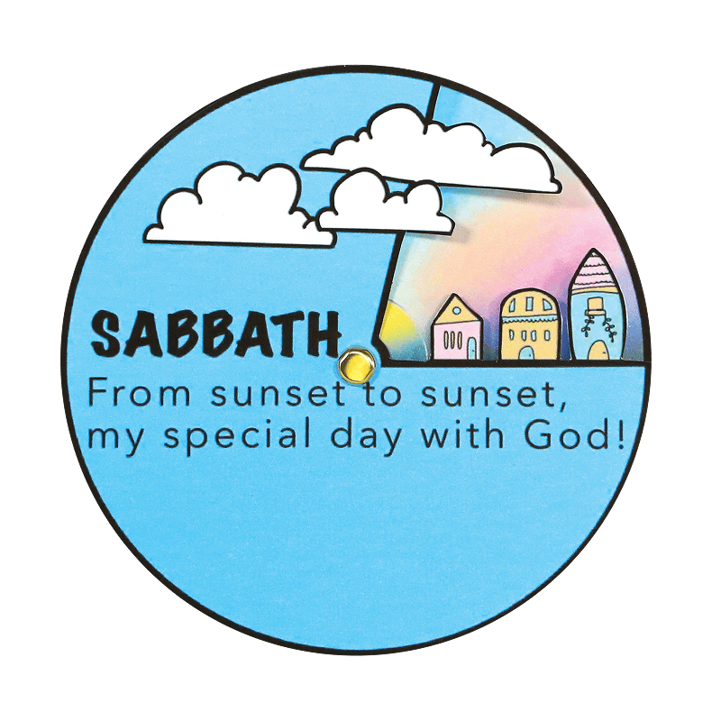

{"style": {"text": {"color": "#58B0E3", "size": "lg"}}}
Sunset-to-Sunset Spinner

**What you need:**

Week 3 craft template on white cardstock, colored pencils, split pin, scissors (1).

```=Craft Template





```

**Instructions:**

- Color in your circles (2).
- Cut out each circle (3).
- Place the Sabbath circle over the full circle and push a split pin through the center (3).
- Rotate them to show the passing of time—from sunset to sunset (4).











_Craft by Kimanh le Roux, A Sketch of Faith. www.asketchoffaith.com. Used by permission._