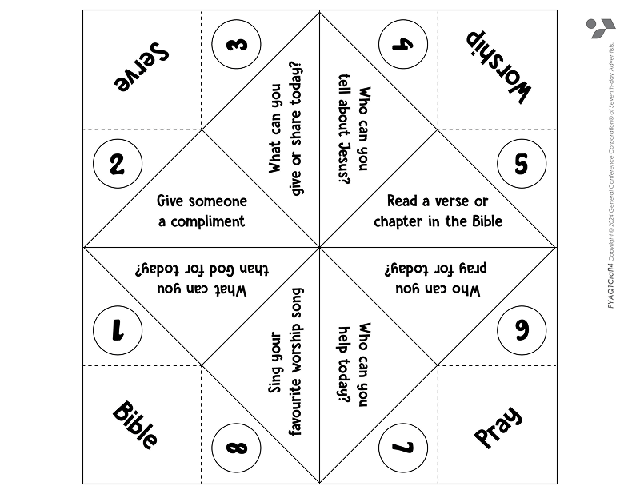
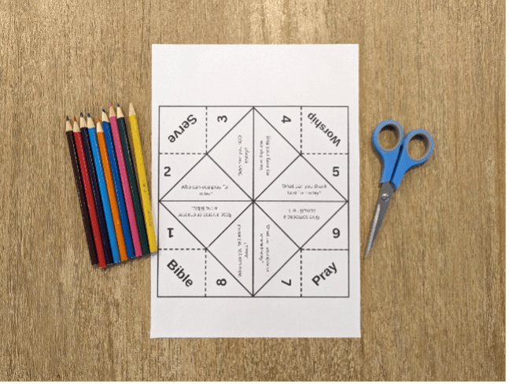
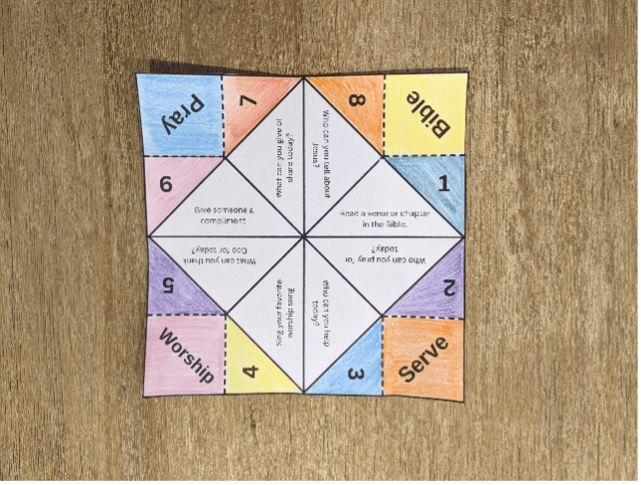
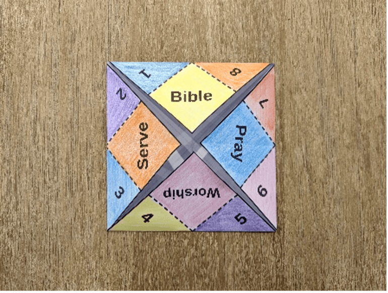
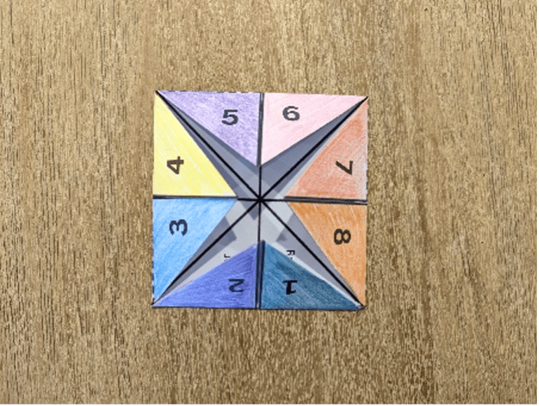
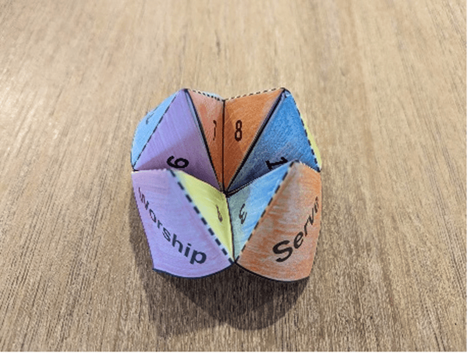

{"style": {"text": {"color": "#58B0E3", "size": "lg"}}}
Good Choices Chatterbox

**What you need:** week 4 craft template, colored pencils, scissors (1).

```=Craft Template



```

**Instructions:**

- Decorate and color your chatterbox template (2).
- Cut around your chatterbox and fold according to instructions (3-6).
- Invite someone to choose which word/number they want and read what’s inside. Then swap!










