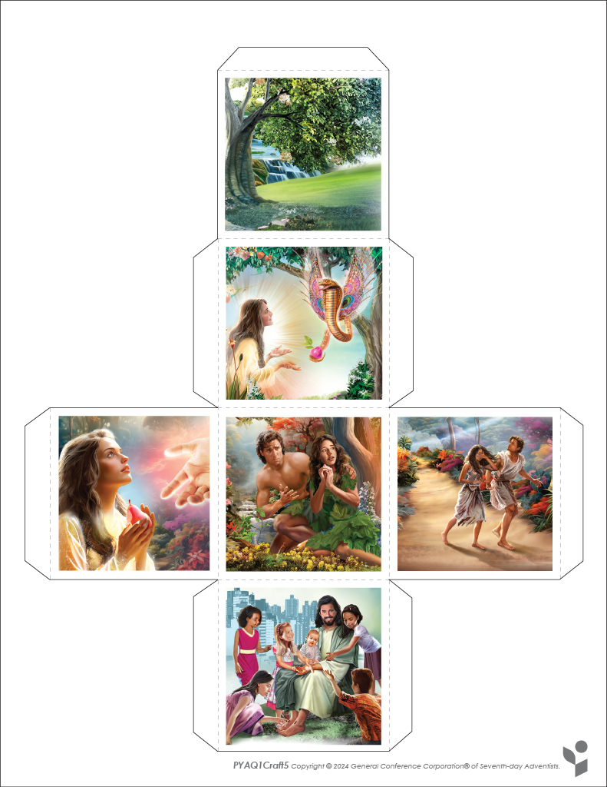
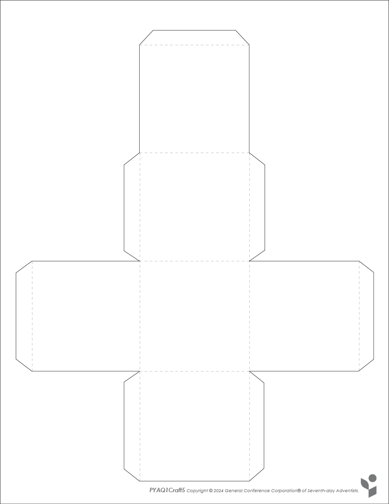
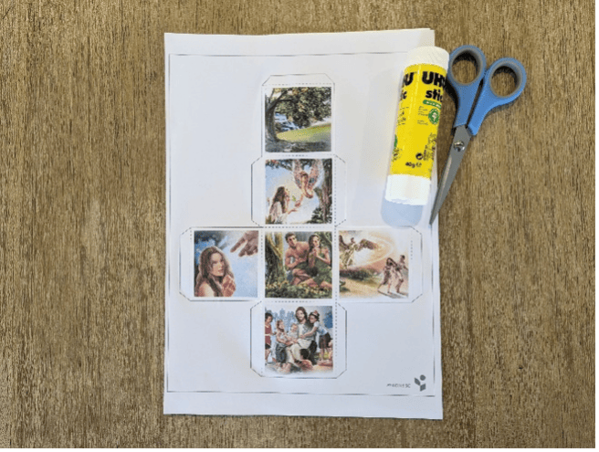
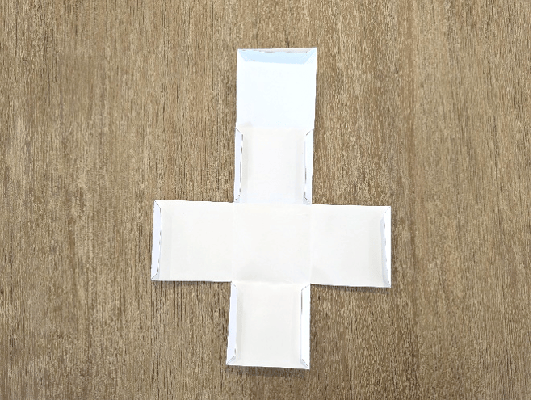
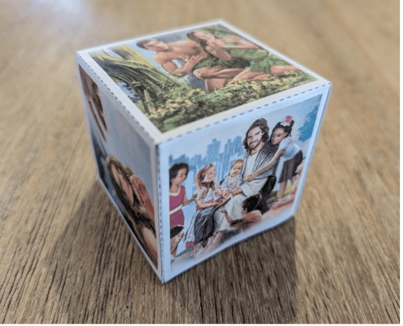

{"style": {"text": {"color": "#58B0E3", "size": "lg"}}}
Storytelling Cube

**What you need:** **^[Week 5 craft template]({"style": {"text": {"color":"#58b0e3"}}})** on white cardstock, scissors, glue (1).

```=Craft template





```

**Instructions:**

- Cut out your cube template (2).
- Fold along the dotted lines and glue the flaps to create a cube (3).





