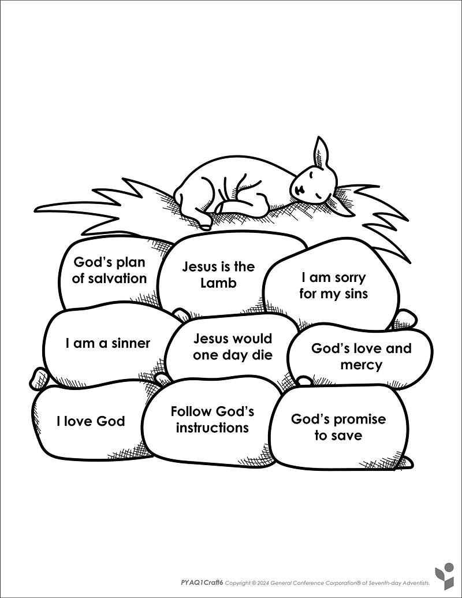
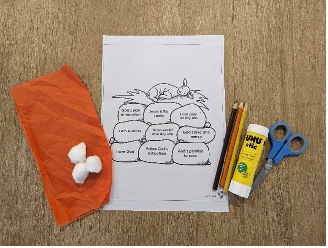
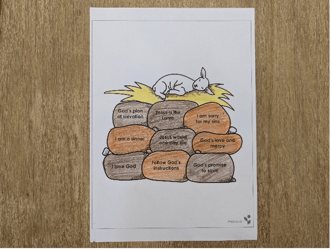
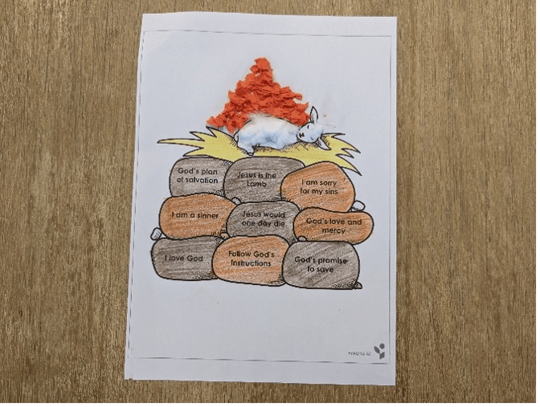

{"style": {"text": {"color": "#58B0E3", "size": "lg"}}}
Stone Altar

**What you need:**

Week 6 craft template, colored pencils/crayons, cotton balls, red or orange cellophane/tissue paper, glue (1).

```=Craft Template



```

**Instructions:**

- Color the altar (2).
- Glue cotton balls onto the lamb (3).
- Glue orange cellophane or scrunched-up tissue paper above the lamb (3).





