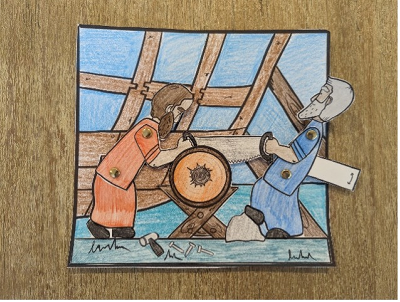

{"style": {"text": {"color": "#58B0E3", "size": "lg"}}}
Ark Builders

**What you need:** Week 7 craft template on white cardstock, four split pins, colored pencils, scissors, glue (1).

```=Craft Template


```

**Instructions:**

- Color pictures and cut out (2).
- Carefully poke holes through each dot, using a pen or sharp pencil.
- Attach split pin through each hole as shown (3).
- Glue the people to the background, only up to the middle of the log and under the holes (4).
- Move the tab up and down to make the men saw the log!

{"style":{"image":{"aspectRatio":1.778}}}


{"style":{"image":{"aspectRatio":1.778}}}




{"style":{"image":{"aspectRatio":1.778}}}


_Craft by Kimanh le Roux, A Sketch of Faith. www.asketchoffaith.com. Used by permission._

---

{"style": {"text": {"color": "#58B0E3", "size": "lg"}}}
Craft Stick Ark

**What you need:** A piece of thick cardboard, 50-60 craft sticks, craft glue, scissors (1).

**Instructions:**

- Glue one craft stick onto the cardboard as shown (2).
- Arrange the next two craft sticks (overlapping each other) and glue (2).
- Continue until all six are in place. This will form the base of the boat (2).
- Dot each end of the craft sticks with glue and carefully layer with more craft sticks (3).
- Build your ark 10-15 craft sticks high, making sure to overlap each time, so there is a slight gap between each craft stick above and below (3).
- Once dry, cut the excess cardboard off around the base and enjoy playing with your ark! (3)

{"style":{"image":{"aspectRatio":1.778}}}


{"style":{"image":{"aspectRatio":1.778}}}


{"style":{"image":{"aspectRatio":1.778}}}
