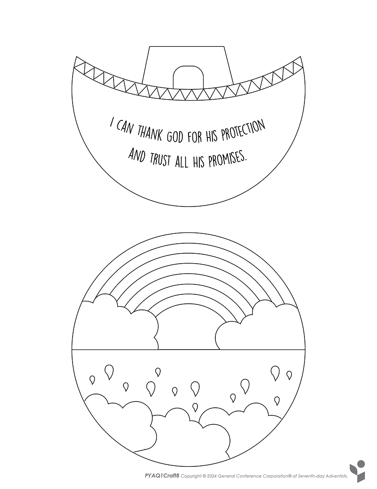
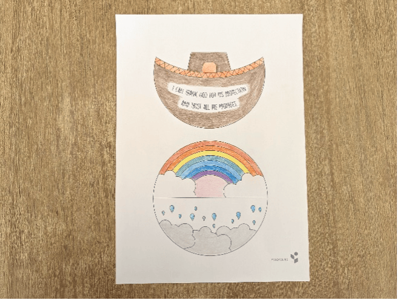
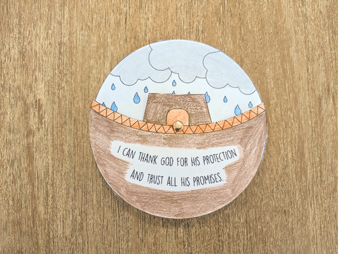
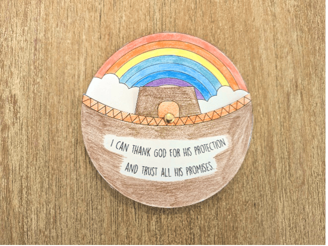

{"style": {"text": {"color": "#58B0E3", "size": "lg"}}}
Promise and Protection Spinner

**What you need:** Week 8 craft template, colored pencils, split pin or brad, scissors.

```=Craft Template



```

**Instructions:**

- Color the pictures (1).
- Cut out each circle (2).
- Fasten the ark on top of the rainbow with a split pin or brad, so that it’s able to spin (2).





