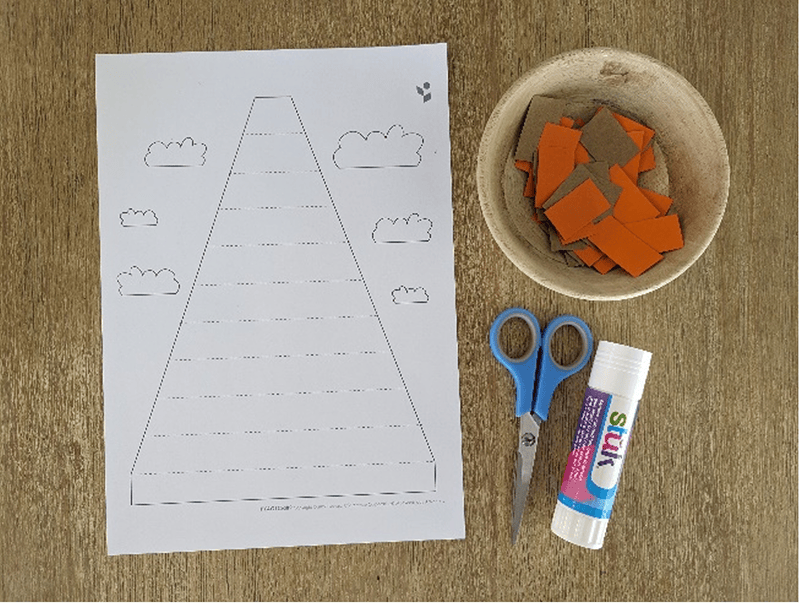
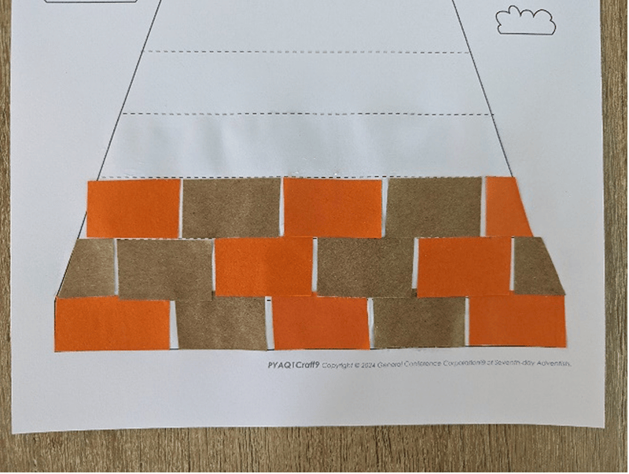
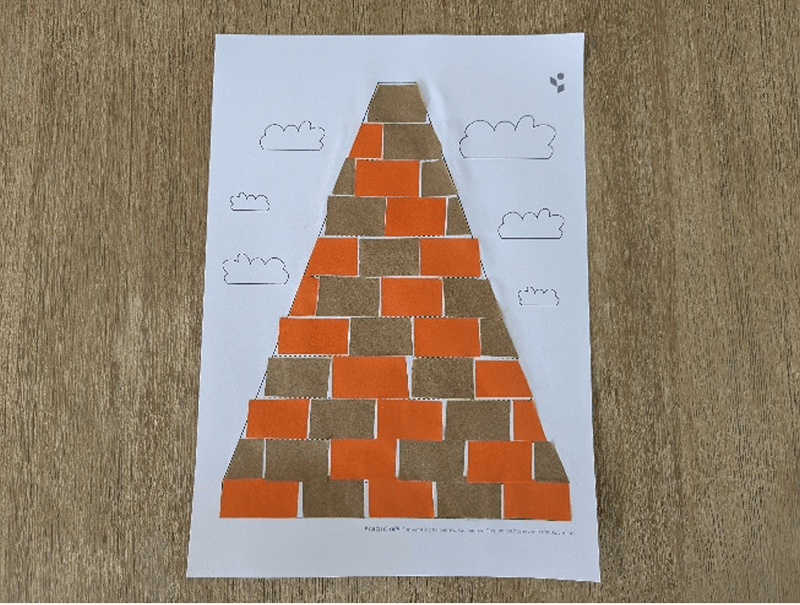
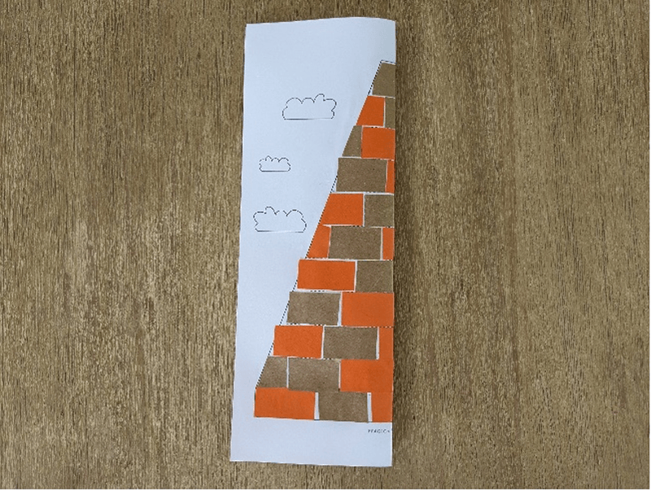
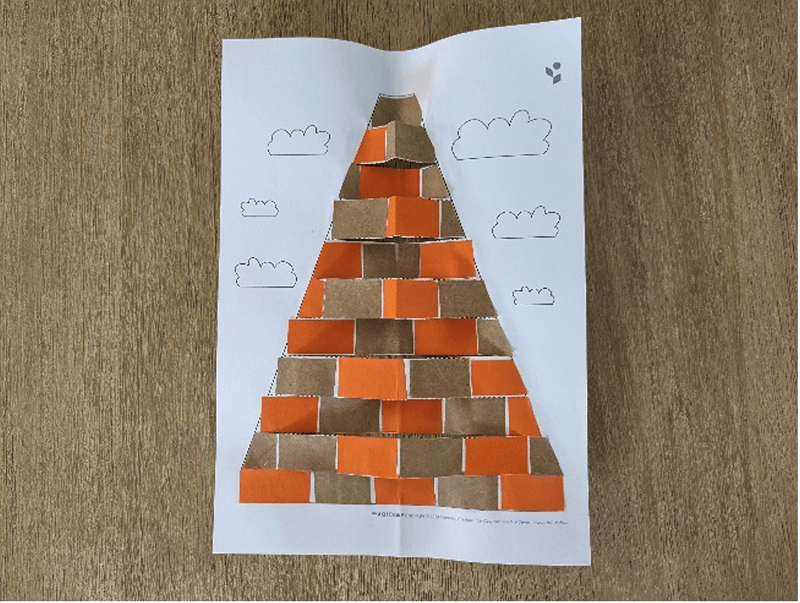
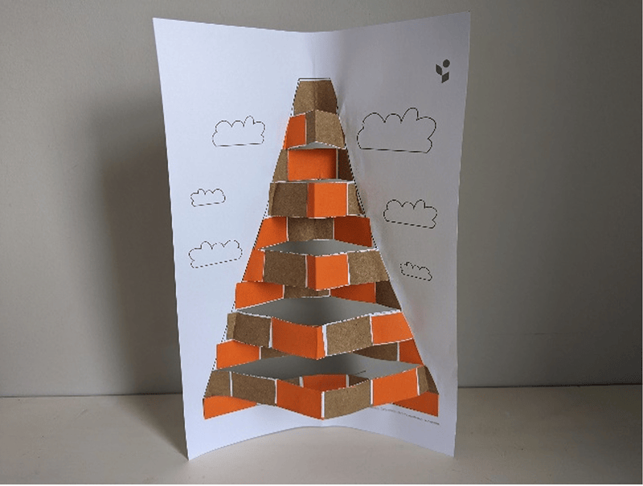

{"style": {"text": {"color": "#58B0E3", "size": "lg"}}}
Tower of Babel

**What you need:** glue (1).

Week 9 template (ideally printed on white cardstock), orange and brown paper (cut into small rectangles), scissors,

**Instructions:**

- Glue the orange and brown rectangles along each row of the tower (2-3).
- Fold the page in half (vertically) (4).
- Cut along each dotted line (5).
- Unfold the page, then refold every second row in the middle and along the edges. This will make each second row stand out (6).

