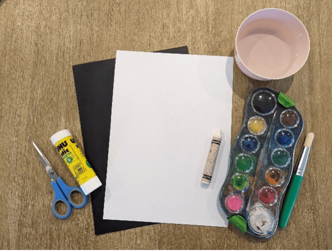
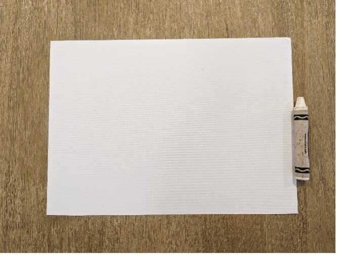
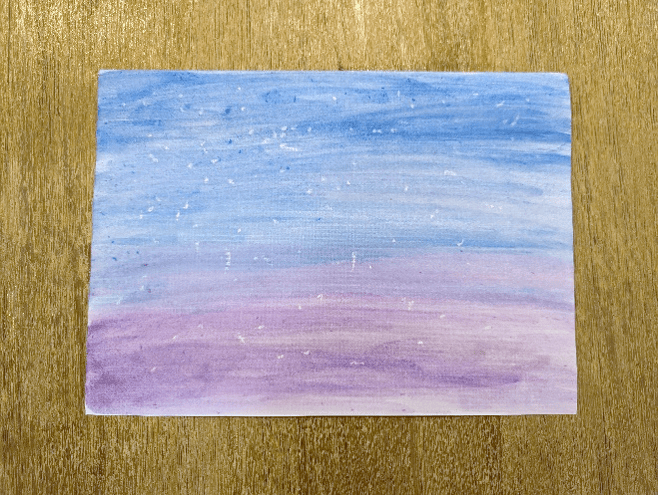
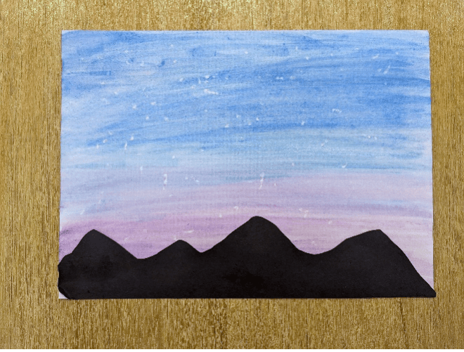

{"style": {"text": {"color": "#58B0E3", "size": "lg"}}}
Starry Sky Picture

**What you need:**

A sheet of white cardstock, black paper, white crayon, watercolor paints, paintbrush, water, scissors, glue (1).

**Instructions:**

- Dot all over the white cardstock using a white crayon (2). The more the better!
- Paint over the top with purple and blue watercolor paints (3).
- Cut out a mountain outline from black paper and glue along the bottom of the page (4).

