{"style": {"text": {"color": "#58B0E3", "size": "lg"}}}
Choosing First Pop-up

**What you need:**

**^[Week 11 craft template]({"style": {"text": {"color":"#58b0e3"}}})** on white cardstock, colored pencils/crayons, scissors, glue (1).

```=Craft Template

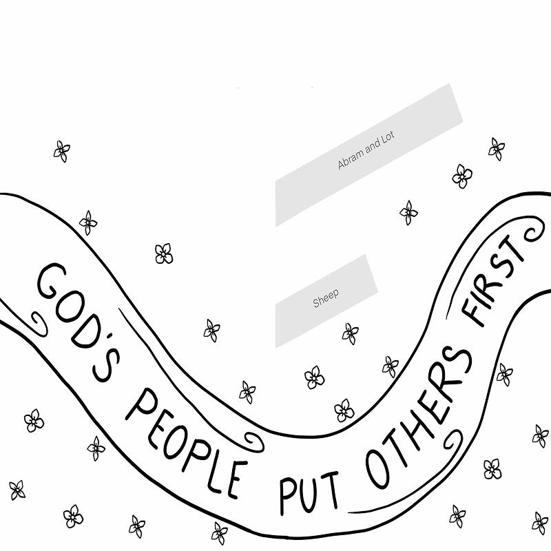

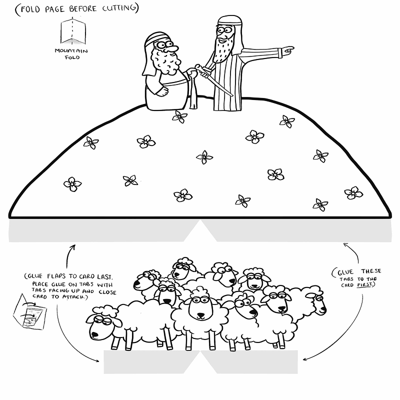

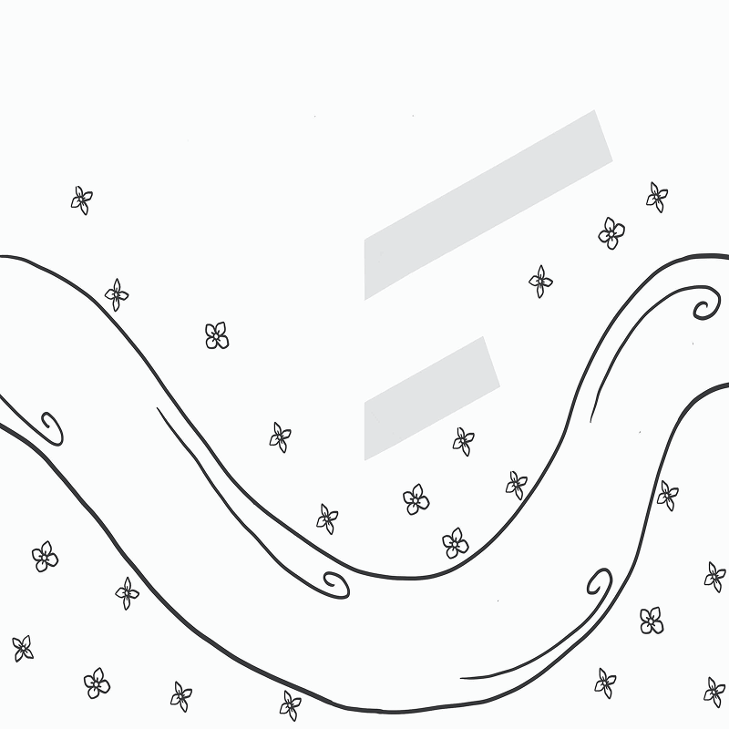

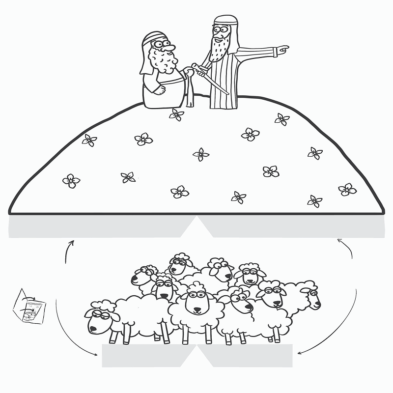

```

**Instructions:**

- Color the pictures (2).
- Fold both pages (vertically), then cut around the pictures of Abram and Lot, and the sheep (3).
- Glue the tabs on the right-hand side of each picture and stick to the card, as shown (4).
- Then glue the tabs on the left-hand side and close the card to stick (5).

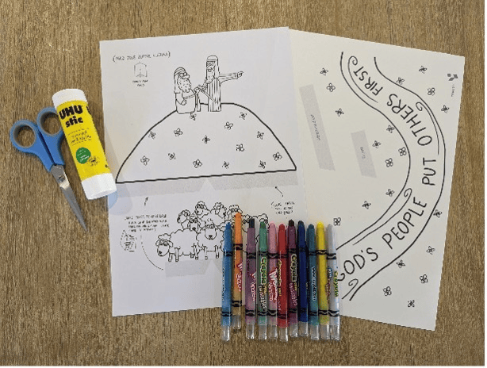

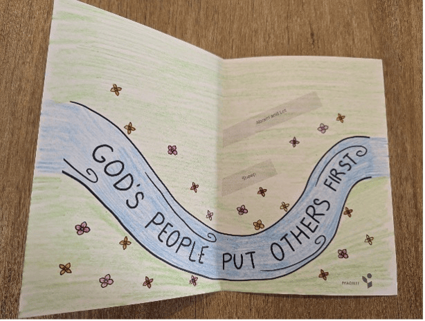

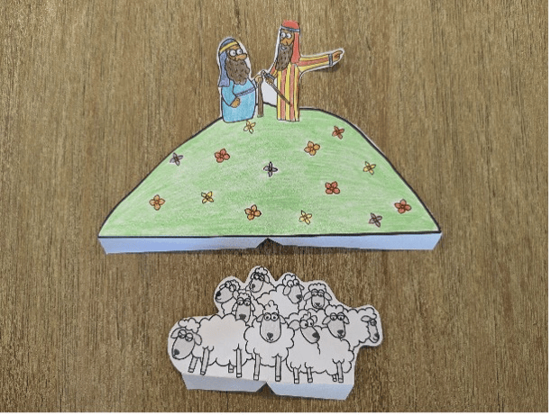

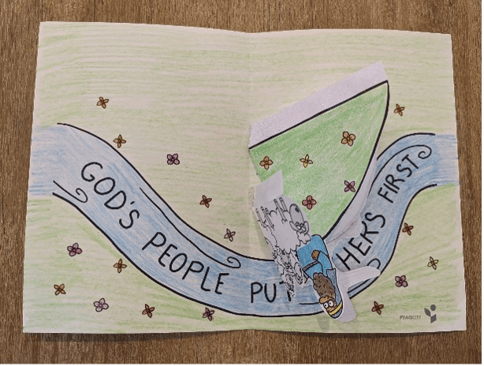

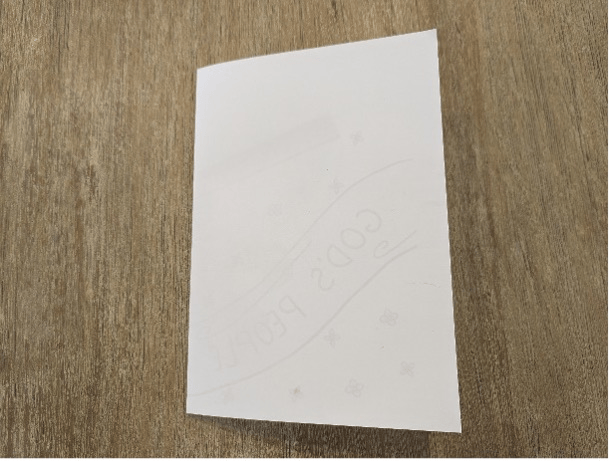

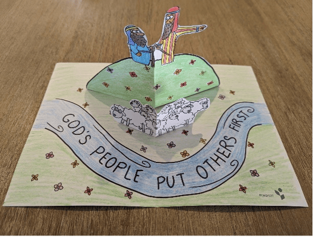

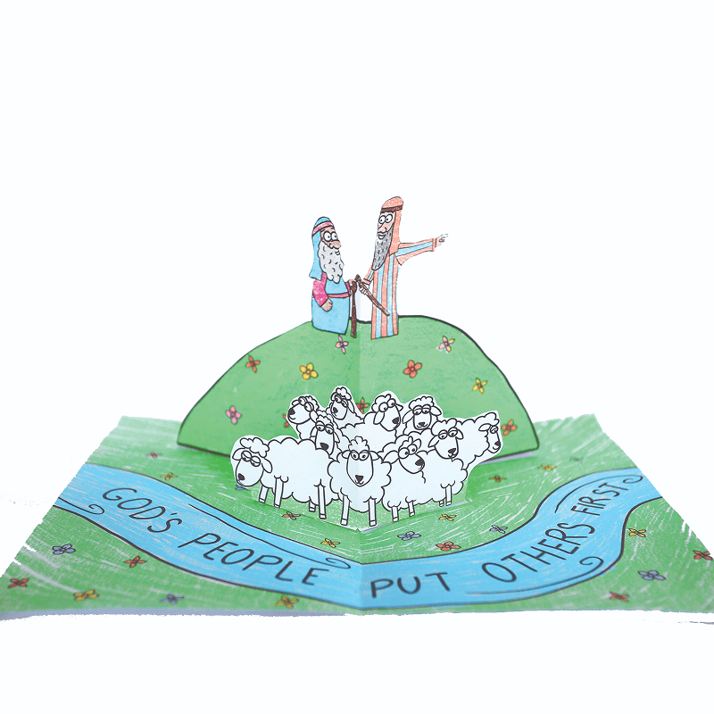

_Craft by Kimanh le Roux, A Sketch of Faith. www.asketchoffaith.com. Used by permission._