{"style": {"text": {"color": "#58B0E3", "size": "lg"}}}
Christian Hospitality Coloring Book

**What you need:** **^[Week 13 craft template]({"style": {"text": {"color":"#58b0e3"}}})** (two pages printed double-sided), colored pencils, scissors, stapler (1).

```=Craft Template

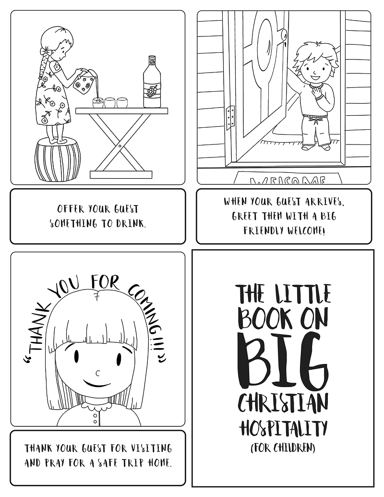

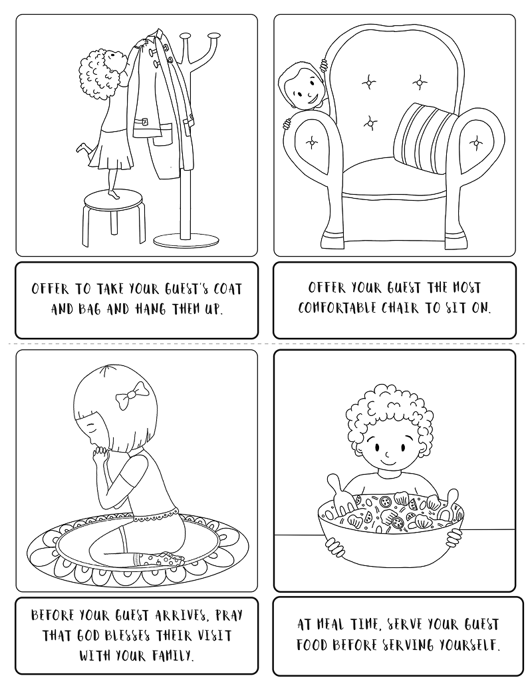

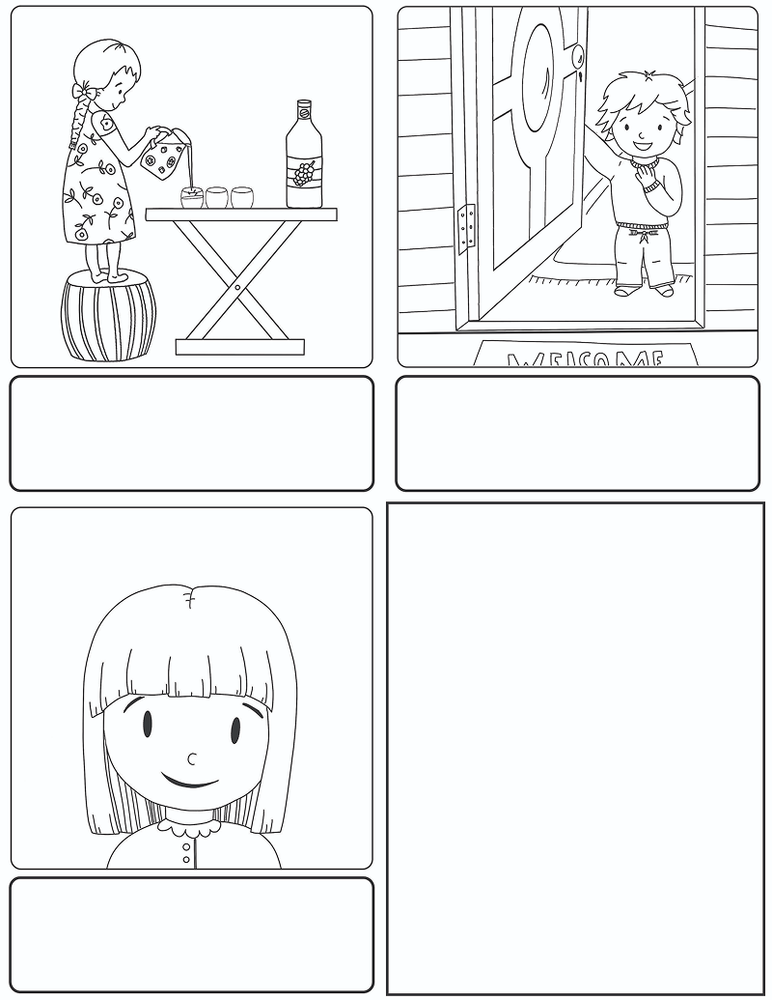

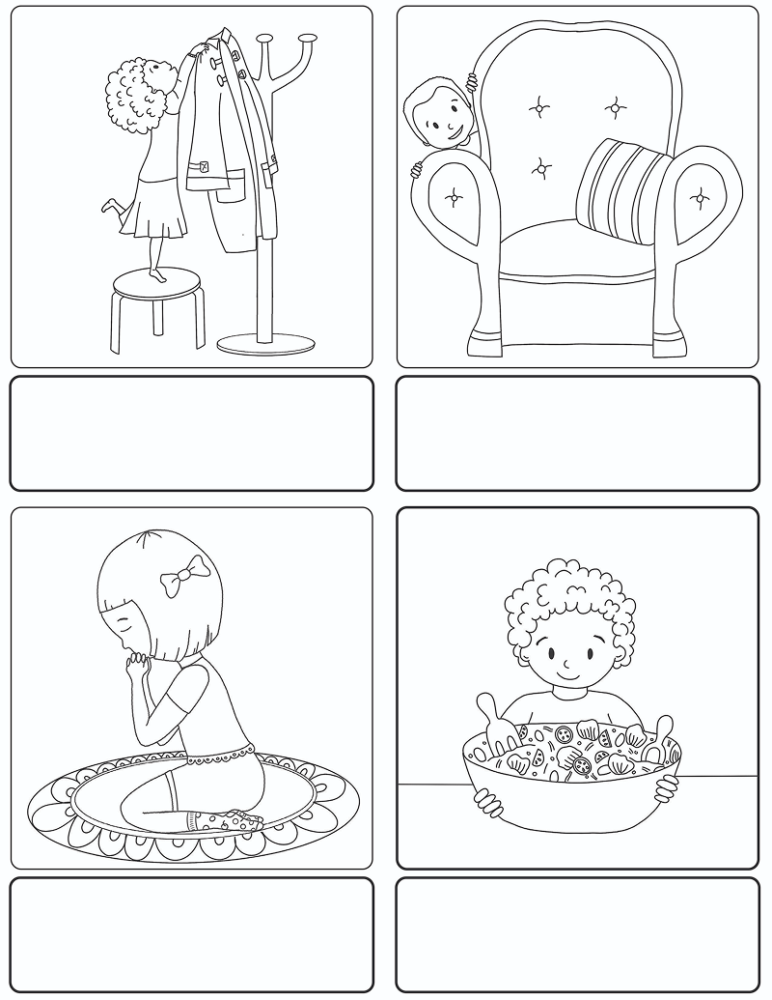

```

**Instructions:**

- Color the pictures (2-3).
- Cut around each rectangle (4).
- Arrange in order and staple together (4-5).

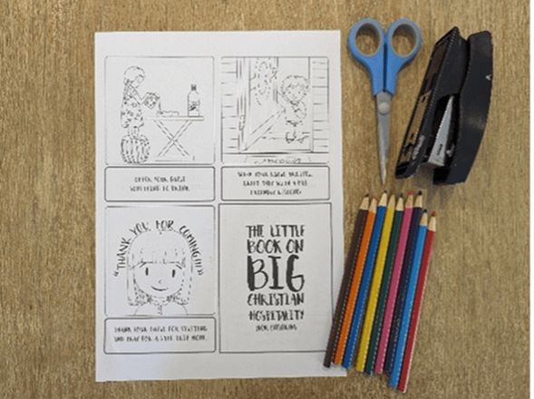

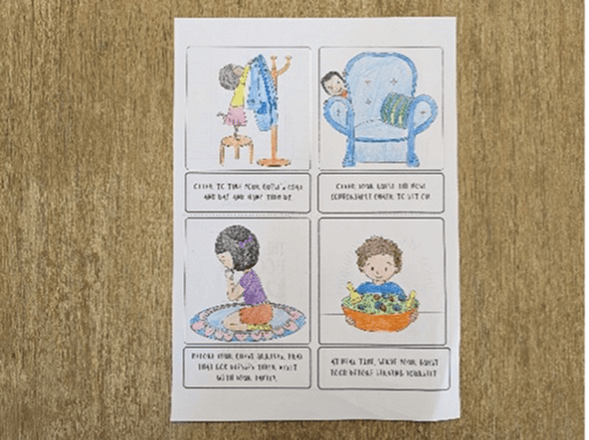

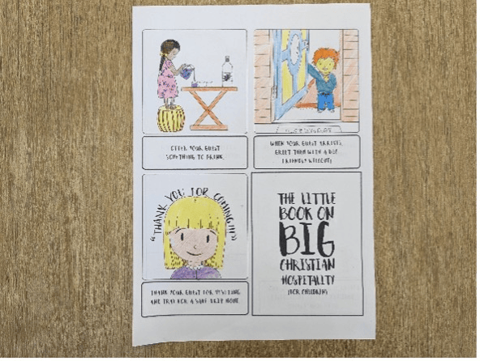

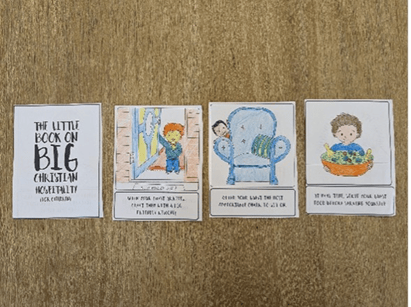

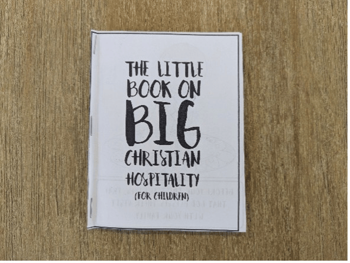

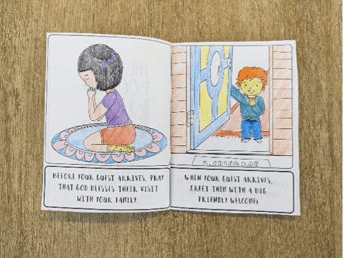

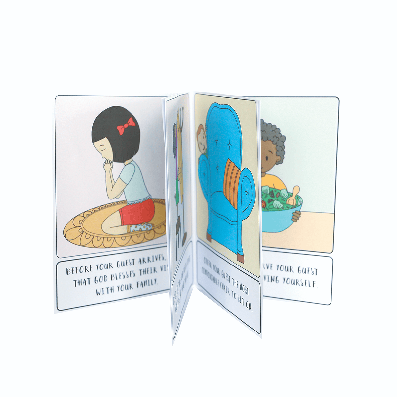

_Craft by Kimanh le Roux, A Sketch of Faith. www.asketchoffaith.com. Used by permission._