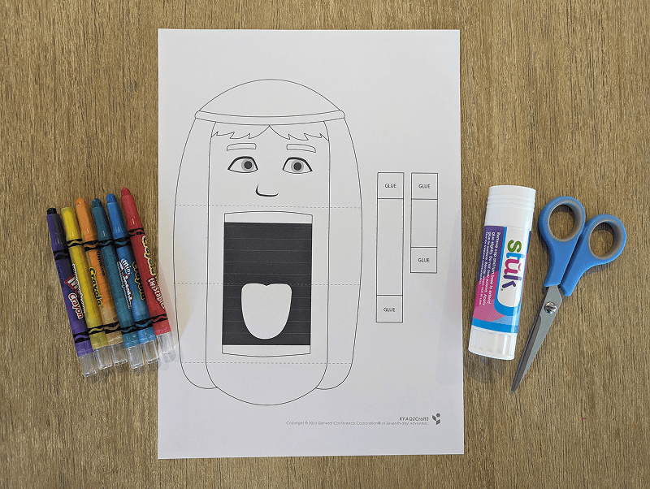
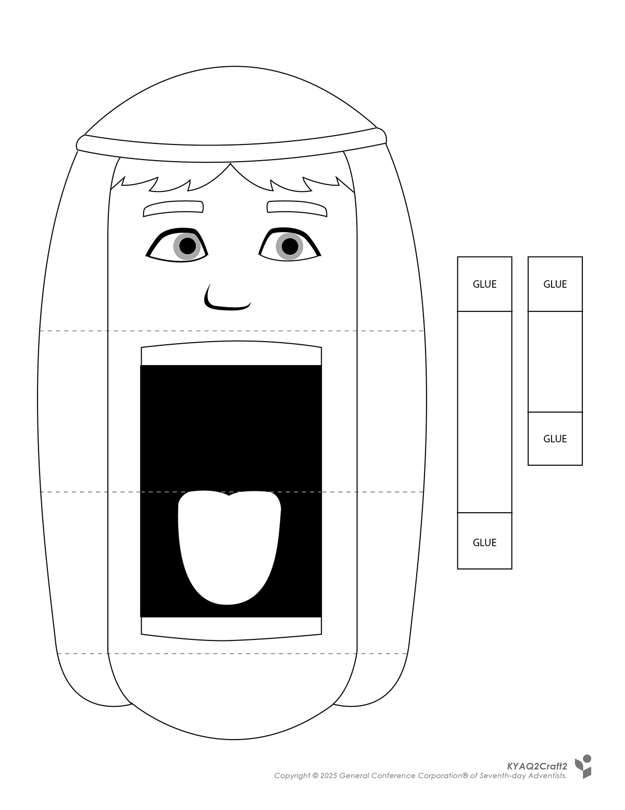
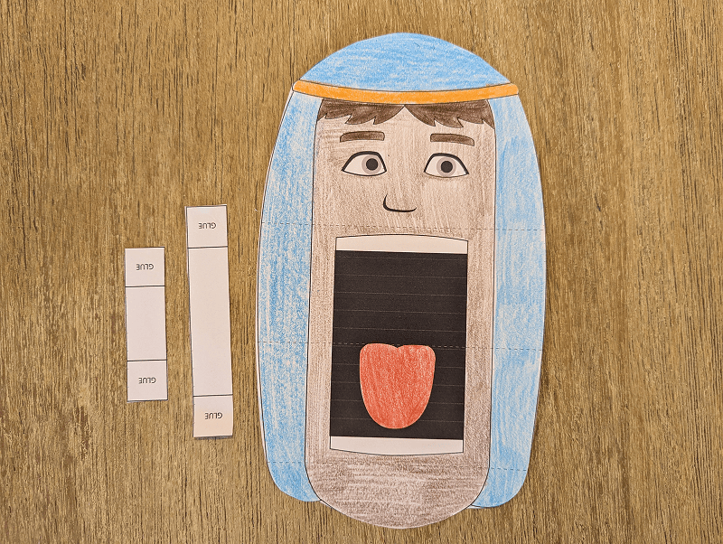
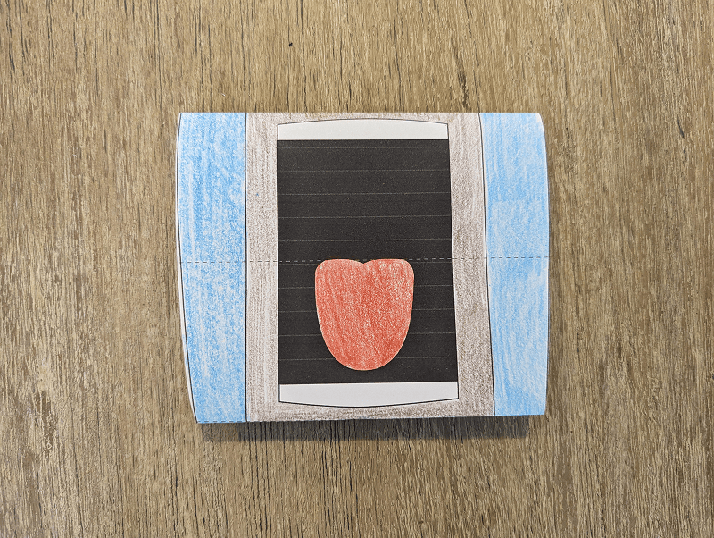
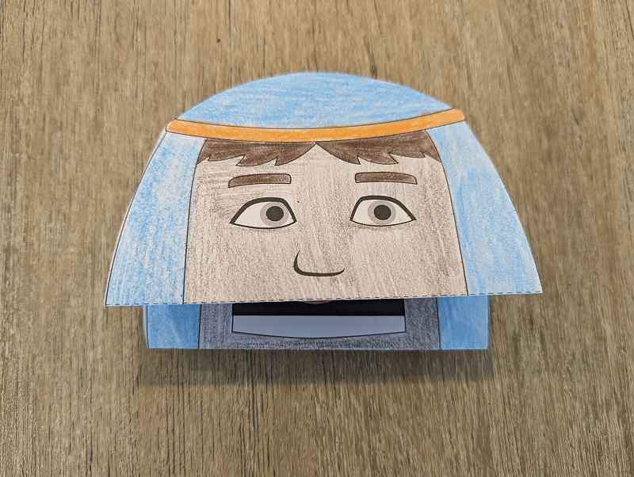
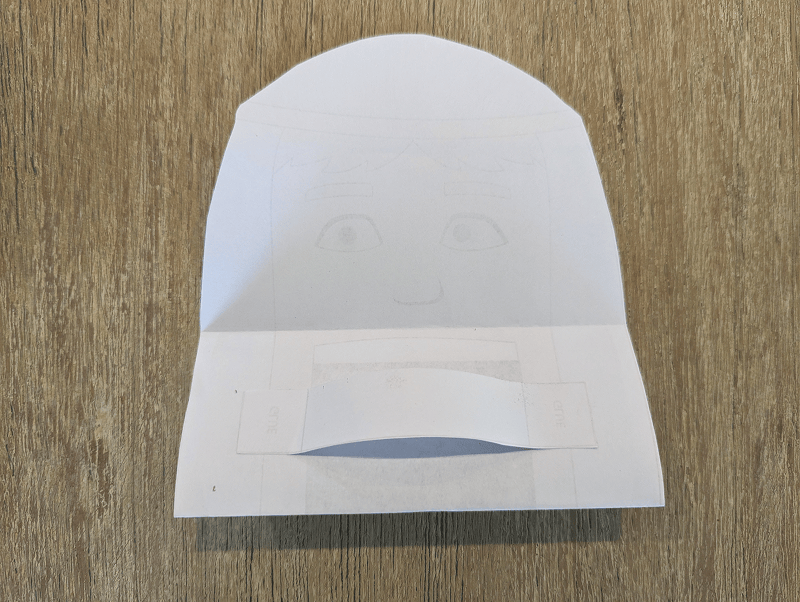
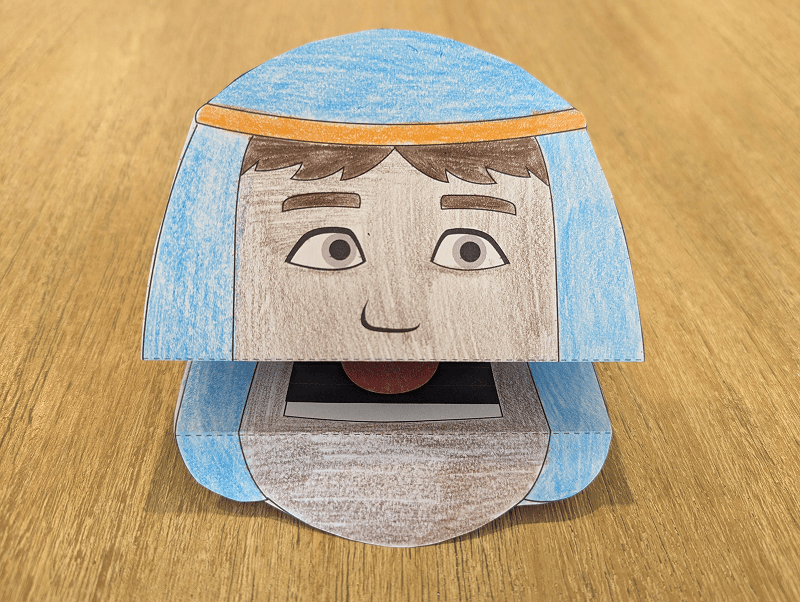

**What you need:**

Week 2 craft template, crayons, scissors, glue.

{"style":{"image":{"aspectRatio":1.778}}}


```=Craft Template



```

**Create it together:**

- Color in the Jacob puppet and cut out.

{"style":{"image":{"aspectRatio":1.778}}}


- Fold backwards along the top and bottom lines (above and below the mouth).

{"style":{"image":{"aspectRatio":1.778}}}


- Then fold inwards along the middle line (above the tongue). Once folded, your puppet is almost ready.

{"style":{"image":{"aspectRatio":1.778}}}


- On the back of the puppet, glue the longer strip on the top for the fingers and the shorter strip underneath for the thumb, so you can hold the puppet.

{"style":{"image":{"aspectRatio":1.778}}}


- Use the puppet to show how Jacob could have spoken the truth to his father.

{"style":{"image":{"aspectRatio":1.778}}}
