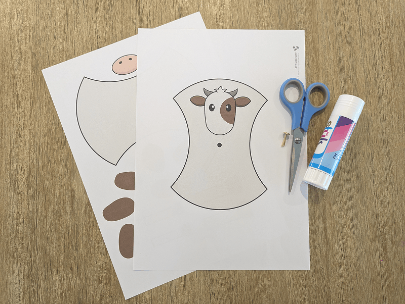
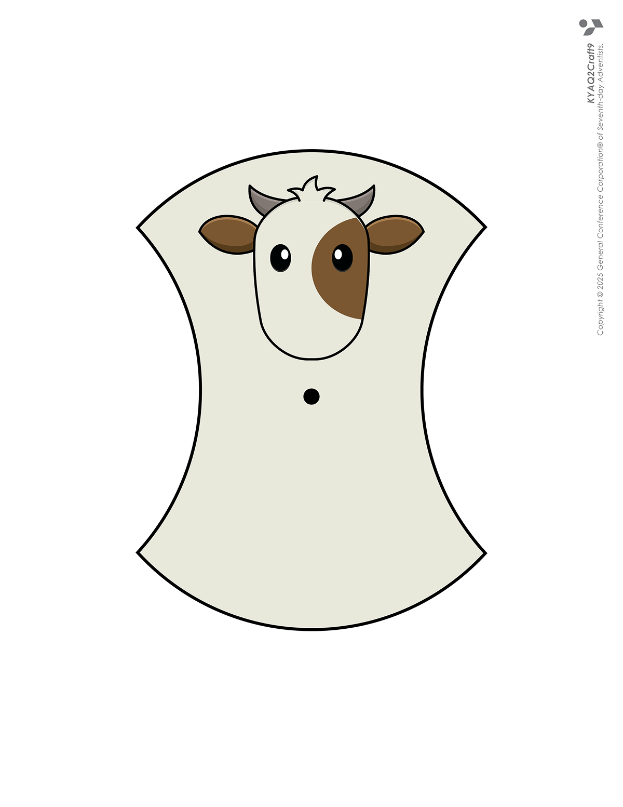
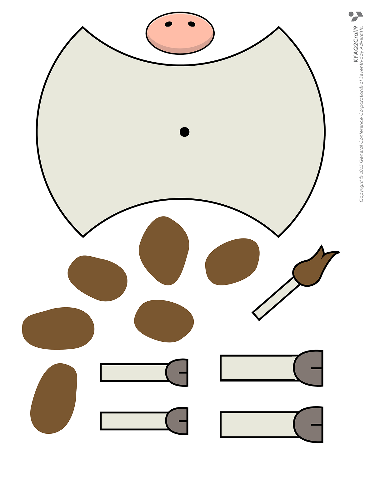
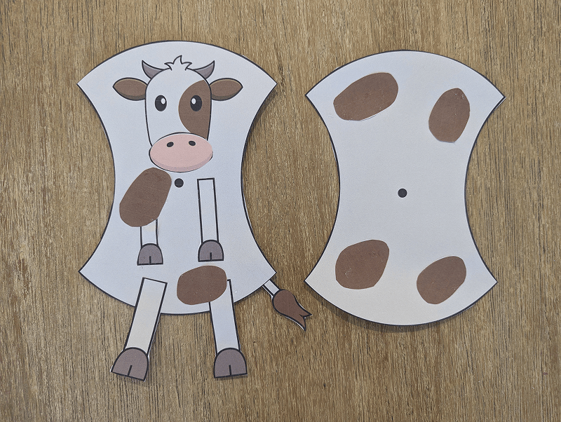
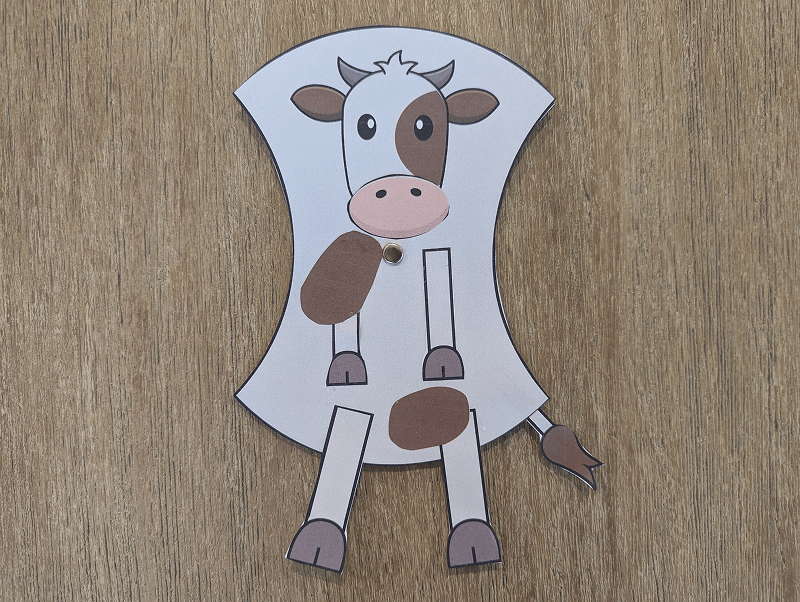
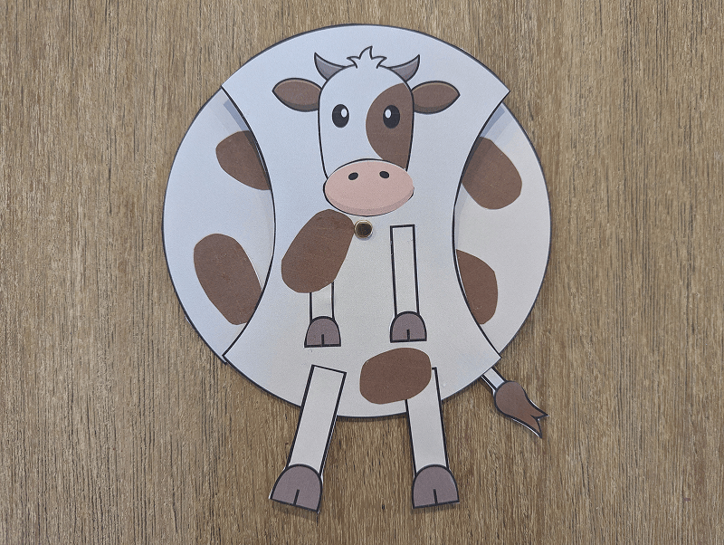

**What you need:**

Week 9 craft template, split pin, scissors, glue.

{"style":{"image":{"aspectRatio":1.778}}}


```=Craft Template





```

**Create it together:**

- Cut out the craft templates.
- Glue the nose, legs, tail and spots onto the body.

{"style":{"image":{"aspectRatio":1.778}}}


- Place the body (with the head) on top of the second body so the dots line up in the middle.
- Push a split pin through the dots to join them together.

{"style":{"image":{"aspectRatio":1.778}}}


- Rotate the back of the cow to make it hungry or full, like the cows in Pharaoh’s dream.

{"style":{"image":{"aspectRatio":1.778}}}


- Explain to a friend what this part of the dream meant.