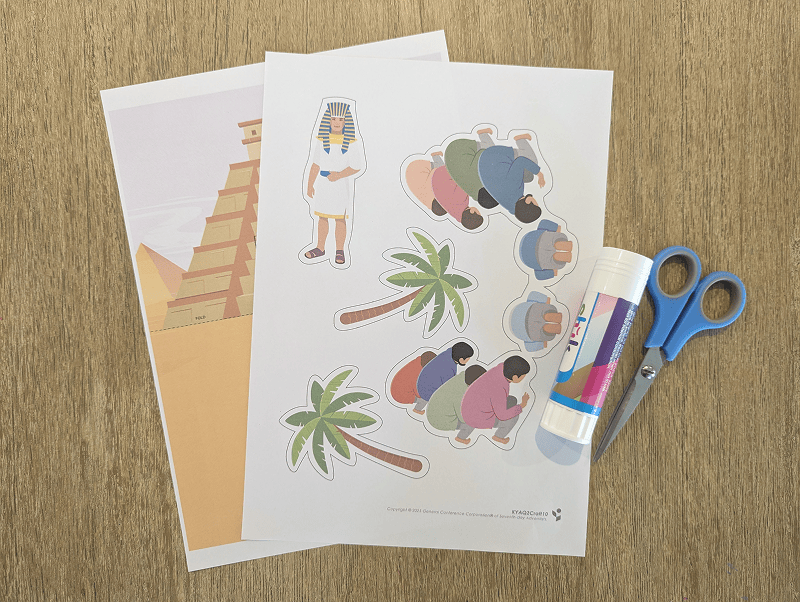
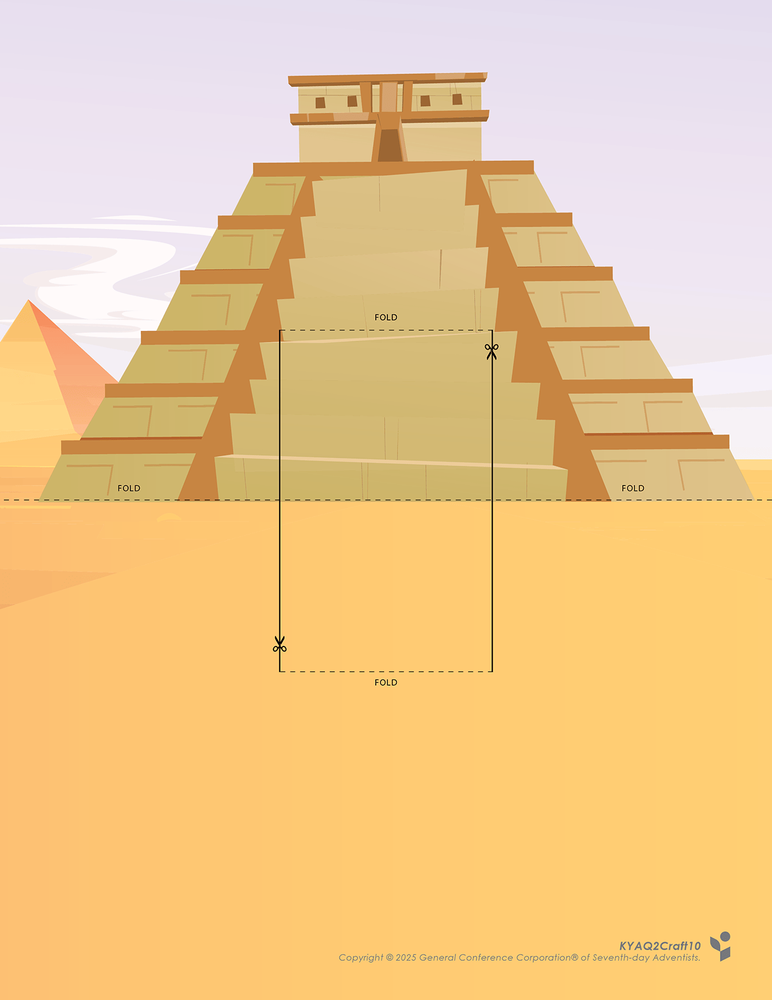
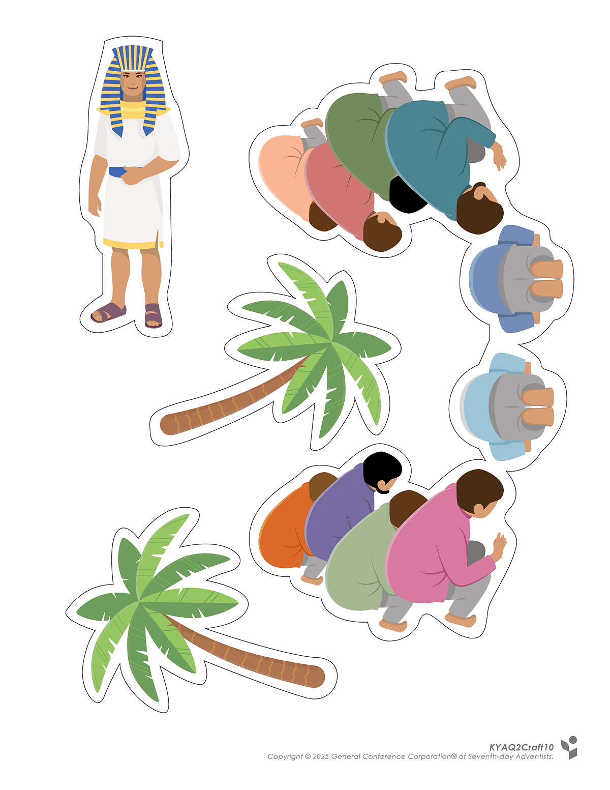
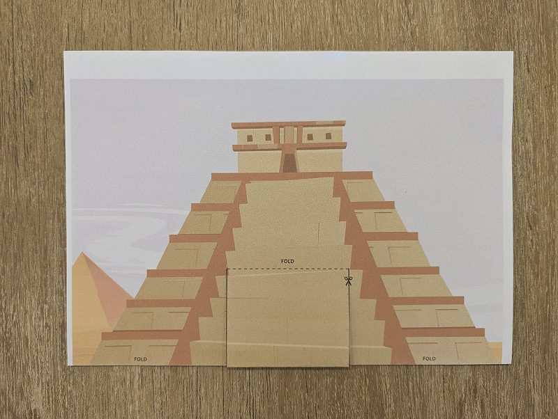
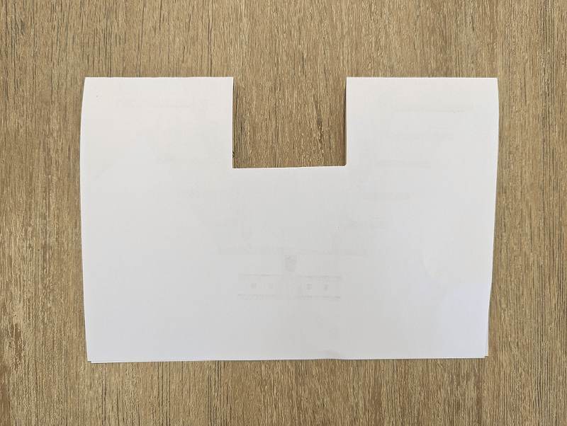
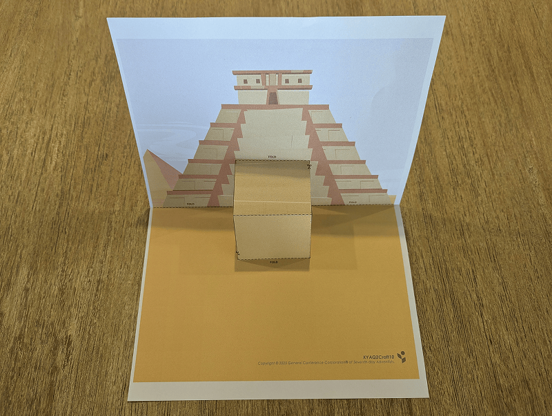
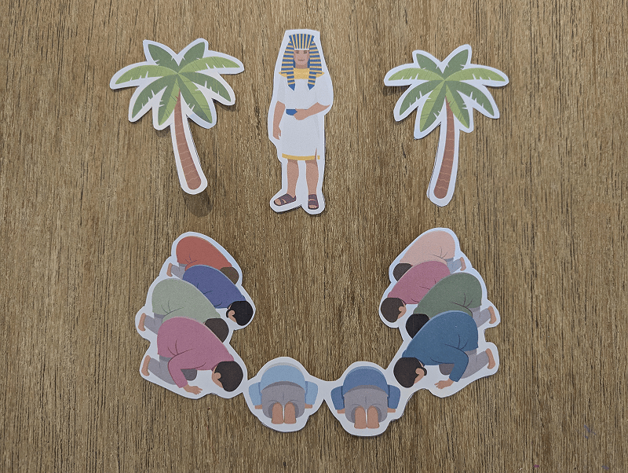
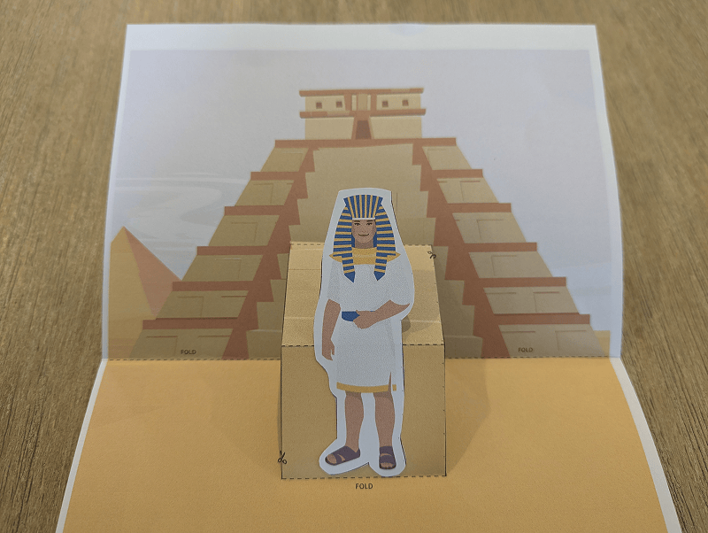
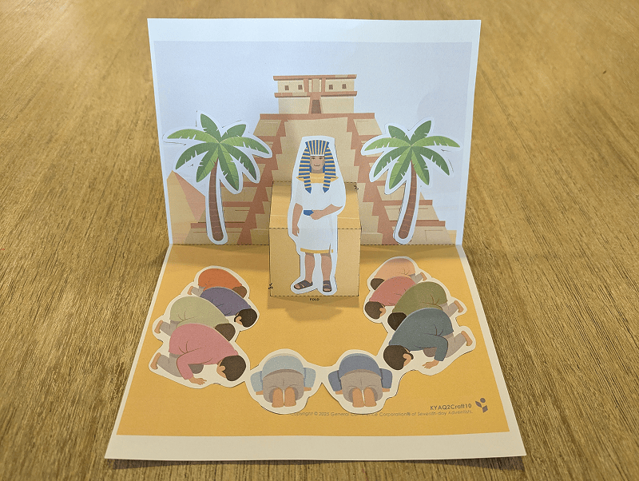

**What you need:**

Week 10 craft template, scissors, glue.

{"style":{"image":{"aspectRatio":1.778}}}


```=Craft Template





```

**Preparation instructions:**

Prepare a craft in advance to show as an example.

**Create it together:**

- Fold the first page in half along the line.

{"style":{"image":{"aspectRatio":1.778}}}


- Cut two vertical slits along the lines indicated.

{"style":{"image":{"aspectRatio":1.778}}}


- Fold the page inward, while folding the horizontal lines above and below the cuts. This will create a pop-out section.

{"style":{"image":{"aspectRatio":1.778}}}


- Cut out the pictures.

{"style":{"image":{"aspectRatio":1.778}}}


- Glue Joseph onto the foldout section, then glue the rest of the pictures onto the background.

{"style":{"image":{"aspectRatio":1.778}}}


- Open the pop-up to show Joseph’s brothers bowing.

{"style":{"image":{"aspectRatio":1.778}}}


- Use this craft to retell this part of Joseph’s story in your own words to a friend.