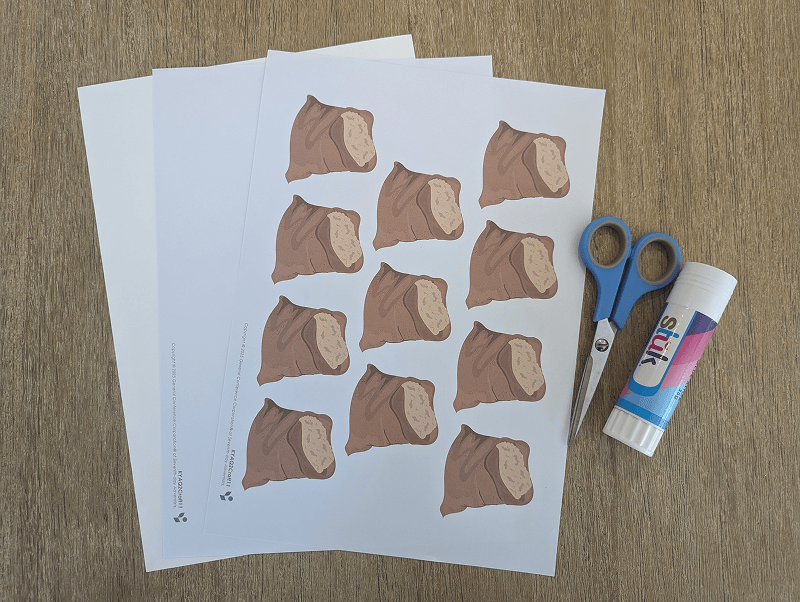
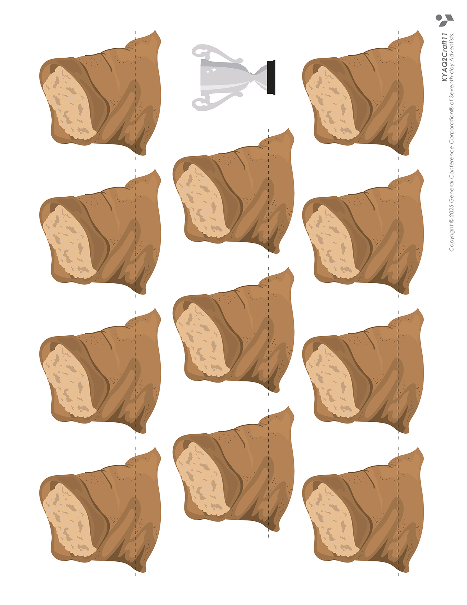
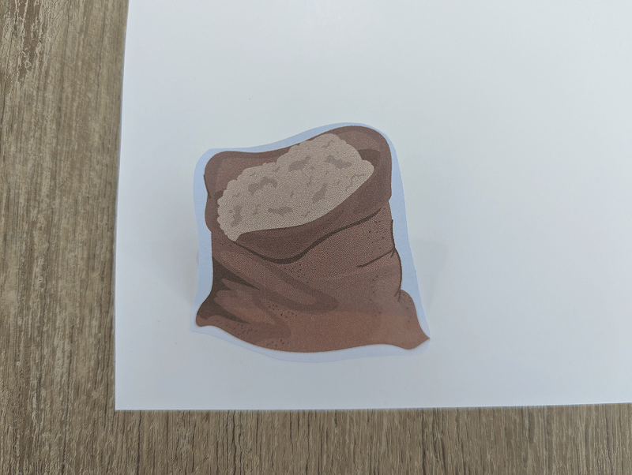
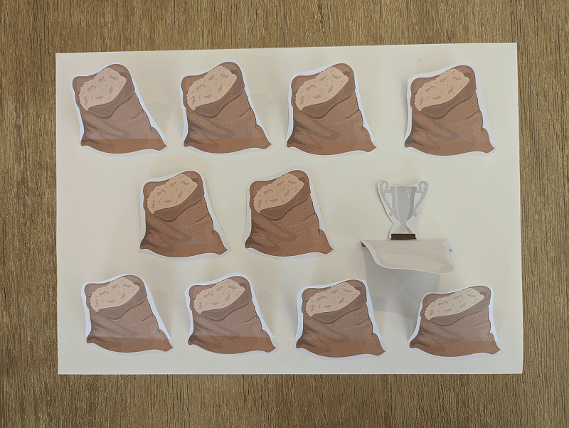
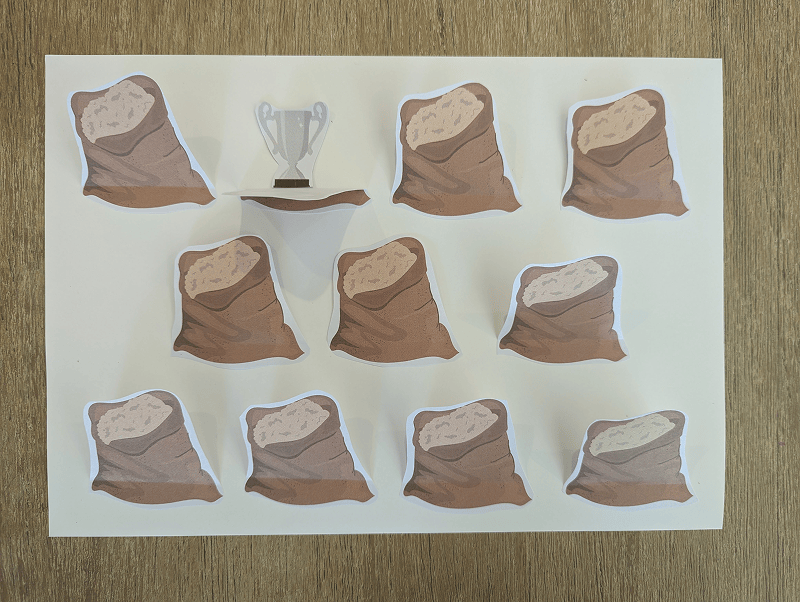
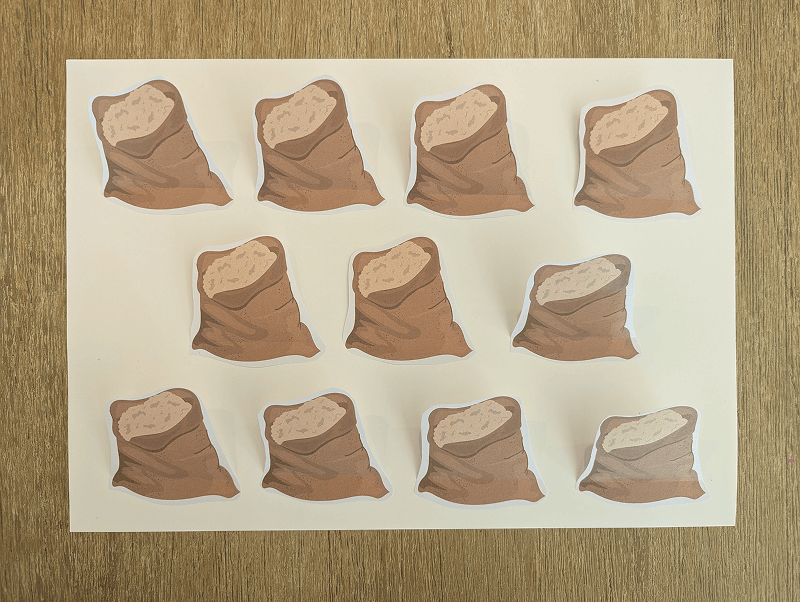

**What you need:**

Week 11 craft template, cardstock, scissors, glue.

{"style":{"image":{"aspectRatio":1.778}}}


```=Craft Template



```

**Create it together:**

- Cut out the grain sacks and fold along the dotted lines.

{"style":{"image":{"aspectRatio":1.778}}}


- Glue just the bottom section of each sack onto a piece of cardstock.
- Cut out the silver cup and place behind one of the grain sacks (3 and 4).

{"style":{"image":{"aspectRatio":1.778}}}


{"style":{"image":{"aspectRatio":1.778}}}


- Have your friends take turns guessing which one is Benjamin’s sack with the hidden cup.

{"style":{"image":{"aspectRatio":1.778}}}
