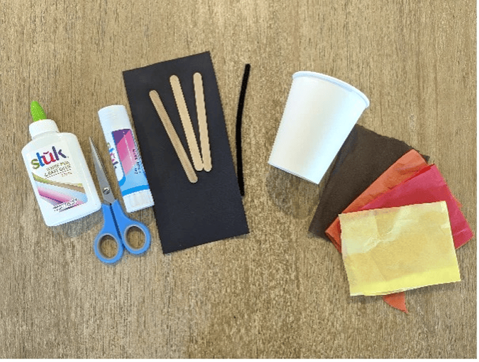
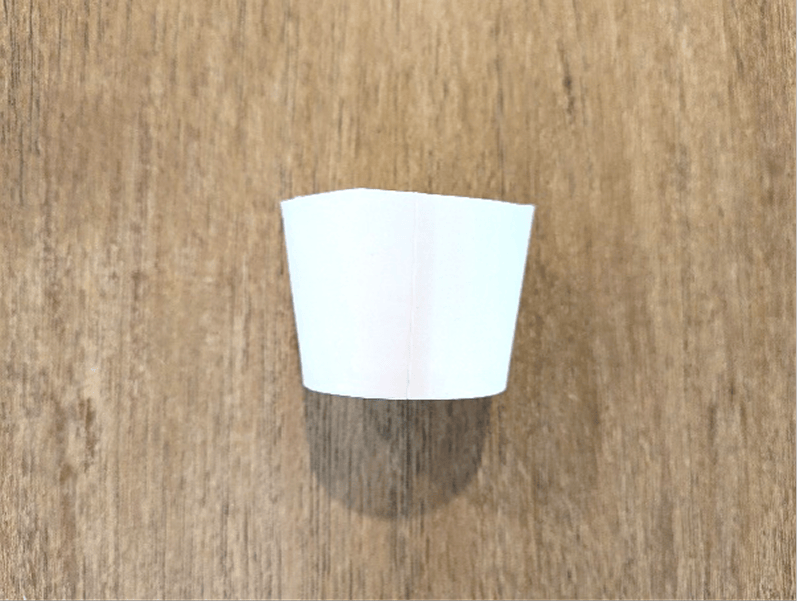
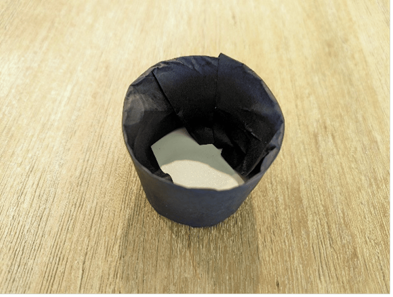
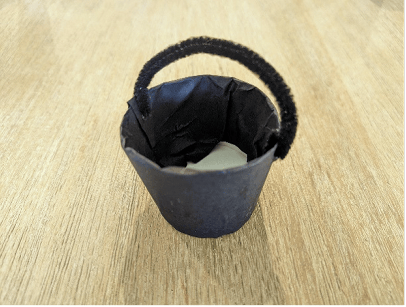
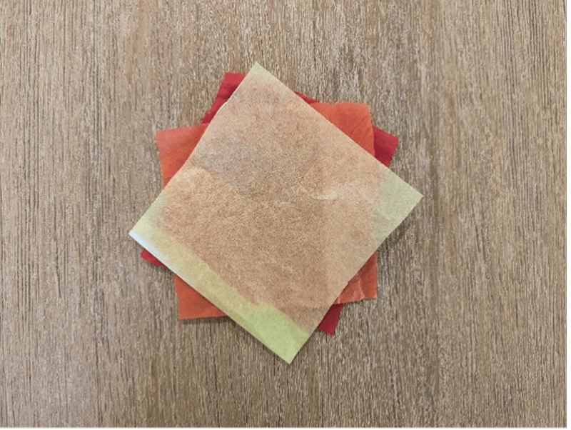
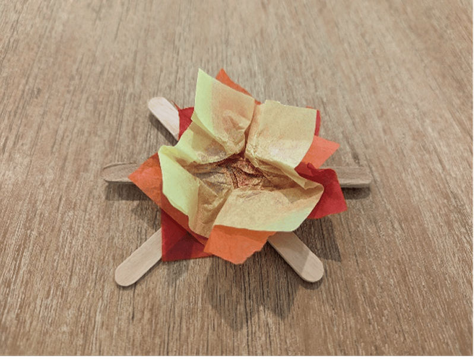
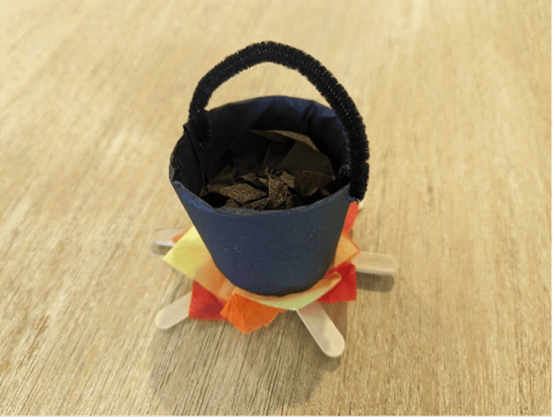

**What you need:**

Black strip of paper; a paper cup; three craft sticks; a chenille stick or pipe cleaner; yellow, orange, and red tissue paper; brown crepe paper; scissors; craft glue.

{"style":{"image":{"aspectRatio":1.778}}}

**Instructions:**

- Glue three craft sticks together, as shown. Leave to dry.

{"style":{"image":{"aspectRatio":1.778}}}

- Cut a paper cup in half and glue a strip of black paper around the outside. Fold the remaining black paper inside the cup.

{"style":{"image":{"aspectRatio":1.778}}}

{"style":{"image":{"aspectRatio":1.778}}}

- Have an adult poke two holes on either side of the cup.
- Cut a chenille stick/pipe cleaner in half and attach to each hole.

{"style":{"image":{"aspectRatio":1.778}}}

- Layer a piece of yellow, orange, and red tissue paper and glue on top of the craft sticks. Scrunch it up a little to make it look like a fire.

{"style":{"image":{"aspectRatio":1.778}}}

{"style":{"image":{"aspectRatio":1.778}}}

- Crumple a piece of brown crepe paper and place inside the black cup.

{"style":{"image":{"aspectRatio":1.778}}}

- Retell the story by pretending to make lentil stew on the fire, as Jacob did.