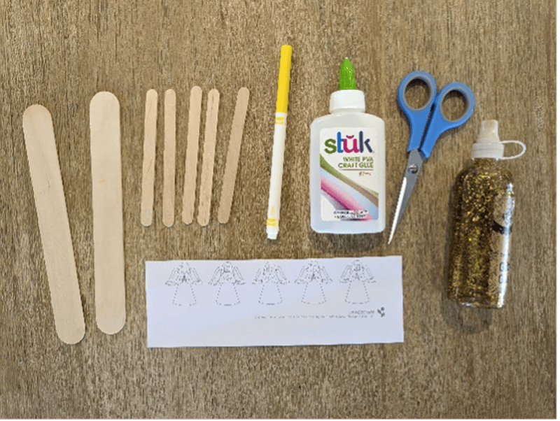
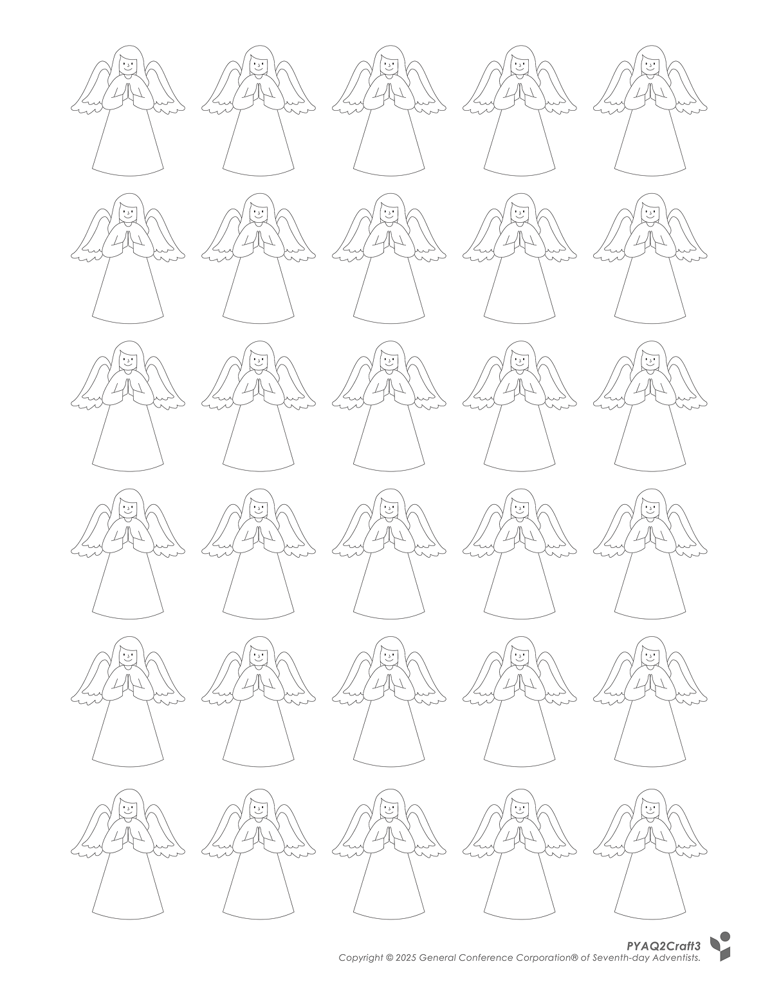
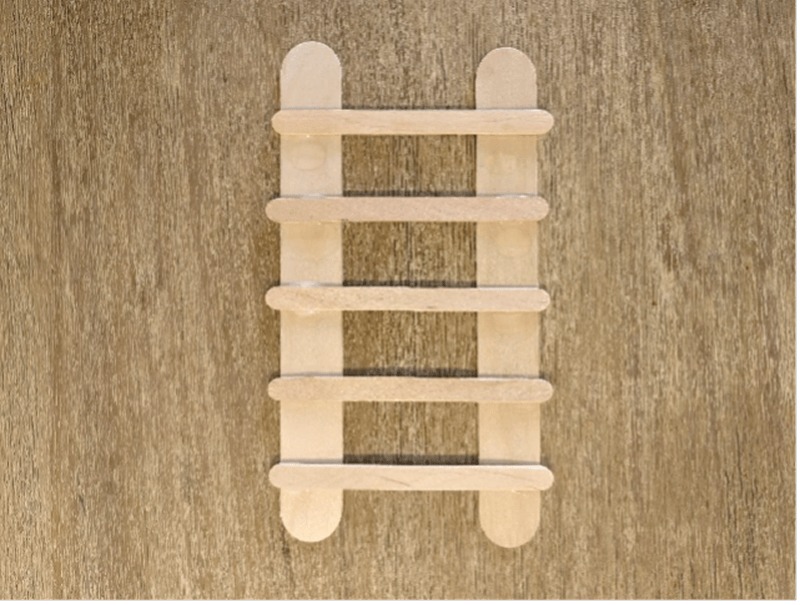
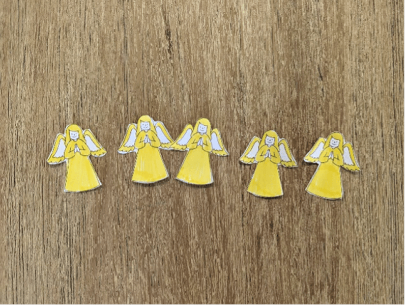
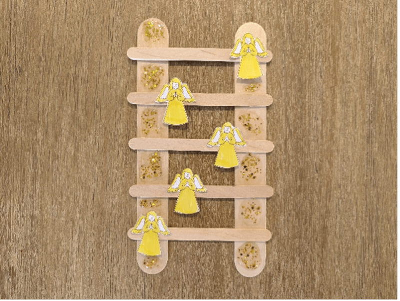

**What you need:**

Week 3 craft template, two extra-large craft sticks, five small craft sticks, yellow marker, scissors, craft glue, gold glitter glue.

{"style":{"image":{"aspectRatio":1.778}}}


```=Craft Template



```

**Instructions:**

- Glue five small craft sticks horizontally across two large craft sticks to make a ladder.

{"style":{"image":{"aspectRatio":1.778}}}


- While it dries, color the angels from the week 3 craft template, and cut them out.

{"style":{"image":{"aspectRatio":1.778}}}


- Glue the angels to the ladder.
- Add gold glitter glue and leave to dry.

{"style":{"image":{"aspectRatio":1.778}}}
