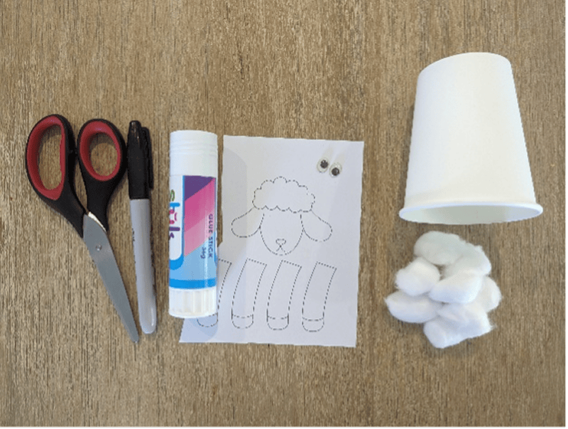
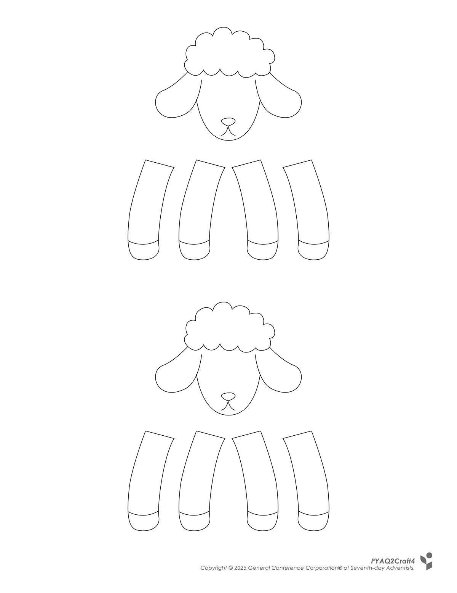
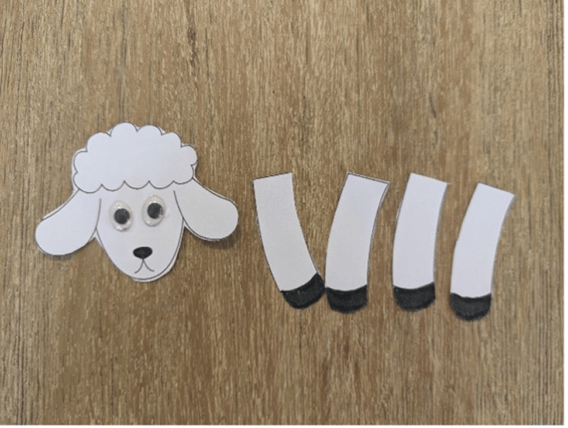
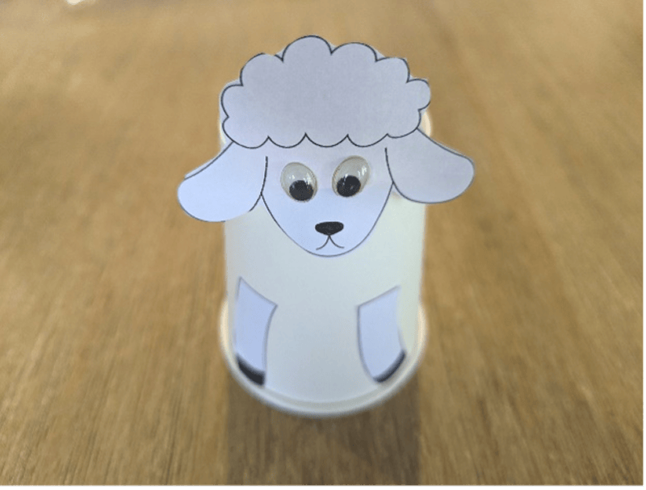
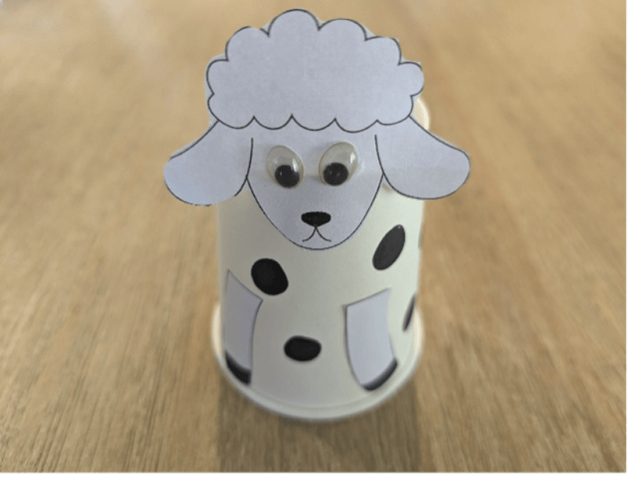
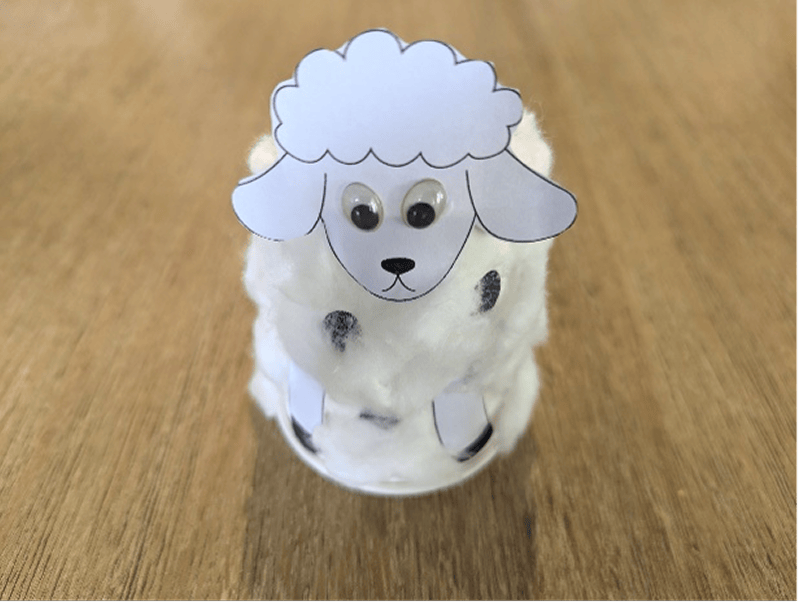
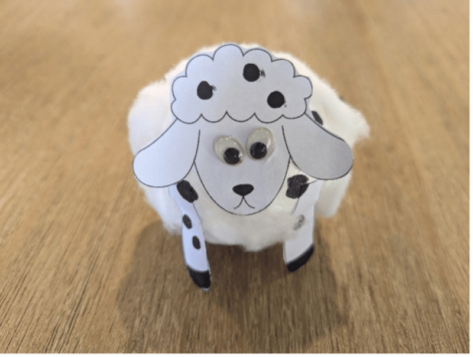

**What you need:**

Week 4 craft template, paper cup or foam ball, cotton balls, scissors, glue, black marker, googly eyes (optional).

{"style":{"image":{"aspectRatio":1.778}}}


```=Craft Template



```

**Instructions:**

- Cut out the sheep, then draw or glue on the eyes.

{"style":{"image":{"aspectRatio":1.778}}}


- Glue the head and legs onto a paper cup or foam ball.

{"style":{"image":{"aspectRatio":1.778}}}


- Draw on spots with a black marker.

{"style":{"image":{"aspectRatio":1.778}}}


- Pull apart cotton balls and glue them around the paper cup or foam ball to make your sheep fluffy.

{"style":{"image":{"aspectRatio":1.778}}}


{"style":{"image":{"aspectRatio":1.778}}}
