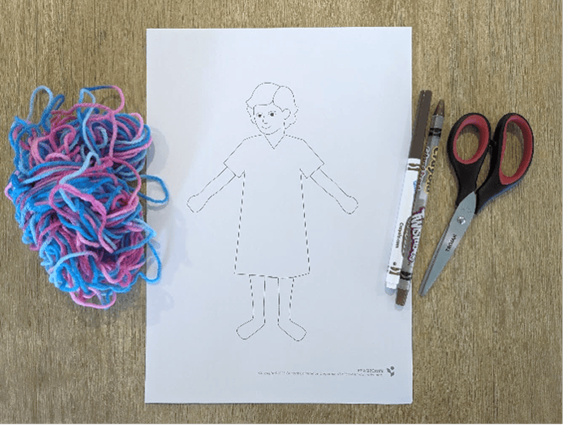
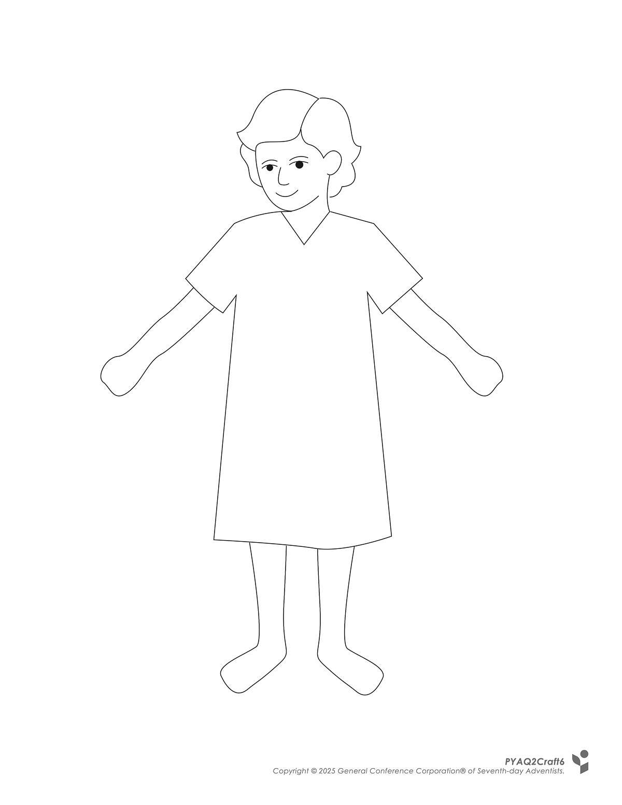
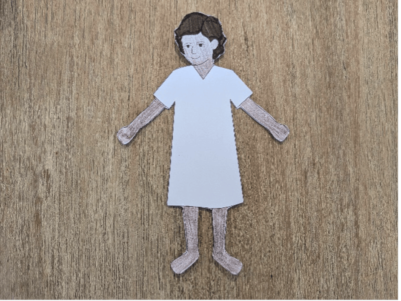
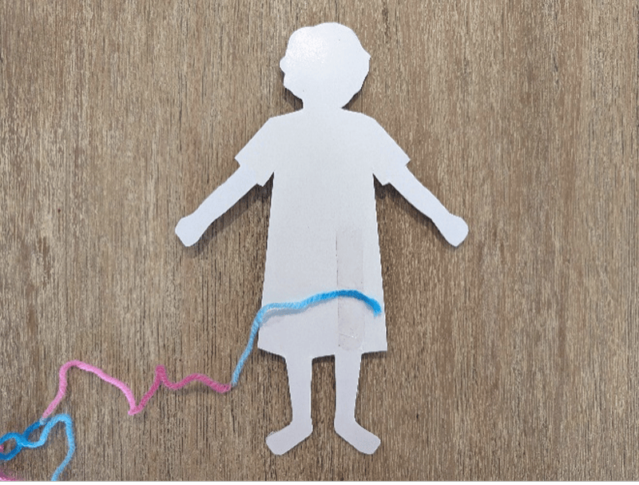
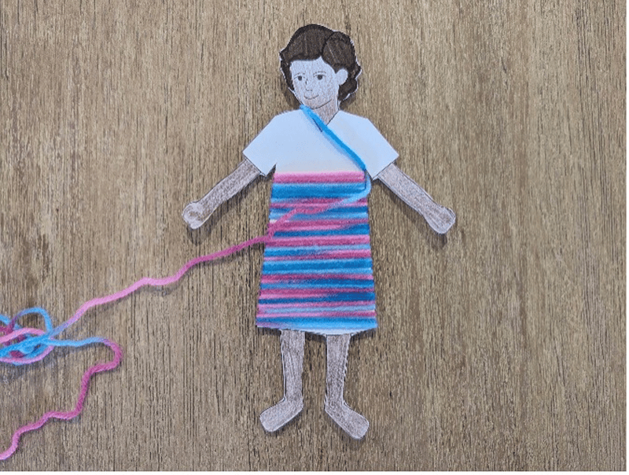
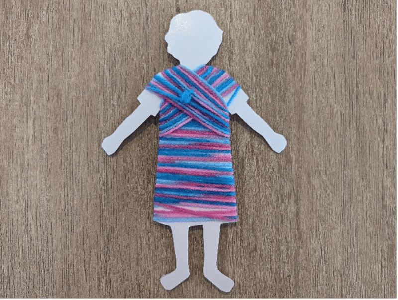
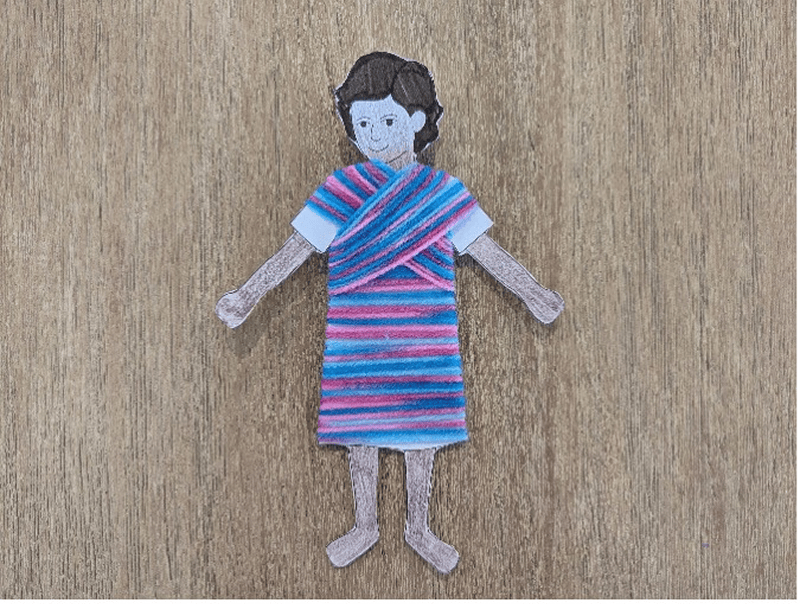

**What you need:**

Week 6 craft template (on white cardstock), colorful yarn, colored pencil/marker, scissors.

{"style":{"image":{"aspectRatio":1.778}}}


```=Craft Template



```

**Instructions:**

- Color and cut out the picture of Joseph.

{"style":{"image":{"aspectRatio":1.778}}}


- Tape the end of a piece of yarn to the back.

{"style":{"image":{"aspectRatio":1.778}}}


- Wind the yarn around the cardstock.

{"style":{"image":{"aspectRatio":1.778}}}


- When you get to the arm, wind the yarn diagonally across, then do the same for the other arm.
- Once finished, cut the end of the yarn and loop it through a couple of strands before making a knot.

{"style":{"image":{"aspectRatio":1.778}}}


{"style":{"image":{"aspectRatio":1.778}}}
