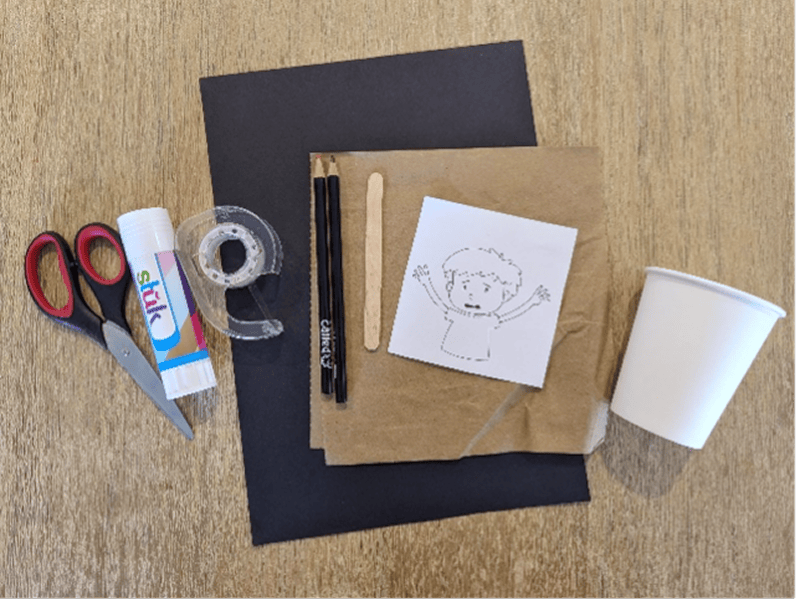
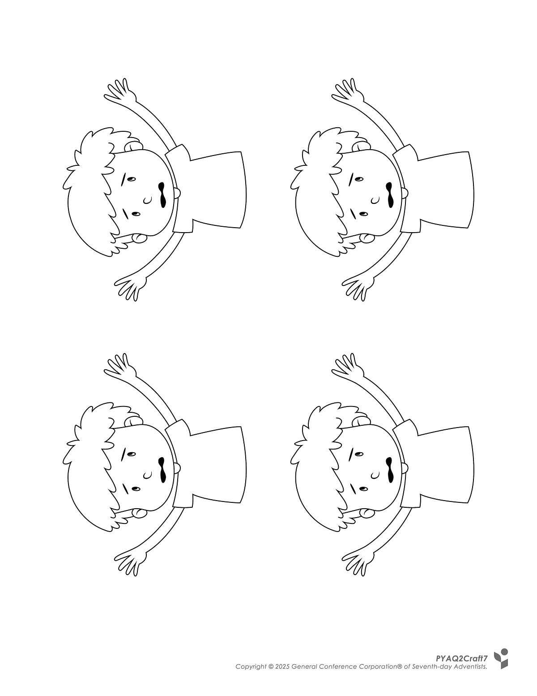
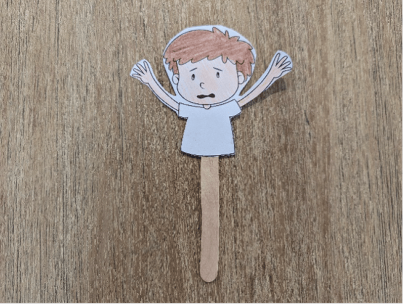
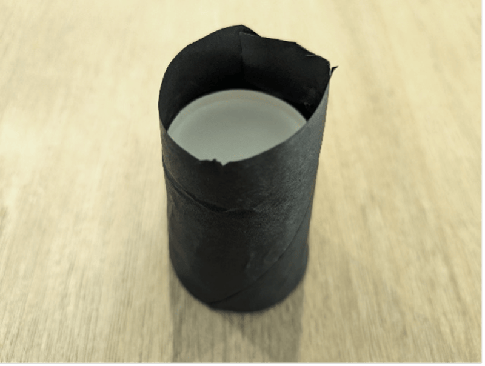
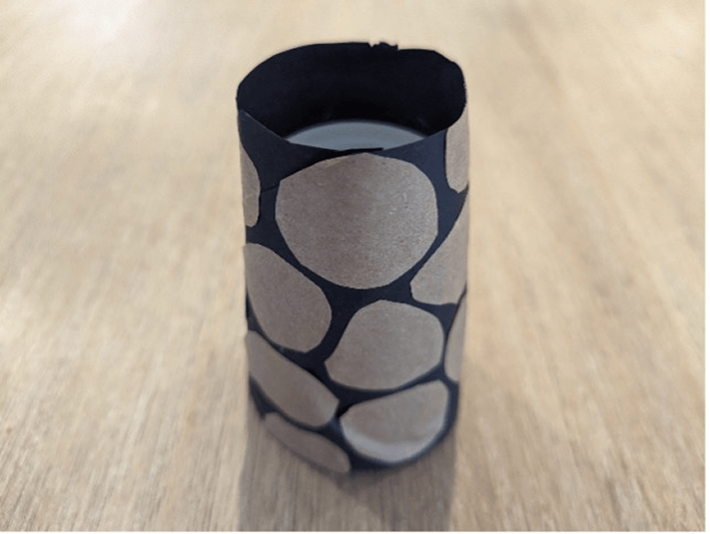
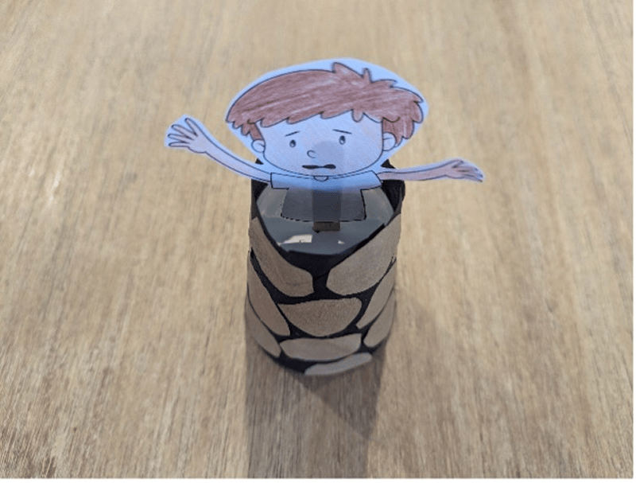
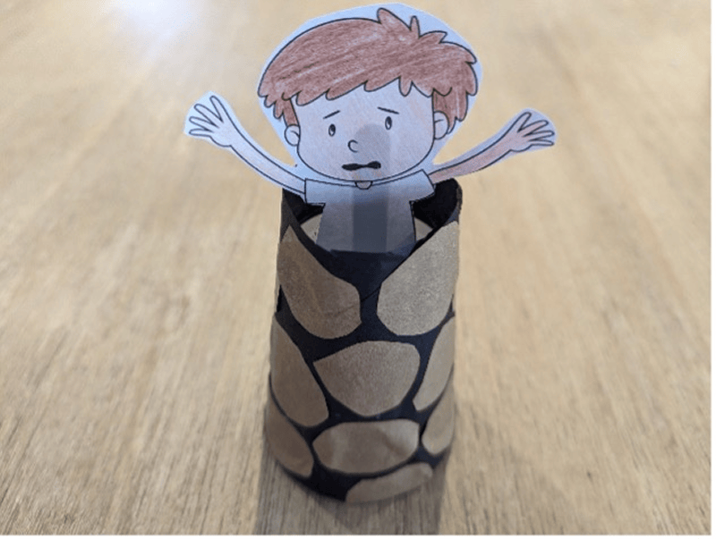

**What you need:**

Week 7 craft template, colored pencils, craft stick, paper cup, black paper, brown paper, scissors, glue, tape.

{"style":{"image":{"aspectRatio":1.778}}}


```=Craft Template



```

**Instructions:**

- Color and cut out the picture of Joseph.

{"style":{"image":{"aspectRatio":1.778}}}


- Tape a craft stick to the back of the picture of Joseph.

{"style":{"image":{"aspectRatio":1.778}}}


- Glue a strip of black paper around a paper cup.

{"style":{"image":{"aspectRatio":1.778}}}


- Cut stone shapes out of the brown paper and glue onto the black cup to make a “pit”.

{"style":{"image":{"aspectRatio":1.778}}}


- An adult can use scissors to make a hole in the top of the cup. Slide the craft-stick puppet of Joseph into the hole and move up and down inside the “pit”.

{"style":{"image":{"aspectRatio":1.778}}}


{"style":{"image":{"aspectRatio":1.778}}}
