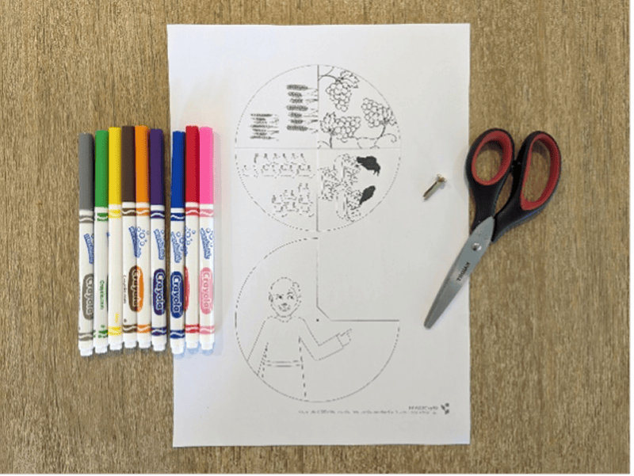
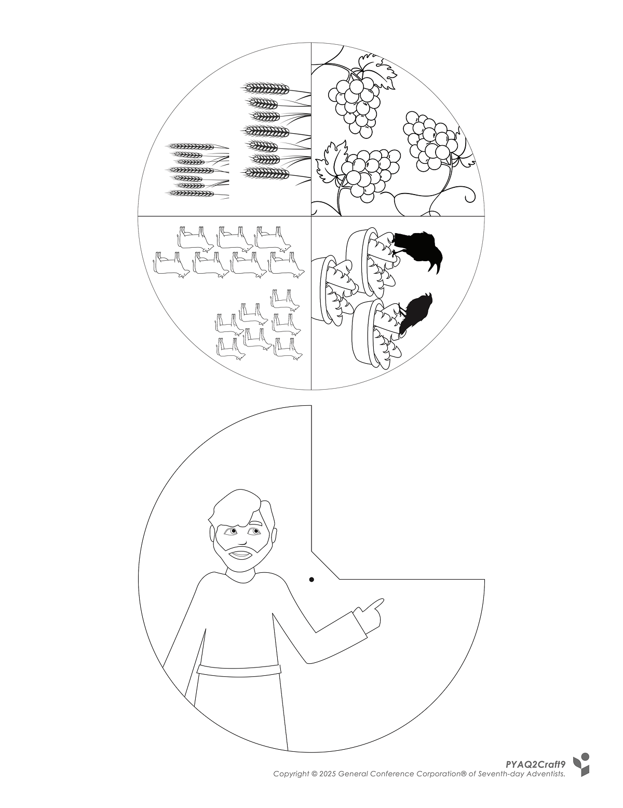
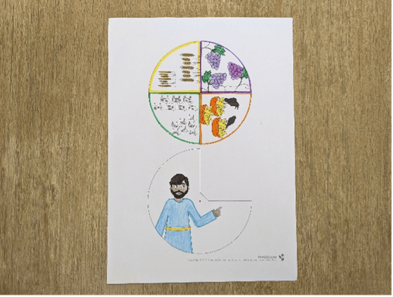
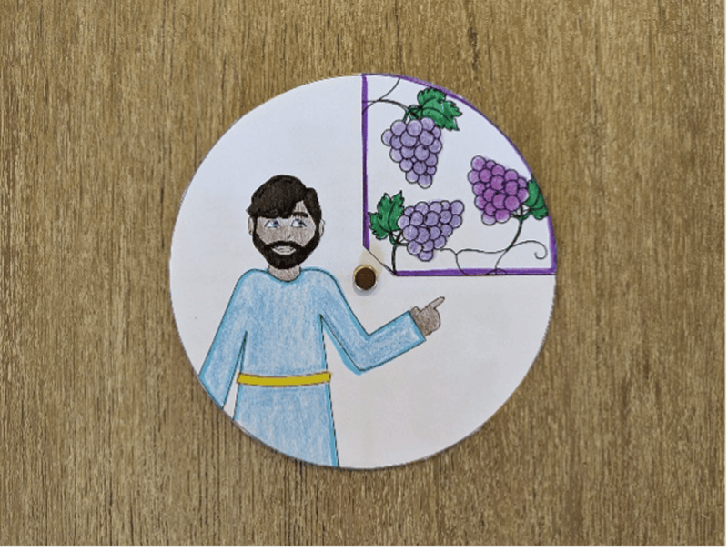
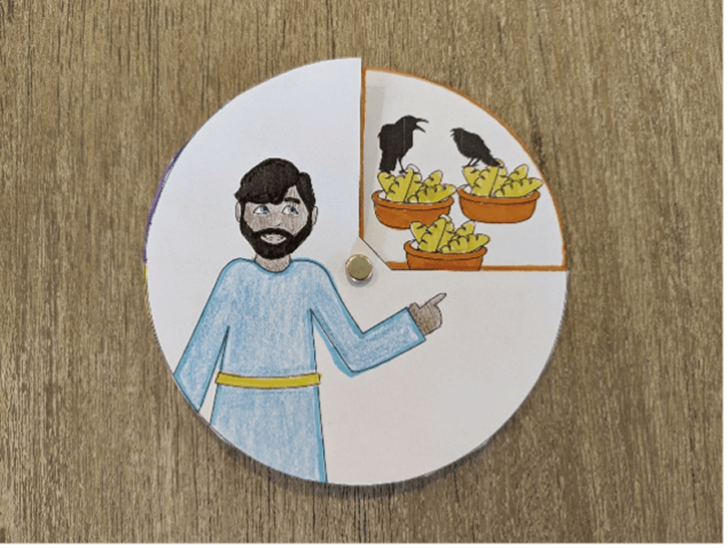

**What you need:**

Week 9 craft template, scissors, markers, a split pin.

{"style":{"image":{"aspectRatio":1.778}}}


```=Craft Template



```

**Instructions:**

- Color in the pictures.

{"style":{"image":{"aspectRatio":1.778}}}


- Cut out each circle.
- Place the Joseph circle on top of the other circle, then push a split pin through the middle to join them together.

{"style":{"image":{"aspectRatio":1.778}}}


{"style":{"image":{"aspectRatio":1.778}}}


- Show the spinner to a friend or family member and ask them to guess who had each dream and what its interpretation was.