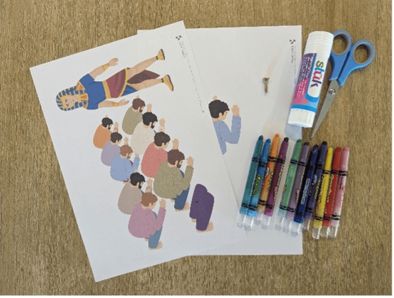
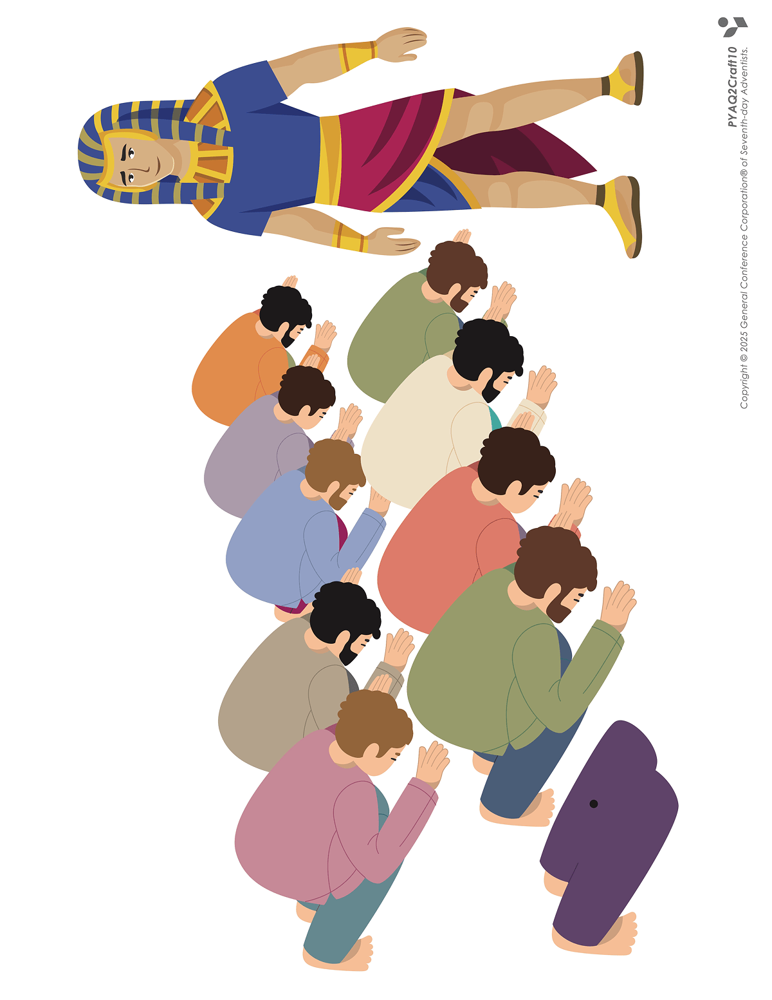
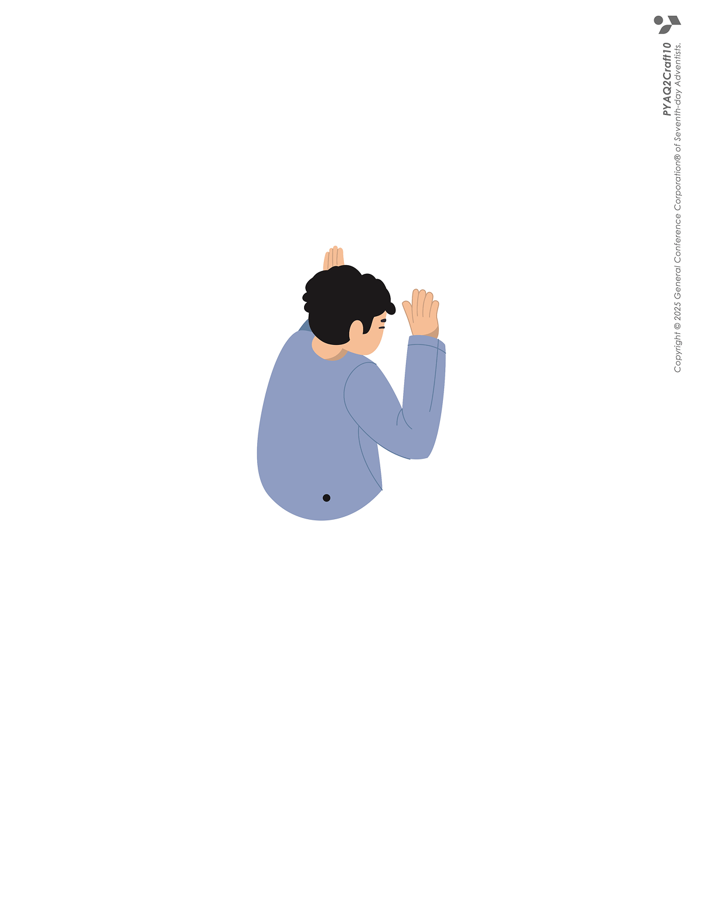
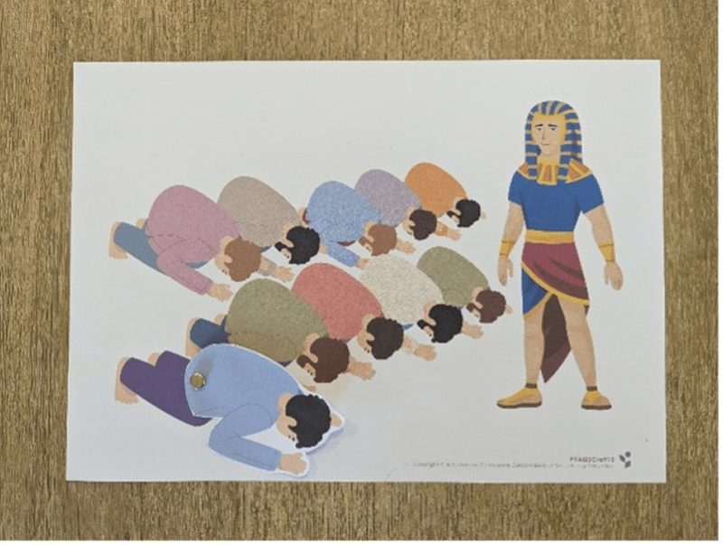
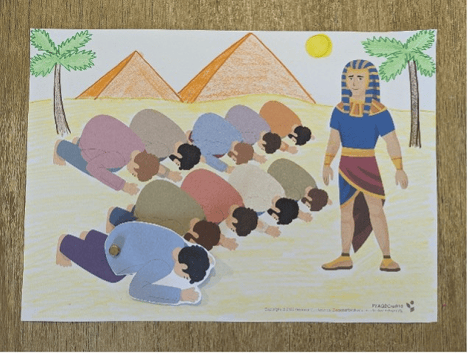

**What you need:**

Week 10 craft template, crayons, scissors, split pin.

{"style":{"image":{"aspectRatio":1.778}}}


```=Craft Template





```

**Instructions:**

- Cut out the bowing person on page 2.
- Line the dots up with the legs on page 1 and push a split-pin through to join them.

{"style":{"image":{"aspectRatio":1.778}}}


- Draw an Egyptian landscape in the background, such as a desert, pyramids, and palm trees.

{"style":{"image":{"aspectRatio":1.778}}}


- Move the person up and down to show how the brothers bowed to Joseph.