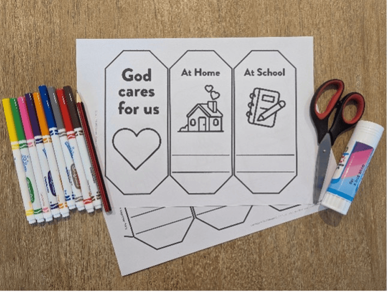
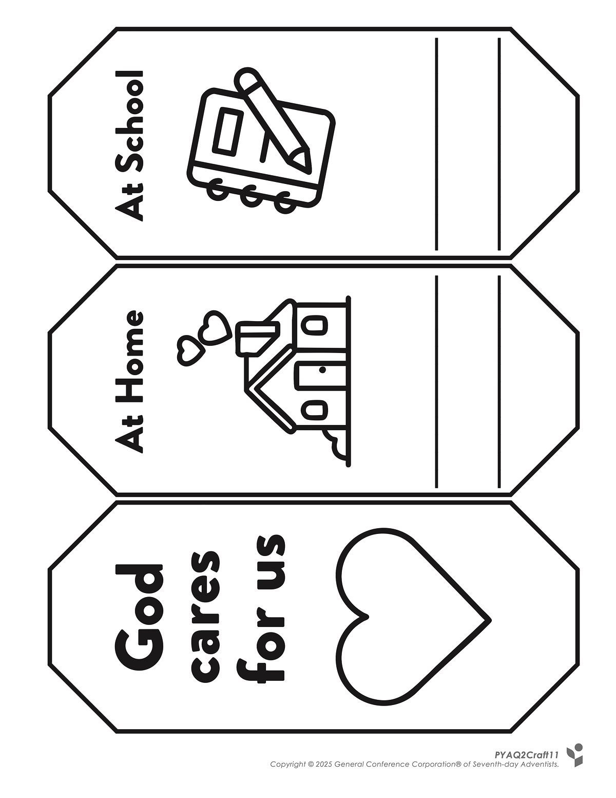
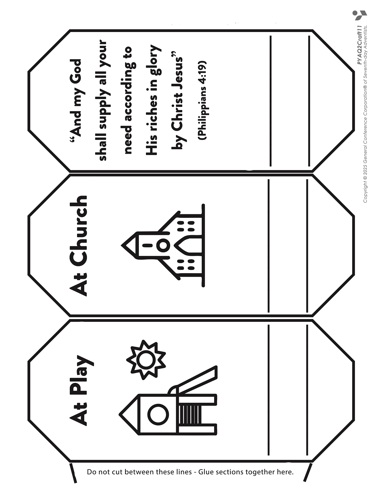
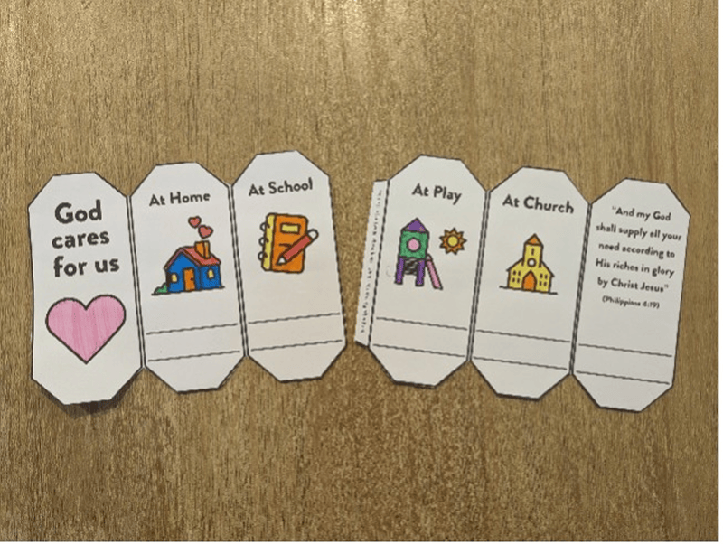
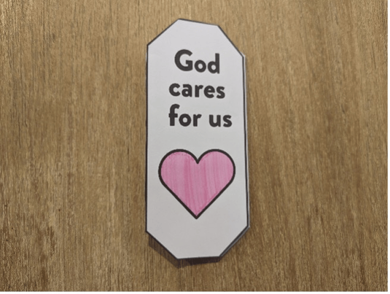
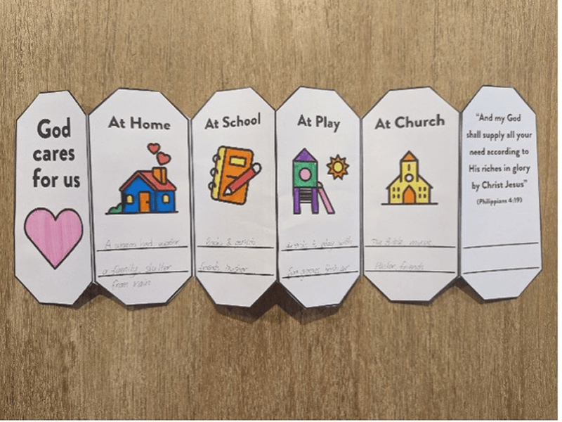

**What you need:**

Week 11 craft template, markers, scissors, glue.

{"style":{"image":{"aspectRatio":1.778}}}


```=Craft Template





```

**Instructions:**

- Color in the pictures and cut around the outside of each template. (Be careful not to cut in between each octagon.)

{"style":{"image":{"aspectRatio":1.778}}}


- Glue along the tab and stick the rows together.

{"style":{"image":{"aspectRatio":1.778}}}


- Fold along each vertical line back and forth like an accordion.

{"style":{"image":{"aspectRatio":1.778}}}


- Write the ways that God cares for you (at home, at school, etc.) on the lines provided.