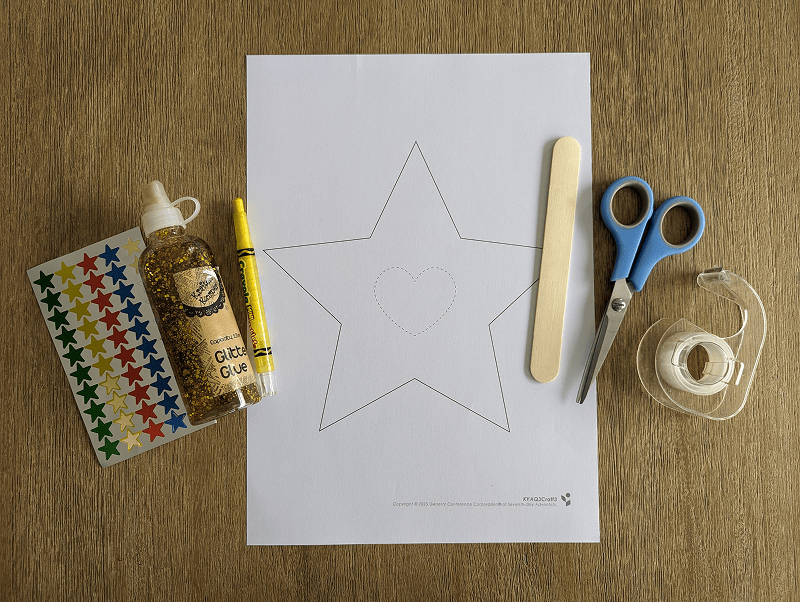
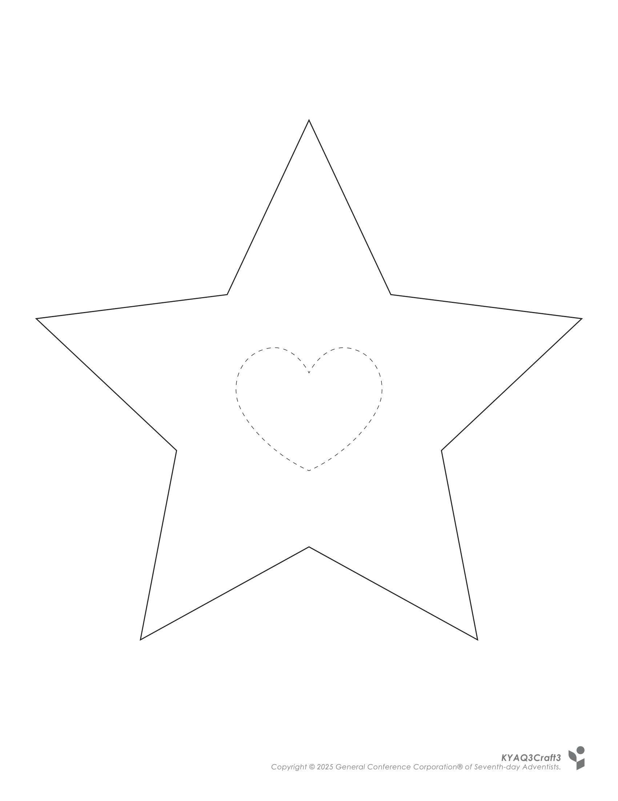
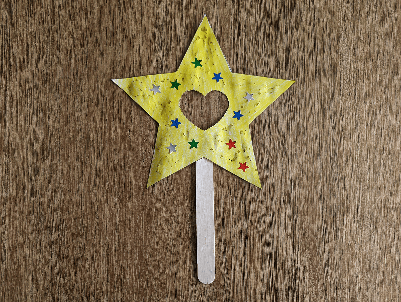

**What you need:**

Week 3 craft template, yellow crayon, scissors, star stickers, glitter glue, large craft stick, tape.

{"style":{"image":{"aspectRatio":1.778}}}


```=Craft Template



```

**Create it together:**

1\. Use a yellow crayon to color in the star, then cut out. An adult can cut out the heart shape in the middle.

{"style":{"image":{"aspectRatio":1.778}}}


2\. Decorate the star with stickers and glitter glue, then tape a large craft stick to the back.

{"style":{"image":{"aspectRatio":1.778}}}
