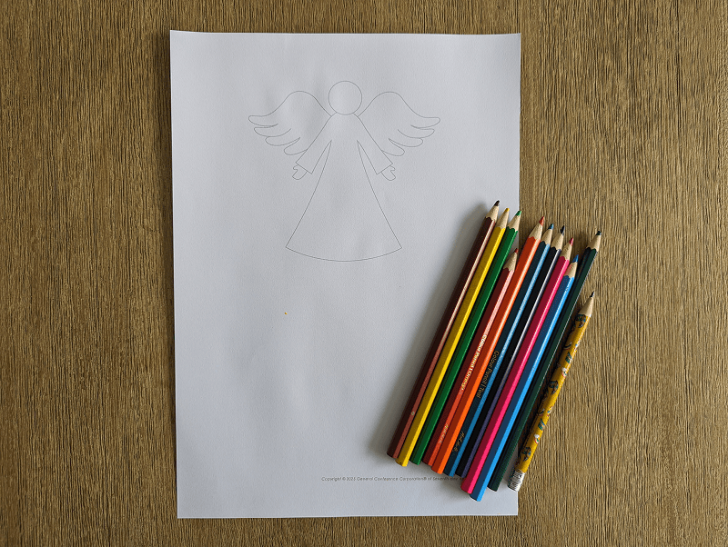
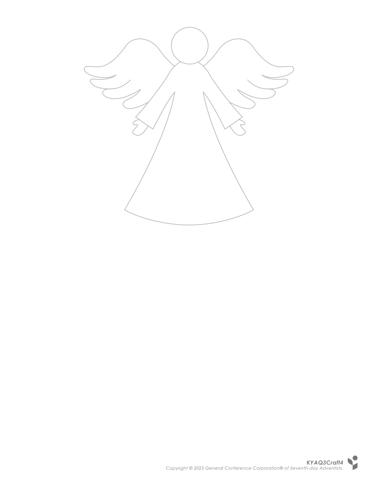
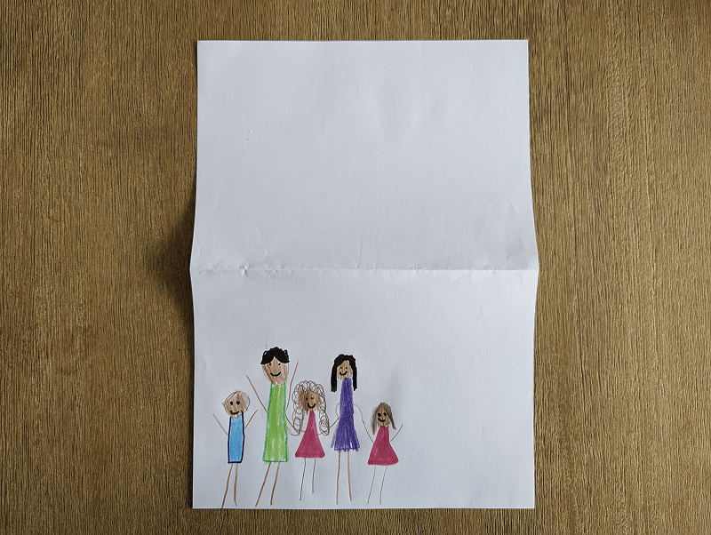
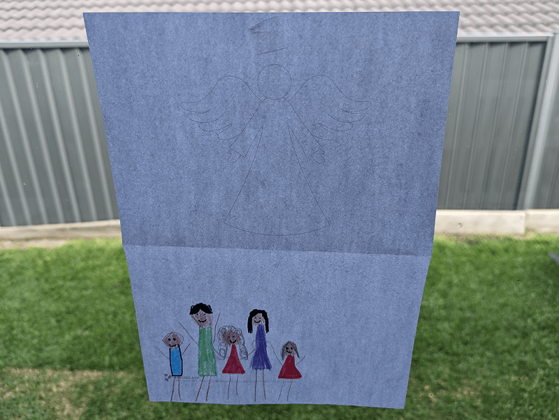

**What you need:**

Week 4 craft template, colored pencils.

{"style":{"image":{"aspectRatio":1.778}}}


```=Craft Template



```

**Create it together:**

1\. Fold the page in half (horizontally) and draw a picture of your family on the back of the page (in the lower half).

{"style":{"image":{"aspectRatio":1.778}}}


2\. Hold the page up to the light and see how the invisible angel is always watching over your family.

{"style":{"image":{"aspectRatio":1.778}}}
