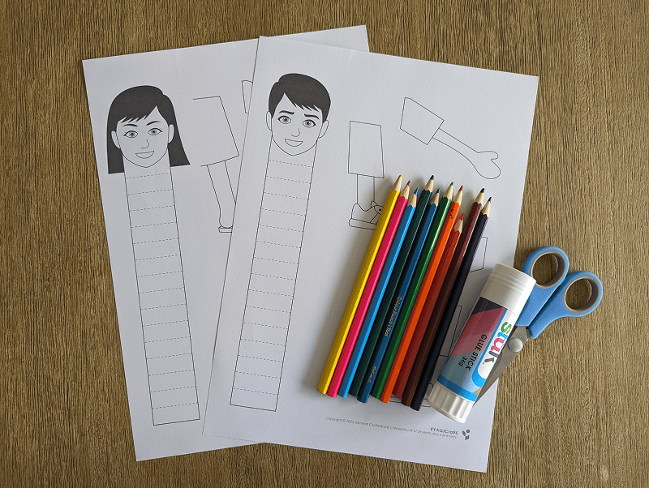
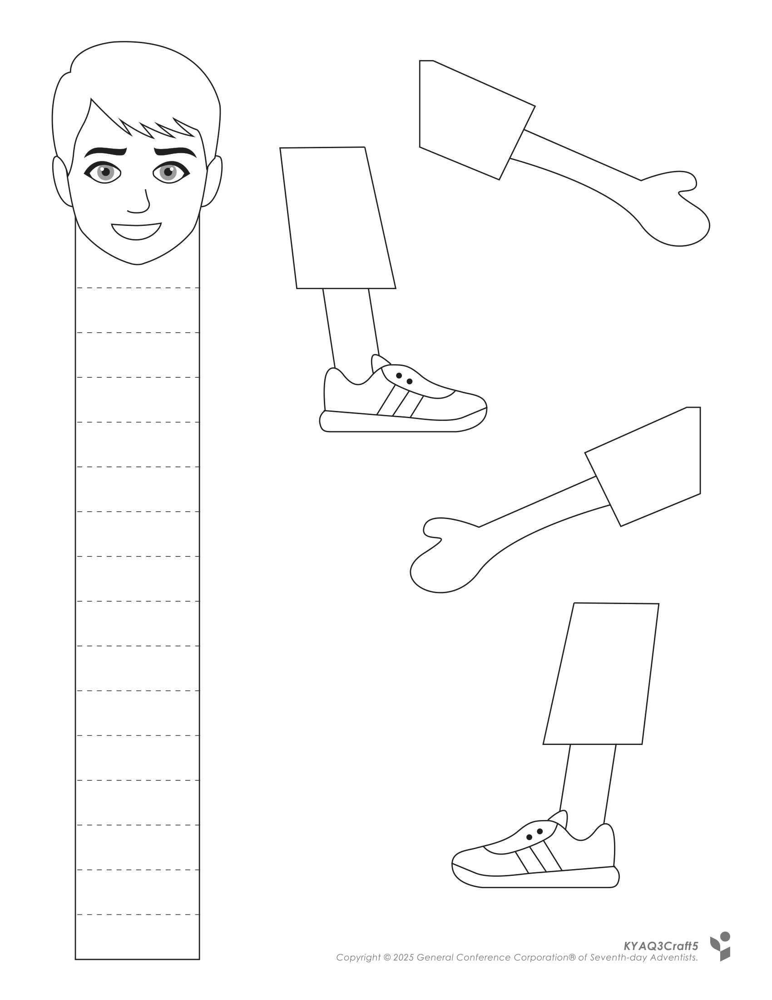
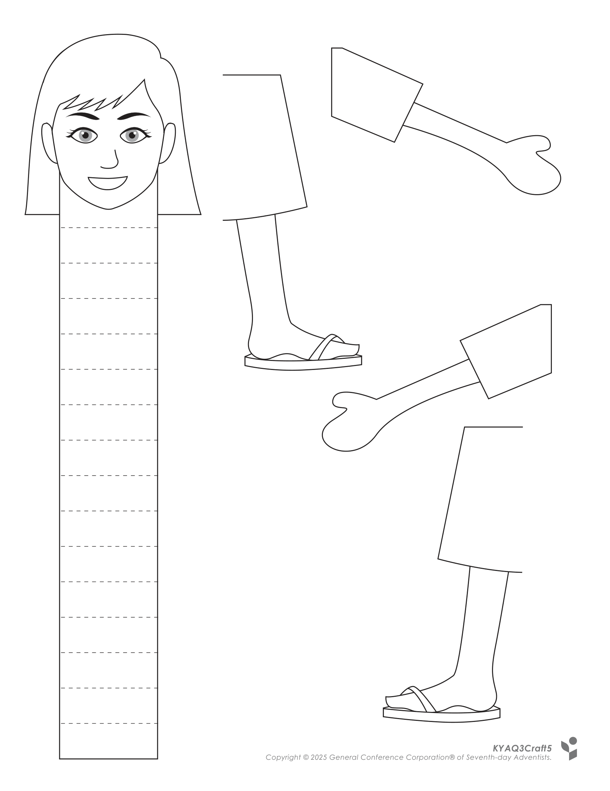
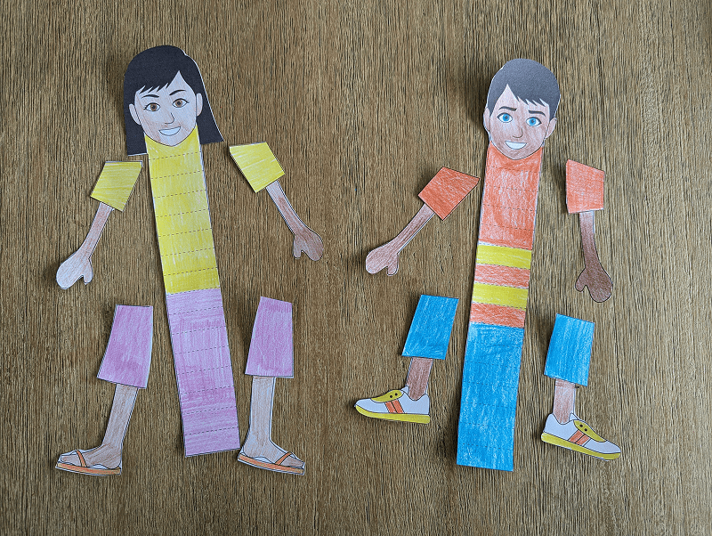
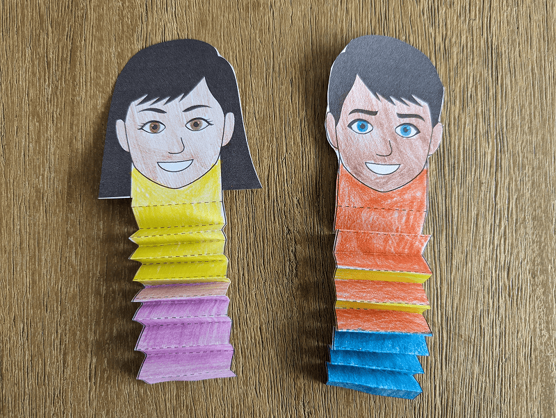
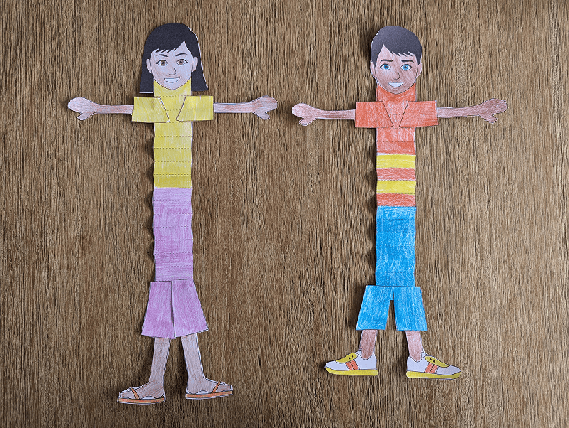
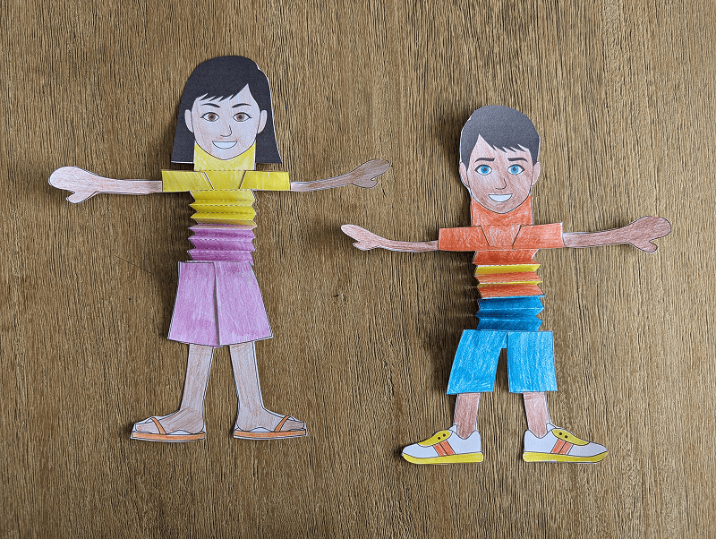

**What you need:**

Week 5 craft template, colored pencils, scissors, glue.

{"style":{"image":{"aspectRatio":1.778}}}


```=Craft Template





```

**Create it together:**

1\. Color in the boy or girl craft template and cut out.

{"style":{"image":{"aspectRatio":1.778}}}


2\. Fold the “body” back and forth like an accordion.

{"style":{"image":{"aspectRatio":1.778}}}


3\. Glue the legs and arms onto the “body”. (It may help to stretch it out first.) Make your person small and then stretch them tall to make them grow!

{"style":{"image":{"aspectRatio":1.778}}}


{"style":{"image":{"aspectRatio":1.778}}}
