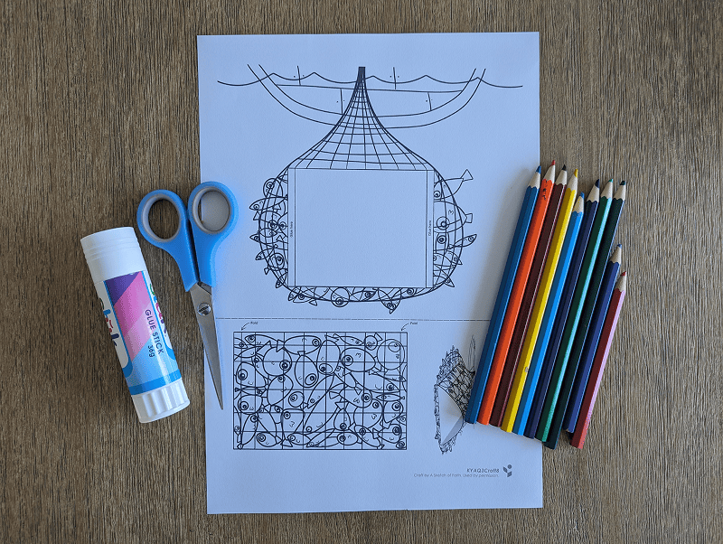
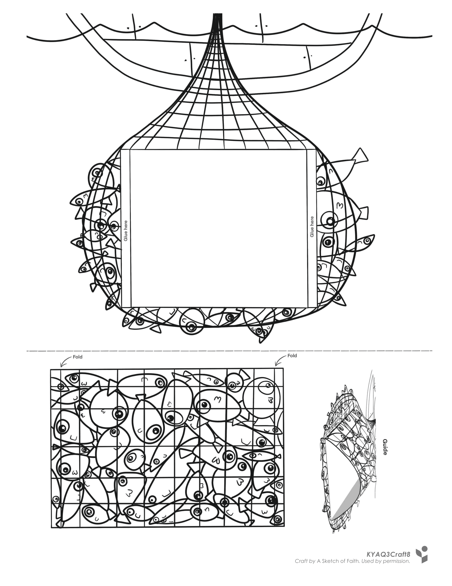
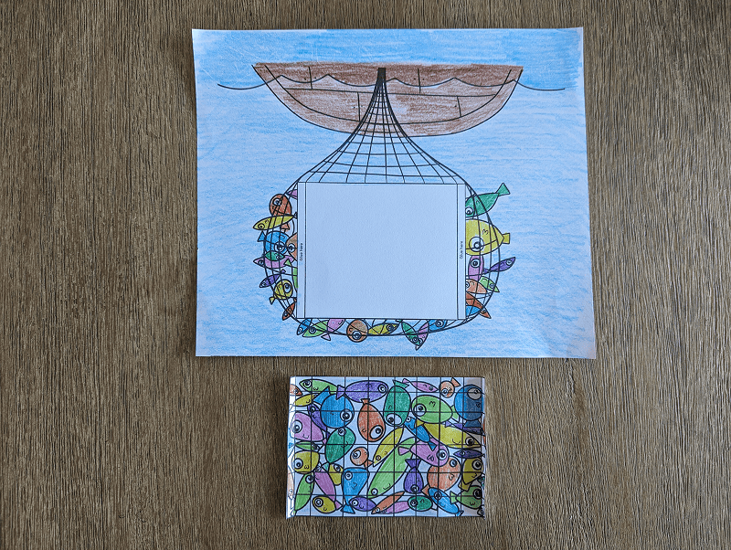

**What you need:**

Week 8 craft template, colored pencils, scissors, glue.

{"style":{"image":{"aspectRatio":1.778}}}


```=Craft Template



```

**Create it together:**

1\. Color in the craft template and cut out the net of fish.

{"style":{"image":{"aspectRatio":1.778}}}


2\. Fold the ends of the net rectangle and glue them to the page, making it bulge in the middle like a net full of fish.

{"style":{"image":{"aspectRatio":1.778}}}
