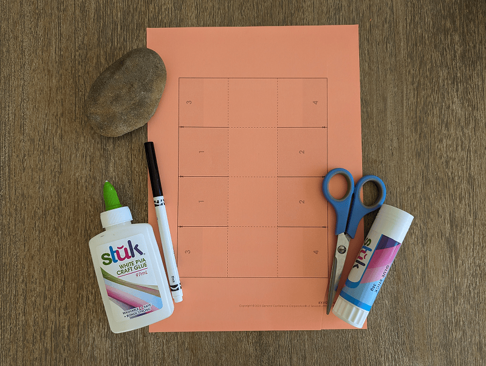
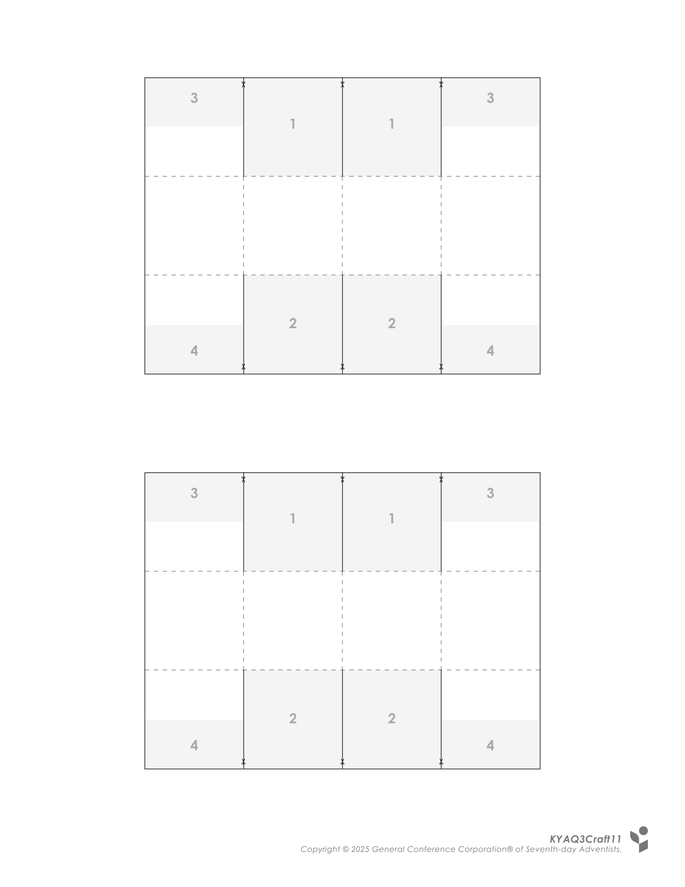
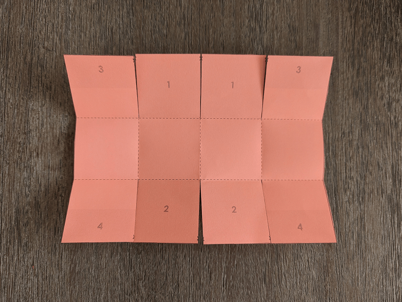
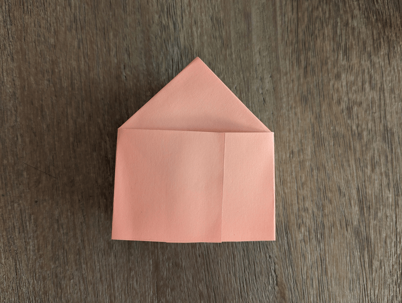
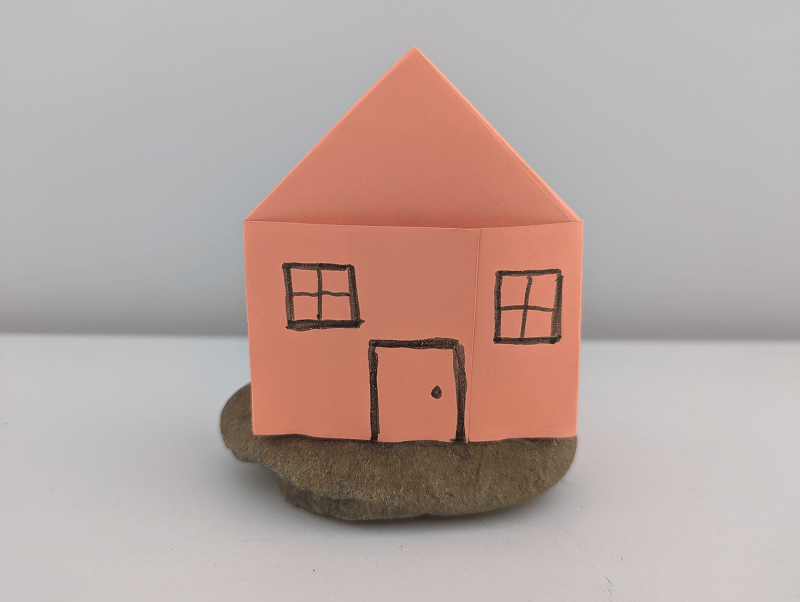

**What you need:**

Week 11 craft template on colored paper, scissors, glue stick, marker, craft glue, rock.

{"style":{"image":{"aspectRatio":1.778}}}


```=Craft Template



```

**Preparation instructions:**

- Collect medium-sized rocks.
- Cut out the house templates from the craft templates.

**Create it together:**

1\. Cut along the cutting lines, and fold along the dotted lines.

{"style":{"image":{"aspectRatio":1.778}}}


2\. Overlap the number 1 squares and glue together. Then overlap the number 2 squares and glue together. This will make the “roof” of the house.

3\. Overlap the number 3 sections (half of the squares) and glue together. Then overlap the number 4 sections and glue together.

{"style":{"image":{"aspectRatio":1.778}}}


4\. Use a marker to draw windows and a door on your little house. An adult can then help glue the base of the house to the rock using craft glue (optional).

{"style":{"image":{"aspectRatio":1.778}}}
