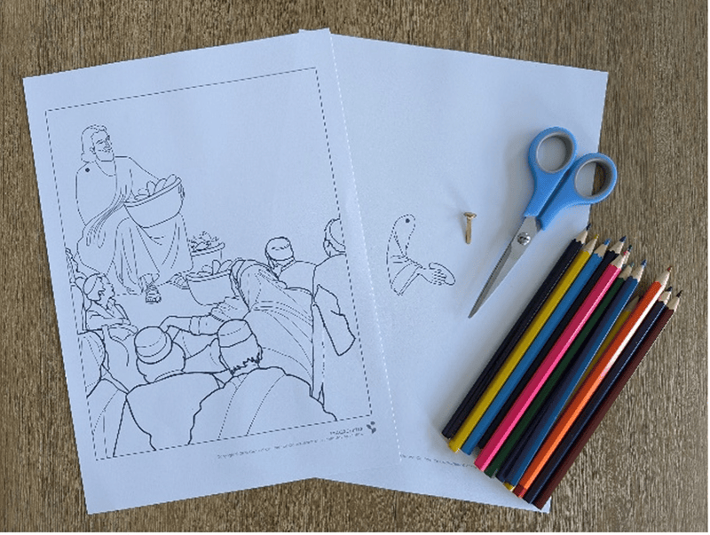
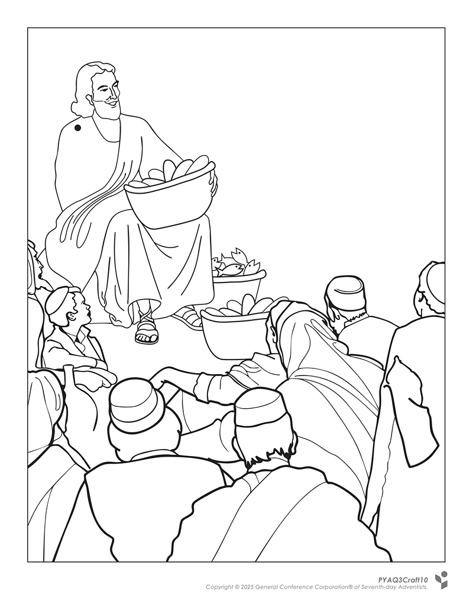
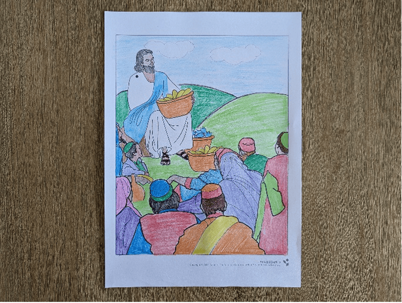
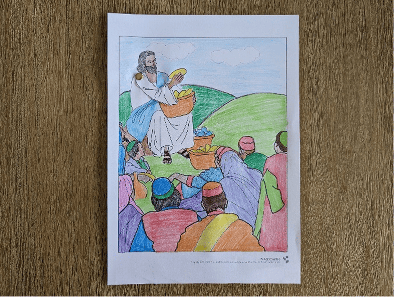

**What you need:**

Week 10 craft template, colored pencils, scissors, split pin.

{"style":{"image":{"aspectRatio":1.778}}}


```=Craft Template




```

**Instructions:**

1\. Color in the craft template.

{"style":{"image":{"aspectRatio":1.778}}}


2\. Cut out Jesus’ arm and line up the hole with the background. Push a split pin through to move Jesus’ arm as though He is handing out the loaves and fish.

{"style":{"image":{"aspectRatio":1.778}}}
