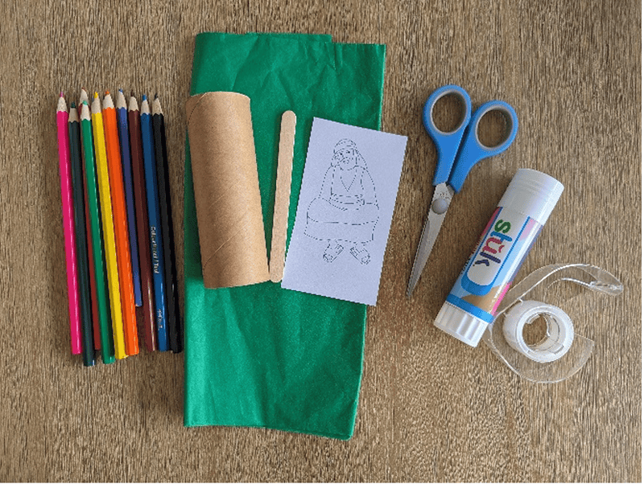
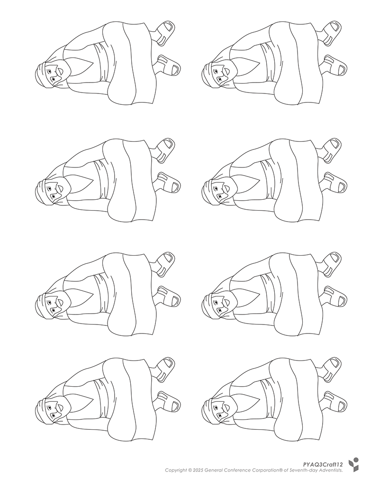
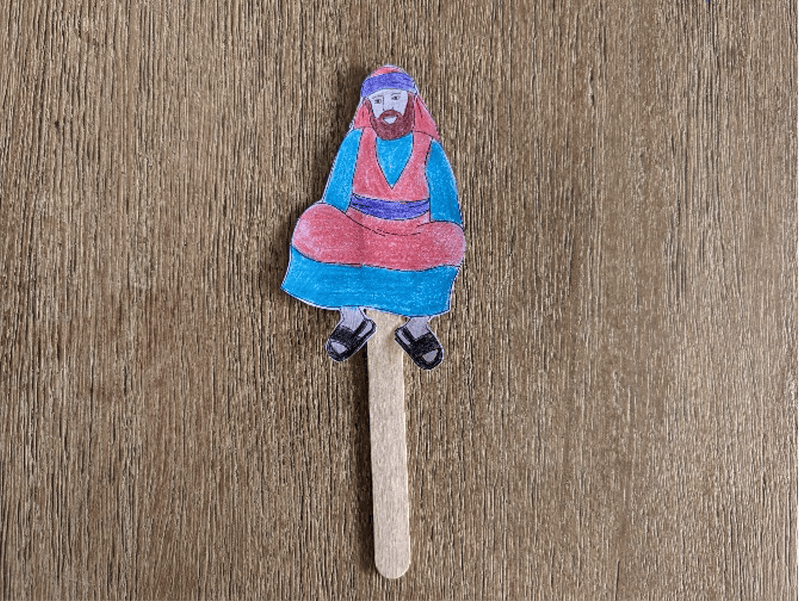
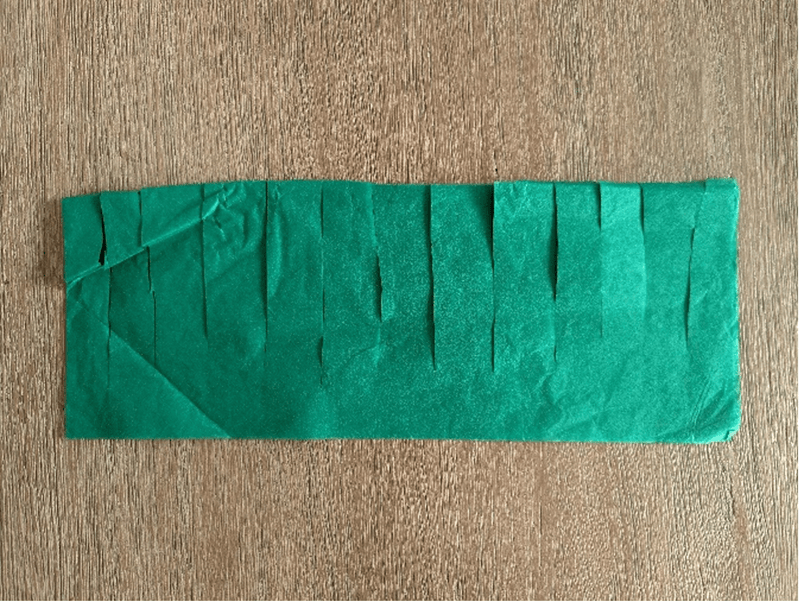
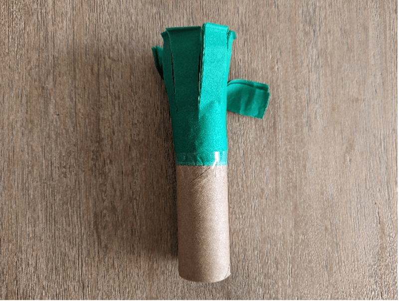
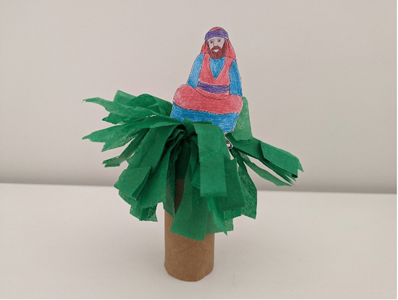

**What you need:**

Week 12 craft template, colored pencils, scissors, craft stick, tape, cardboard roll, green tissue paper.

{"style":{"image":{"aspectRatio":1.778}}}


```=Craft Template



```

**Instructions:**

1\. Color and cut out Zacchaeus and tape to a craft stick.

{"style":{"image":{"aspectRatio":1.778}}}


2\. Cut slits into a layered strip of green tissue paper.

{"style":{"image":{"aspectRatio":1.778}}}


3\. Wind the tissue paper around a cardboard roll and tape into place.

{"style":{"image":{"aspectRatio":1.778}}}


4\. Ruffle the tissue paper leaves and put Zacchaeus into the top of the “tree.”

{"style":{"image":{"aspectRatio":1.778}}}
