```=Week 1: Jesus Calms the Storm

**The Big Storm**

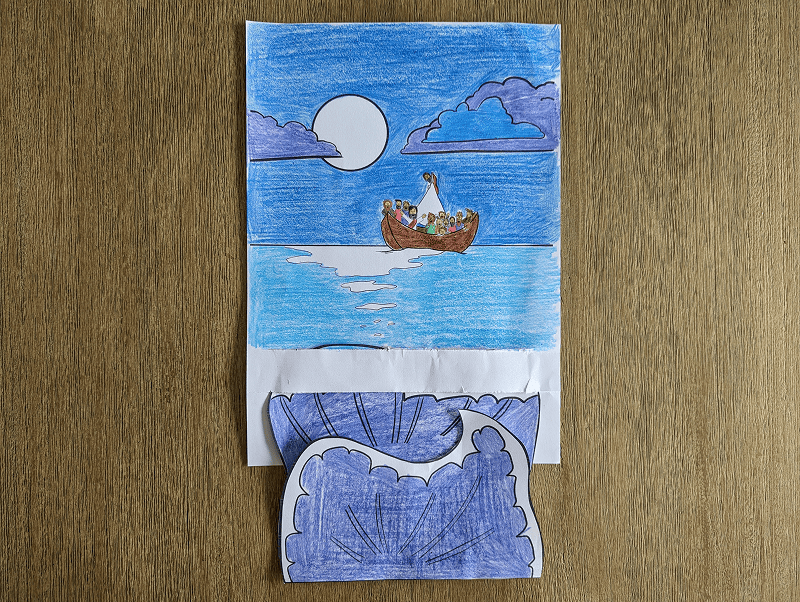

**Resources/supplies:** Week 1 craft template, colored pencils, scissors, glue.

```

```=Week 2: Healed from Afar

**The Nobleman’s Son**

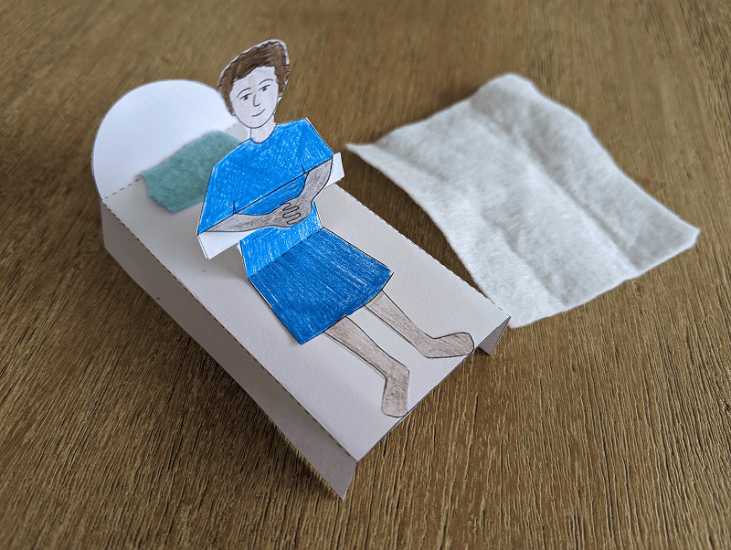

**Resources/supplies:** Week 2 craft template, colored pencils, scissors, glue, pieces of felt.

```

```=Week 3: The Man with Four Faith-Filled Friends

**A Hole in the Rooftop**

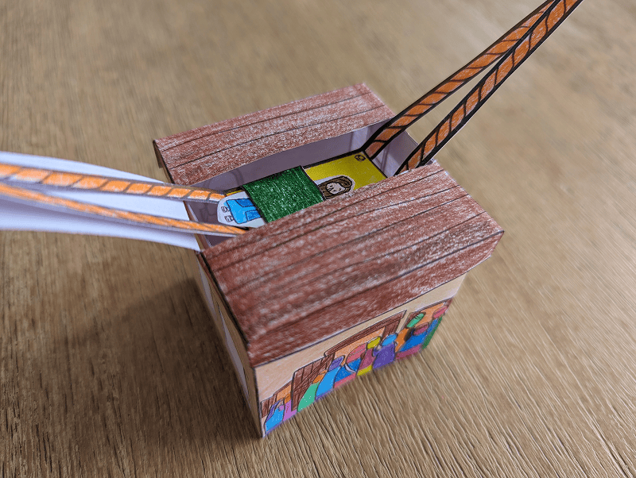

**Resources/supplies:** Week 3 craft template, colored pencils, scissors, glue.

```

```=Week 4: Jesus Walks on Water

**Jesus Saves Peter**

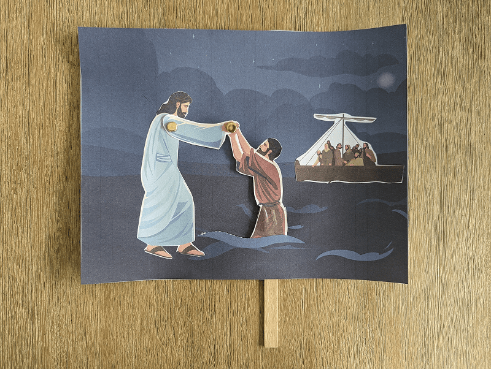

**Resources/supplies:** Week 4 craft template on cardstock, scissors, glue, craft knife (adults only), craft sticks, tape, sharp pencils, craft split pins.

```

```=Week 5: Jesus Shows Compassion

**The Blind Man Sees**

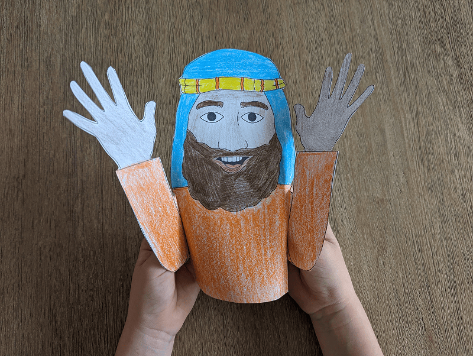

**Resources/supplies:** Week 5 craft template, colored pencils, scissors, glue.

```

```=Week 6: A Healing Touch

**Reach Out to Jesus Jack-in-the-box**

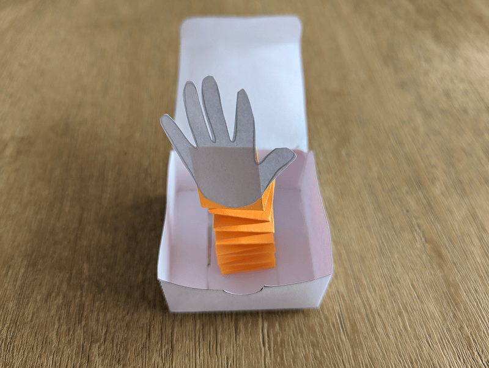

**Resources/supplies:** Week 6 craft template on cardstock, colored paper, black markers, scissors, glue.

```

```=Week 7: Jairus’ Daughter

**Jairus’ Daughter Pop-up**

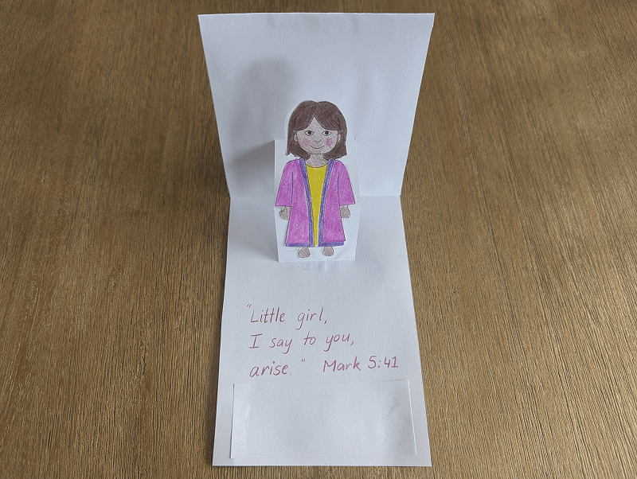

**Resources/supplies:** Week 7 craft template, scissors, patterned paper, colored pencils, glue.

```

```=Week 8: Sabbath Healings

**Sabbath Sticks**

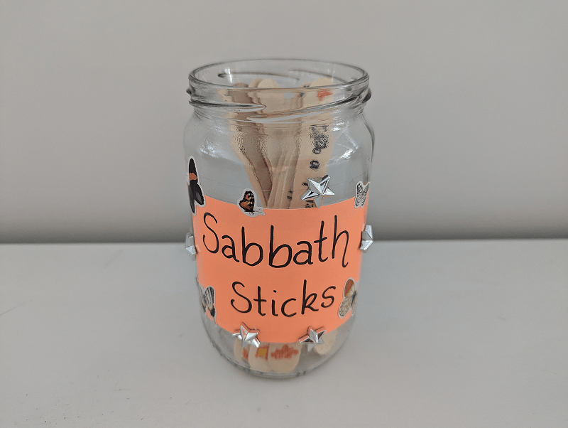

**Resources/supplies:** A jar (or disposable cup), large craft sticks, colored paper, scissors, tape, markers, stickers.

```

```=Week 9: Healed at the Pool of Bethesda

**Woven Mat**

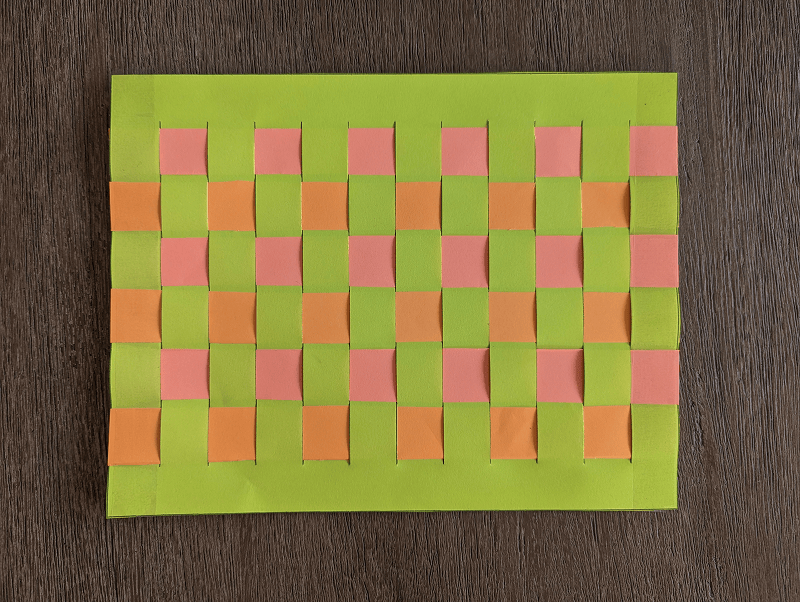

**Resources/supplies:** Week 9 craft template on colored paper, other colored pieces of paper, craft knife (adults only), scissors, tape.

```

```=Week 10: Blind Bartimaeus

**Blind Bartimaeus**

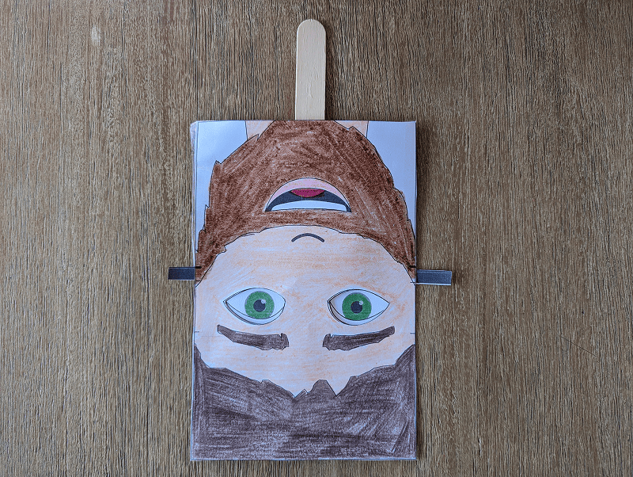

**Resources/supplies:** Week 10 craft template, colored pencils, scissors, large craft sticks, tape.

```

```=Week 11: The Centurion’s Servant

**Roman Shield**

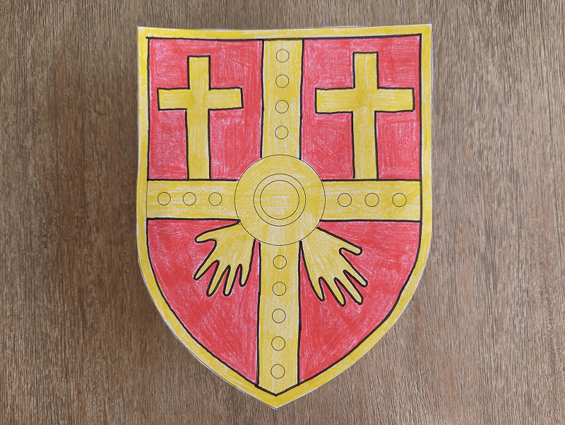

**Resources/supplies:** Week 11 craft template, pencils, colored pencils/markers, scissors, strip of cardboard, tape.

```

```=Week 12: Miracle in Nain

**Mosaic Comfort Card**

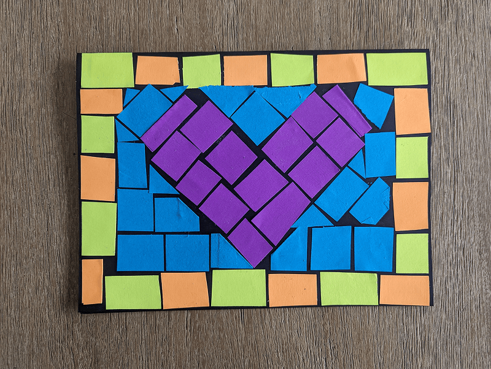

**Resources/supplies:** Black cardstock, white paper, pieces of colored paper, glue.

```

```=Week 13: “Lazarus, Come Out!”

**Lazarus and the Tomb**

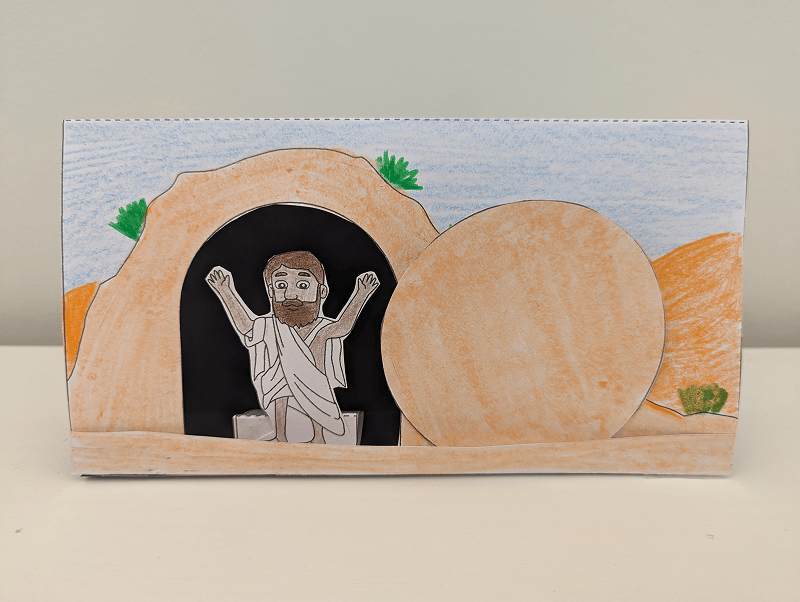

**Resources/supplies:** Week 13 craft template, colored pencils/markers, scissors, glue, black paper, tape.

```