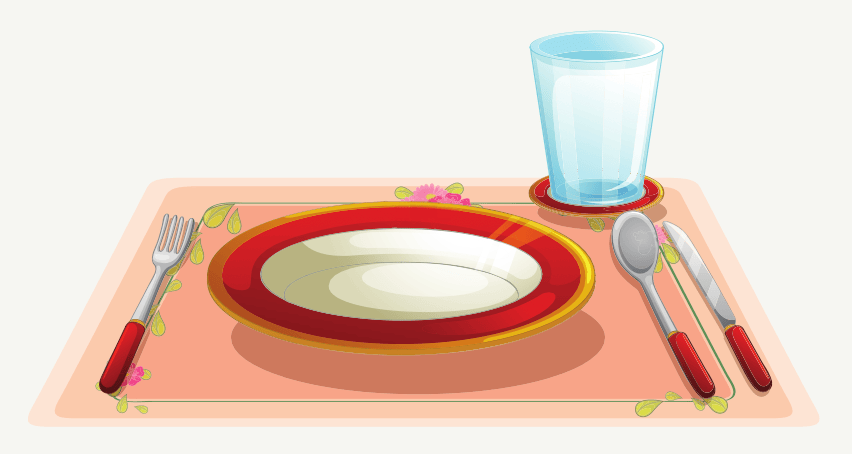

Soon it would be Katie and Kenny’s birthday! They planned ten kind things they could do for other people. Then they wrote a list of gifts they wanted for themselves. They climbed into Daddy’s lap and showed him their kindness plan and their wish lists.

Daddy grinned. “Oh, what long lists! Let me see...toys, more toys, and even more toys!” He read their lists out loud. “Which of these things do you really need?” Kenny needed to have a new watch so he knew when it was time to come home for dinner. Katie needed a new bicycle because her old one was too small for her. Daddy nodded “You’ve both made good choices! Let’s see what happens on your birthday!”

“When I was your age, my family was very poor,” Mommy said. “All I had for my birthday was a warm sweater. At first I was disappointed. But it was a very cold winter, and I was very glad to have a good sweater for school, because I could play outside with my friends.”

Daddy opened his Bible to the Lord’s Prayer. “Jesus taught us to pray, ‘Give us this day our daily bread.’ God gives us all the basic things we need to keep us alive and well for one day at a time. And that’s enough. He already knows everything we need and every good gift we have comes from Him, because He loves us.”

“Even bicycles and watches?” asked Kenny.

“Yes, everything that we give you comes from God! He gives me the energy to work and earn money to look after you!” Daddy smiled.

“That’s why we thank God for our food when we sit down to eat,” said Mommy. “It reminds us that God cares for us every single day.” She picked up a box. “Who wants to help me fill this box with food for the new family in our church? Their daddy doesn’t have any work yet. Perhaps we’ll be an answer to their prayers today!”

### Let’s do this!

- Create a set of placemats or cards for your dinner table. Write on them your favorite prayers of thanks for the food.

- Make a food parcel to take to a family who might need food today. Be an answer to their prayer for daily bread.

### Let’s Pray

- Discover different prayers of thanks for food from around the world.
- Make a list of all the things God has done today to keep you alive and healthy. Think about every minute you slept, every breath you took, and every beat of your heart. Then thank Him for everything you have listed. Each one of them is a gift of love from our Father God.