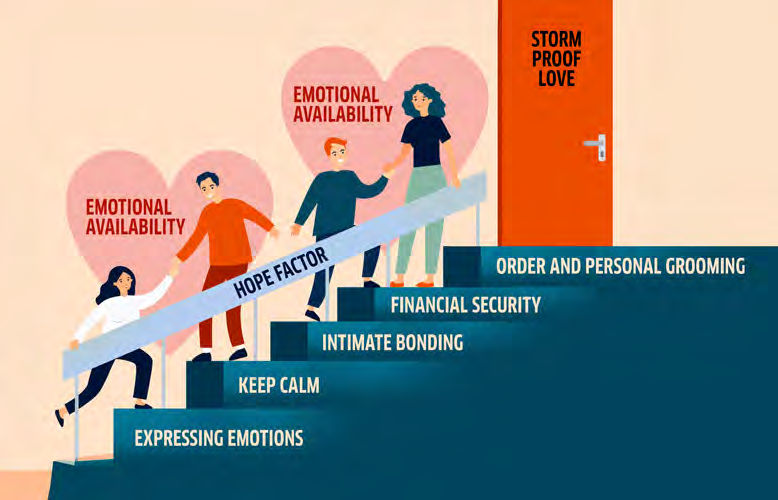

_By Gabor Mihalec_

Since 2020, our lives have undergone significant changes. Initially, we thought the pandemic posed only a health and economic threat, but since then, we’ve come to realize it has also severely strained our relationships. Couple therapists are busier than ever before, and internationally, divorce rates have surged. Domestic abuse has become rampant in many places, prompting the UN to classify it as a “shadow pandemic” alongside COVID-19. This was followed by the Russian- Ukrainian conflict and a subsequent surge in inflation, energy crisis, uncertainty, and threat. It’s no wonder families and relationships feel more burdened than in previous decades.

What sets apart those couples and families who have buckled under the pressure of recent years, drifting towards dissolution or even breaking apart, from those who have managed to grow steadily, even amidst crises? This was the question I posed during the first wave of lockdowns when I sought answers through a survey of 1,300 participants. We analyzed nearly 100,000 data points to find precise answers and provide tools for couples and families to thrive. We identified the differences between the two groups in 7 key points, all of which are learnable!

The findings of this research are summarized in the book “Storm Proof Love,” (Mihalec, 2021), which I wrote with a focus on making each chapter equivalent to a 1.5-hour seminar, suitable for in-person or online delivery. The chapters end with exercises to enhance interactivity, which are conducted with participating couples during the seminar.

### 1. Expressing Emotions

Couples whose relationships strengthened during times of crisis were skilled at involving each other in their emotional world. Even if they experienced negative emotions (fear, uncertainty, sadness), expressing them brought them closer together because it elicited empathy in the other person.

in tense situations, arguing and rational communication create distance. It gives the impression that we are not important to the other person. However, emotions bring people closer together. When we start talking to our partner about our emotions, it evokes trust, creates empathy, and bridges the gap. The physical distance between two people begins to narrow, their voices become quieter, and a confidential atmosphere is established between them.

But how do we talk about our emotions if no one has taught us how? The technique of sports commentary can be very helpful in mastering the expression of emotions. Sports commentators have a fantastic ability to make us see what is happening on the field through verbal communication alone, while we are traveling in a car and only see the asphalt. Imagine that the emotional storm raging within us is a football match in our hearts, and the emotions are the players. Let’s start by naming the players on the field (labeling emotions)! Instead of Ronaldo, let’s say there is anger; instead of Messi, there is fear, and instead of Szoboszlai, there is hope. Once we have identified all the players on the field, let’s say who is moving where and what they are doing. For example, anger pushes forward aggressively. Fear is running alongside. But opposite them, there is hope; although it’s running slowly and weakly, at least it’s on the field.

Once you have become proficient in emotional broadcasting as a sports commentator, it’s time for the next step. Now, move from the commentator’s seat to the coach’s seat, and don’t just observe what’s happening on the field; be the ones who determine what happens on the field! Instead of being observers, let’s become the directors of our emotional lives and regain control over our emotions!

### 2. Keep Calm Even in Challenging Situations

Couples who thrive under pressure take responsibility for their own tension and process it within themselves rather than projecting it onto each other.

Have you ever noticed how quickly we can switch from being angry to being kind when, for example, our phone rings in the middle of scolding our child? Just as we can be kind to strangers and not let ourselves get carried away with angry behavior towards them, we should also speak calmly and kindly to our loved ones!

This is something that pet care books also teach us. Cesar Millan’s description of why some dogs become uncontrollably disobedient around their owners is enlightening. The solution lies in a behavior, or perhaps an attitude, which Millan calls “calm confidence.” “A dog can express dominance over another simply by moving calmly and assertively and by claiming space. [...] on the other hand, humans use words and rely on them in dialogue and written communication.

Because of our intellectual capacity for speech, we easily lose touch with our own energy and have no idea what we are conveying to the world. [...] to be a successful pack leader - and generally a successful human being - you need to be able to pay attention to your energy and learn to adjust it when you are not in a calm and confident state of mind” (Millan, 2010).

Self-soothing is a learnable skill! It’s not about being naturally fiery or calm, but about what behavioral patterns we have reinforced within ourselves over the years. and if we’re capable of exploding, then we’re capable of extinguishing the fire too.

### 3. Intimate Bonding

Stress affects our sexuality in various ways. For some, it increases their appetite, while others completely lose interest in intimacy. This change often leads in two different directions within a relationship. Strong couples understand how stress affects their own and their partner’s sexual experiences, and they strive to create intimate moments, even in changed circumstances, where they can express tenderness towards each other.

So, let’s pause for a moment and think back to a difficult, emotionally taxing moment. What would you have done if your partner had approached you sexually at that time? Perhaps this actually happened, so it’ll be easy to recall. Did you welcome the approach and feel relieved? Or did it make you even more tense, causing you to turn away from your spouse? This can already help you determine how stress affects your sexual appetite. Whatever the deviation from normal mode, this reaction is completely healthy, a normal human response to stress. However, it can be very frustrating and often deeply hurtful when a husband’s libido goes up while his wife’s goes down. (By the way, this is the average tendency, but the reverse also exists.)

Understanding from the partner who has lost their sexual appetite towards the sexually active partner is crucial in such situations. If you know what sex means to your partner on deeper levels, you can handle their approach in a way that provides intimacy without having to engage in intercourse. If you say to them, “I can’t believe it! Seriously, you’re only thinking about sex at a time like this? Just leave me alone. Can’t you see I’m not in the mood?” This will surely drive a wedge between you two. But you could also say, “Honey, I can see that you would really enjoy being intimate right now, and I would too if we weren’t in this situation. But I wouldn’t be able to relax right now. However, you need to know that you’re very important to me, and I’m glad you’re my husband.” After such a response, the couple’s strong bond remains intact without engaging in intercourse.

### 4. Financial Security

During crises, tension often prevails in families living from one month to the next. in contrast, households that have made reserves tend to have a calmer and more loving atmosphere.

Every economic unit should have reserves equivalent to at least three, preferably six months’ worth of operating expenses. This means that if the inward cash flow is cut off tomorrow, the given economic unit would still be able to operate for six months. Since the family is also an economic unit, it should have at least this much savings available.

When I talk about this at a seminar, someone usually remarks, “It’s easy to save if you have something to save from.” If our family’s financial security is important to us, then we should quickly erase this kind of argument from our minds! No one will take financial responsibility for our family if we don’t! This is a responsibility that cannot be delegated in any direction. and savings are not dependent on income but primarily on mindset!

The famous relationship researcher David Olson aptly notes: “Economic hardship and problems in couple and family relationships are often related. Researchers have found that divorce, marital separation, domestic violence, and the abuse of alcohol and other drugs are more likely among people with low incomes than in any other socioeconomic group [...]. Earning an adequate income and managing money effectively are important for a couple’s and a family’s well-being. If they have enough money to meet their basic needs, couples and families can focus on enhancing the quality of their lives and relationships” (Olson, 2006).

Our own research has supported this observation. There was a clear correlation between lack of savings and higher alcohol consumption, and the emergence of physical violence.

A family budget plan is an excellent tool for this process. There are many definitions of a budget, but the one I like best is budgeting, which means telling your money where to go instead of wondering where it went at the end of the month.

### 5. Order and Personal Grooming

When faced with something we cannot control, we can better cope with it by starting to control what we do have power over.

Many studies examining resilience in difficult times have overlooked this factor. Still, we discovered that couples who maintained order in their homes during quarantine, didn’t neglect their personal grooming, dressed nicely, and took care of their bodies even during home-office hours were in much better relationships with each other than those where disorder prevailed. Home, where disorder prevailed, revealed couples who wandered around the house with five-day- old stubble, mustard-stained tank tops and spent their days watching series until 2 a.m., then were non-functional until 11 a.m. the next morning.

Interestingly, drug prevention programs targeting children have also drawn attention to this phenomenon. Children who keep their rooms tidy are much less likely to turn to drugs or alcohol as teenagers and are better able to resist peer pressure. The main message is: “Keep order around you! An orderly environment results in orderly thinking, and those who think orderly resist pressure and temptation!” (Mfune, 2016).

We couldn’t choose to have a pandemic, war, or other measures affecting us. But we can decide whether to clean up, shave, and follow a routine in difficult situations.

### 6. Emotional Availability

While the previous five steps are very practical, the last two are more about factors that determine the atmosphere, the climate of the relationship, and the long-term result of repeated decisions.

You’ve surely noticed that every home has its own air and climate. When we enter a stranger’s house, we inhale the air and feel whether fear, respect, or love reigns there. Strong couples are emotionally available to each other. Emotional availability means that the parties can emotionally connect, be touched by what happens to the other (they can cry and laugh together), and rely on each other’s active support in times of trouble.

We are creatures designed for attachment! Our brains are wired to need the closeness, touch, and comfort of other people. As far back as the 1700s, it was observed that children in orphanages who received all physical care but did not have their deep need for attachment fulfilled, died of sadness. in the 1940s, children left alone in hospitals were said to fall into a state of “debilitating grief.” It has become generally accepted that children need the touch of a loved one’s secure emotional attachment. However, for a long time, it was thought that adults outgrow this emotional dependence. Those who remain dependent on others as adults, needing protection, closeness, and love, were labeled weak, immature, codependent, undifferentiated, symbiotic, and fused, even in psychology. They even idealized those who were sovereign, independent, and autonomous. Think of James Bond or the heroes of the Marvel and DC universes (Batman, Spider-Man, Thor, Superman, etc.). They are all cool, emotionally unapproachable, one-man armies. Maximum efficiency, minimal emotional expression. However, if we take a closer look at them, we find that most of them experienced severe emotional traumas in their childhoods (Batman witnesses his parents’ murder in a dark alley; Spider-Man becomes an orphan and is raised in his uncle and aunt’s house, his favorite uncle Ben dies in his arms; Superman is the sole survivor of his race and is sent to Earth...), and as adults, they are unable to commit, have no normal relationships, and have no children.

The paradigm shift was brought about by a psychologist named John Bowlby, who extended attachment theory from childhood to adulthood. in contrast to the previous position, Bowlby spoke of “effective dependence” and that one sign and source of strength is our ability to turn to others for emotional support ‘from the cradle to the grave. This idea was further developed by the late Sue Johnson, who completely rephrased everything we thought about love. Thanks to her work we now know that love is actually the most irresistible survival mechanism of the human species. Not because it prompts but because love compels us to emotionally bond with those few, most valuable people who provide us with a safe haven amidst life’s storms. Love is the fortress whose purpose is to provide us with emotional protection so that we can cope with the vicissitudes of existence. The need for emotional attachment is coded into our genes and our bodies. It is just as fundamental to health and happiness as the need for food, physical safety, and sex (Johnson, 2016).

### 7. Hope Factor

As a pastor and couples therapist, perhaps this was the most exciting part of the research for me. Is there any connection between faith, spirituality, and whether a relationship progresses or declines in crisis? The numbers convincingly confirm that spirituality is an important component of relationship resilience, the ability to cope with difficulties. It is also clear that couples who live out their faith together (spiritually compatible) are more likely to be on a path of growth than those who do not engage in any religious life or do not live it in harmony with each other (spiritually incompatible couples). Depending on our personal attitude, faith can be a resource in a relationship, but it can also be a serious source of conflict. in the case of couples on a growing path, faith tends to be more of a resource.

The research has highlighted the significant role of shared faith in coping with difficulties. Strong couples not only rely on each other but also on their shared faith. Their source of strength is beyond visible reality. This provides them with peace and hope, opening up new solutions that were previously unseen. The crisis is also a test of faith, showing whether we followed something out of habit or formality or whether we truly identified with it deep inside.

The following table shows how the respondents answered questions related to faith. The percentage indicates the proportion of respondents who agreed with the statement.

| Statement | Developing Couples | Declining Couples |
| --- | --- | --- |
| I am satisfied with how we practice our faith. | 64% | 37% |
| in difficult times, we can rely on our faith. | 73% | 50% |
| Our shared faith brings us closer to each other. | 63% | 23% |
| The differences between our faith values cause tension in our relationship. | 6% | 16% |
| For us, faith is more a personal experience than a religious formality. | 73% | 49% |

Perhaps not everyone knows what to make of the term “faith” or “spirituality” in a secular context, so I like to define it as the “Hope Factor.” Just as mentors search for the X-factor in talent shows, we can also look for the Hope Factor in difficult situations. Those who possess the Hope Factor see beyond the challenges and are able to grasp onto things that are not immediately visible.

We can summarize the seven factors as follows:

### Storm-resilient Training Plan

We’ve looked at the seven secrets of storm-resistant family and love relationships, and now the question remains: How can you make your relationship storm-resistant too? I like to imagine this as a barrel with seven staves, each representing one of the seven factors listed and each of varying lengths. What determines how much water the barrel can hold? The answer is very simple: The water will spill out at the lowest stave (Schwarz, 1996). Therefore, we must recognize the weakest point of our relationship and develop it so that the imaginary barrel can hold as much water as possible, meaning our relationship becomes as storm-resistant as possible.

#### References

Johnson, S., & Sanderfer, K. (2016). Created for connection: The "Hold Me Tight" guide for Christian couples. Little, Brown and Company.

Mihalec, G. (2021). Storm proof love. Autumn House Publications.

Millan, C. (2010). How to raise the perfect dog (pp. 58–59). Hodder & Stoughton. (Page numbers are taken from the

Hungarian edition.)

Mfune, S. S. (2016). Say NO to drugs. Pacific Press.

Olson, D. H., & DeFrain, J. (2006). Marriages & families: Intimacy, diversity, and strengths (p. 215). McGraw Hill.

Schwarz, C. A. (1996). Natural church development: A guide to eight essential qualities of healthy churches. Churchsmart Resources.

_Gabor Mihalec, PhD is the Director of the Department of Family Ministries at the Hungarian Union Conference of Seventh-day Adventists in Pecel, Hungary._