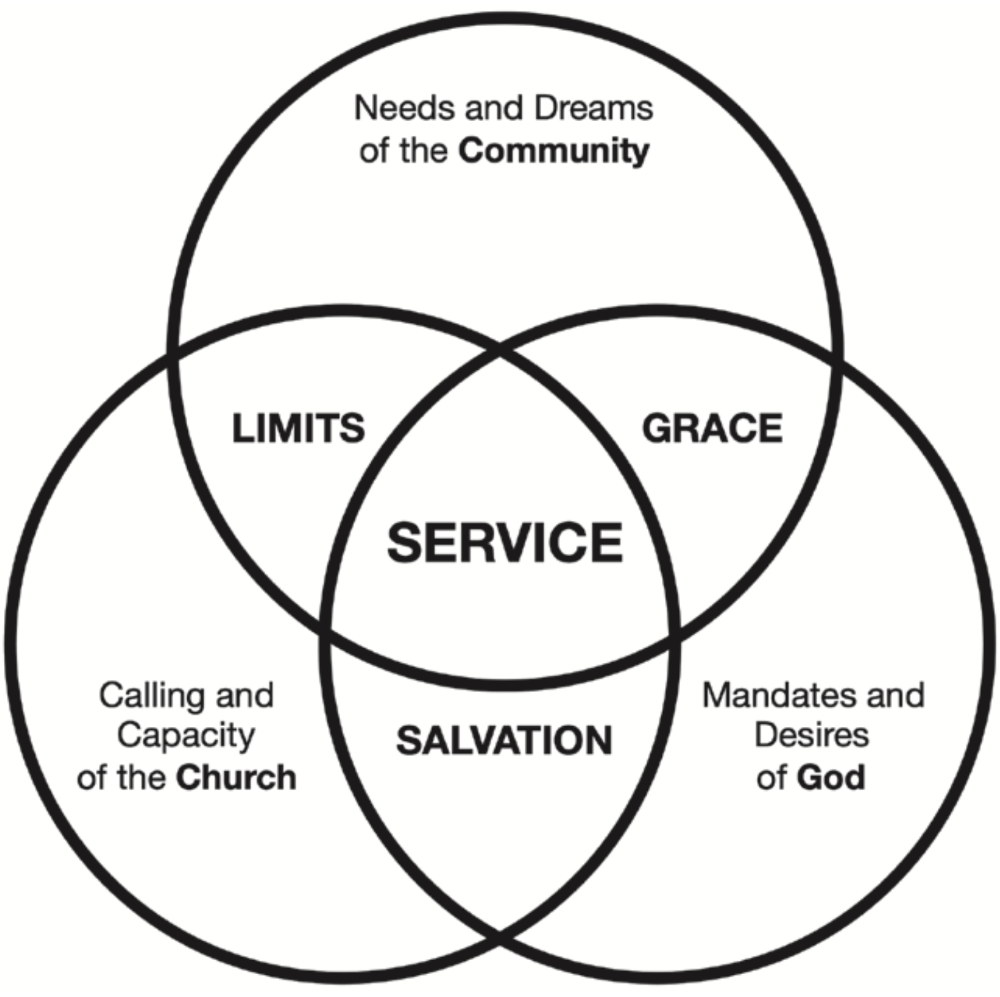

_Fylvia Fowler Kline_

When determining the world’s saddest countries, the Annual Misery Index1 uses unemployment as a primary predictor of misery. When the employment rate creeps toward 7 percent, a country panics2— crime increases, health declines, divorce is on the rise, and even life expectancy is shortened. It is a time of crisis because less money and fewer people are attempting to fund the ongoing needs of a country. More alarming, the negative consequences of unemployment often linger for decades, long after employment picks up.

The rate of unemployment reflects the number of “uninvolved” people—those not participating in a country’s economy. If a country panics when 7 percent or more of its population are unemployed, should not the church panic when an average of 80 percent of church members are uninvolved in the life of their local church?3 In the average church only 20 percent of worshippers4 are “active”—these are the people who have a church office or who pitch in when there is a need. These active participants are ambassadors of their faith. The other 80 percent are pew warmers, worshippers who check in for worship on Sabbath and check out of church life for the rest of week.

Similar to how unemployment has a debilitating effect on a country, the higher the percentage of noninvolvement and disengagement within a church, the greater the risk of a church becoming stagnant, losing members, or worse, shutting down—“By some estimates, every day in the United States nine churches shut their doors forever.”5 According to one study in 2014, of the approximately 300,000 churches in the United States, 177,000 had less than 100 members.6 A lifestyle of service, on the other hand, is a key performance indicator of a healthy, vibrant, growing church. The measure of a church is not in its attendance but in the transformational effect it has on its community. It’s about the lifestyle of service that exists within the church family.

### Servanthood—The Mark of Every Christian

If the current service projects in your church are not making a significant impact on the health and growth of your church, it may be because (1) only a small percentage of worshippers are involved in service while the rest are passive supporters, (2) the service initiatives are perceived needs and not the true needs and desires of the community, or (3) the acts of service are happening void of close relationships, and therefore are perceived as handouts or charity rather than love and support.

Connecting with the community is not solely the responsibility of the pastor.

“Ministers should not do the work which belongs to the church, thus wearying themselves, and preventing others from performing their duty. They should teach the members how to labor in the church and in the community. There is work for all to do in their own borders, to build up the church, to make the social meetings interesting, and to train the youth of ability to become missionaries. . . . They should cooperate actively with the minister in his labors, making the section of country around them their field of missionary effort. . . .

“This work has been neglected. Is it any marvel that God does not visit the churches with greater manifestations of his power, when so large a number are shut in to themselves, engrossed in their own interests?”7

Servanthood—helping others in love—is not a spiritual gift. It is the mark of every Christian. Christians serve others just as Jesus did. It’s as simple as that. How we serve and how we use our spiritual gifts and talents are an assorted variety, but the call to serve is the common call of all worshippers. To experience maximum impact in your church, service opportunities need to be strategic, intentional, and occur at all of these three levels:

1. **The church as a whole**—service projects that the corporate church does as one large body (e.g., adopt a nursing home and visit the residents regularly with church worshippers on a rotating schedule).

2. **Small groups**—service projects that come out of relationships created between worshippers and their friends and neighbors in the community (e.g., two families from church who live in the same neighborhood and who have children or the same age begin a book and babysitting club with two other families in the neighborhood, taking turns meeting in one of the four homes each month; after a brief study of the book, all the children are babysat by the host of the month in their home while the other three couples go on a date).8

3. **Families/Individuals**—service projects that individuals and families choose to participate in that make service an integral component of their Christian lifestyle (e.g., a musically gifted family offers their services once a month to a neighboring Sundaykeeping church, providing the family with opportunities to make friends outside of their own church and to partner with another church in community projects, etc.). “It is no small matter for a family to stand as representatives of Jesus, keeping God’s law in an unbelieving community. We are required to be living epistles known and read of all men. This position involves fearful responsibilities.”9

When service opportunities are supported by strong relationships and spiritual nurture, churches can result these positive outcomes:10

- increase in giving and in church attendance and involvement

- increase in spiritual growth

- increase in efforts to share one’s faith

An example of this is a church in Groesbeck, Texas, a small town of about 4,000 people and 20 churches. When John Carabin stepped into this church as its new pastor, the building was falling apart and its membership was at just nine faithful worshippers. First they changed their name to “Living Proof.” Then they began living their new name by proving God’s love to their town through meaningful service that met specific needs. Two and a half years later, in 2016, their membership was 90. By 2019 it had grown to 200.11 “In every land and in every community there are many opportunities for helpful service. . . . Look these ones up. Use your talent, your ability, by helping them. First give yourself to the Master; then He will work with you. To every man He gives his work.”12

### Service—The Shared Space

“A company of believers may be poor, uneducated, and unknown; yet in Christ they may do a work in the home, in the community, and even in ‘the regions beyond,’ whose results shall be as far-reaching as eternity.”13 In their analysis of community-centered, externally focused churches, Rick Rusaw and Eric Swanson emphasize that “the power of service requires a deep understanding of three intersecting circles that form a visual construct for the externally focused church. Wherever churches are engaged in community transformation, the avenue they’ve chosen lies at the intersection of the needs and dreams of the city or community, the mandates and desires of God, and the calling and capacity of the church.”14 This section is a summary of their three-circle concept that describes the connections between the local church, its community, and God’s desire for both.

The first circle represents the needs and dreams of the community. Rather than assume, learn what the true needs are. Being connected to people who work in key areas such as city government, law enforcement, and schools is an easy way to be tuned in to the needs of the community. One church, for example, hosts a monthly lunch for a few leaders and business-people. The guest list is created with strategy and intention to encourage brainstorming and networking among one another, making the church a great community liaison.

The second circle is the mandates and desires of God. “From Isaiah 65:17-25, Dr. Raymond Bakke, speaking of a future city, outlines six characteristics of a healthy community from the heart of God—public celebrations and happiness (verses 17–25), public health for children and the aged (verse 20), housing for all (verse 21), food for all (verse 22), family support systems (verse 23), absence of violence (verse 25). To this list we would add meaningful work (verses 22, 23).”15 This is what God wants for people everywhere.

The third circle is the calling and capacity of the local church. “The capacity of each local church determines the part it will play as an agent of community transformation. No church can do it all, but every church has the capacity to serve the city and the people of the community in a meaningful way that represents the love, mercy, and power of God.”16

When these three circles come together, intersecting spaces are formed that define what happens between these circles and how they are connected. Rusaw and Swanson use John Calvin’s term, _common grace_, to describe the space where the city’s needs and desires of a city meet the mandates and desires of God—“Common grace is God’s beneficence toward everyone as reflected in Luke 6:35: ‘[God] is kind to the ungrateful and wicked’ and Matthew 5:45: ‘He causes his sun to rise on the evil and the good, and sends rain on the righteous and the unrighteous.’ God desires for all people to live in safety and with justice. The city wall that provides protection for believer and unbeliever is an expression of common grace. . . . Common grace is part of the reason we ‘give to Caesar what is Caesar’s’ (from Mark 12:17).”17

Control takes up the space shared by the city and the church. There are often limitations, boundaries, and laws a relationship between the church and the city.

Salvation takes up the shared space between what God wants and what the church is called to do. “God ‘wants all men to be saved and to come to a knowledge of the truth’ (1 Timothy 2:4). God’s words to the exiles who were carried off to Babylon are also relevant here: ‘Seek the peace and prosperity of the city to which I have carried you into exile. Pray to the Lord for it, because if it prospers, you too will prosper’ (Jeremiah 29:7).”18

The circles and the intersecting spaces point out that “as much as God wants the city to be saved and the task of saving the people of the city is the calling of the church, salvation is really outside of what the city desires.”19 If you were to ask city leaders to list their needs and desires, salvation would most likely not be on that list. Service, on the other hand, is the space that is shared by all three circles.

“Service is something that the community needs, God desires, and the church has the capacity to do. The community may not care much about salvation, but it does have needs. It is in meeting those needs through service that meaningful relationships develop, and out of relationships come endless opportunities to share the love of Christ and the gospel of salvation. The early church grew because its people loved and served. We believe servants can go anywhere. Service gives us access not only to places of need but also to places of influence. . . . Barriers to the gospel melt away when people are served and blessed. It’s been said, ‘There is only one way to God and that is through Jesus. But there are a thousand ways to Jesus.’ By creating a thousand entry points into the community, we create a thousand ways to show the love and share the good news with the city.”20

### The Community—An Extension of the Church

When you view the church’s immediate community as an extension of itself, it becomes easier to find ways to integrate the church into the life of the community, to “meet people where they are, and take them where Jesus wants them to go. . . . Leading people on a personal level must involve hearing their individual story, understanding their worldview, and engaging persuasively through building bridges to a gospel-centered, word-centered way of life. ”21 The strategy is simple—weave a fabric of friendship and relationships within the church’s immediate community.

One way to do this is to become a part of community events, initiatives, and organizations such as the chamber of commerce, Lions, Rotary, etc. This provides unparalleled opportunities to connect. Here is how one particular church takes advantage of its membership at the local chamber of commerce.22

1. **They show up and make friends**—Whether it is the casual weekly meeting for small businesses or the formal monthly luncheon, they are there. But they don’t just attend to be seen; they show up early to greet and connect and stay back to help clean up. This extra 15 minutes makes a huge difference in not only how they were perceived but also gives them opportunities to mingle and get to know others. It is not just the pastor who attends—church officers and worshippers, be they members or not, take turns, ensuring the church is always represented.

2. **They connect through service**—Organized and intentional, worshippers form teams based on interest and relevance. For example, church families with children that attend the local public high school make up a team and work together to find ways to connect and build relationships with other parents in the school. This “team” represents the church by meeting needs specific to the school community. During the basketball season, for example, they provide bottles of water for the team and help out at school events.

3. **They are always available**—The church always keeps up with local news. When there is a news story about a need, they are the first to show up with a plan, ready to serve, and to rally other businesses to get the job done.

4. **They take the church to the community**—Rather than hold events at the church to lure the community, they go into the community, where the people are. In the middle of town, during the week, they run a community center that offers a variety of programs such as after-school care and tutoring, various trade classes, and community service credits for teens on probation. And on their day of worship the church has a parallel worship service right there in their community center. Because a majority of worshippers are active participants and not pew warmers, they have enough volunteers to do all of this.

Ellen G. White points out that “in almost every community there are large numbers who do not attend any religious service. If they are reached by the gospel, it must be carried to their homes.”23 While she was specifically referring to the work of missionary nurses, the premise is applicable in other situations. “It takes between 12 and 20 positive bumps (refreshing encounters with the church) before people come to Christ. Our presence in the public square through service gives us opportunities to provide these refreshing encounters.”24 Take a look at the current programs in your church and determine which ones can be repurposed for your community. Here are a few examples:

- If you have a Sabbath designated for children’s church, repurpose it as free day care to the first 10 who sign up.

- Consider having the Pathfinders and Adventurers meet somewhere in the community and marketing it as a kids club for the neighborhood families.

- Partner with a local organization and take movie night from the church gym to a public space.

- Move your smaller Bible study groups from the church to a local coffee shop. The chances of random strangers joining your Bible study at Starbucks are slim, but the probability of strangers considering God and prayer during a bleak moment in life because of what they saw in Starbucks is a possibility.

### Worshippers—Not Visitors

Within these relationships spiritual seeds will be sown. “Let us not grow weary of doing good” (Galatians 6:9, ESV). We must serve without any agenda but to reflect the life of Jesus on earth. If and when they come to church is the work of the Holy Spirit. Jesus served with no expectations. He healed 10 lepers knowing only one would say thank you. In His last act of service of washing the feet of His disciples, He had no agenda or expectation in return. Had He expected faith in return, he would have skipped Thomas. Had He expected loyalty, Peter’s feet would have remained caked in dirt. He didn’t even expect honesty, for He washed Judas’ feet.

When the church is connected in its community and worshippers are plugged into their neighborhood, people from these relationships may visit your church. And as a church we must welcome them as if we have been expecting them. From the moment someone new steps into our church, they become a worshipper—one of us. Calling them visitors implies a temporary connection.

Like meeting for the first time the family of the one you’ve been dating, first-time worshippers are often apprehension. But just as how one is slowly but intentionally drawn into a new family, it is important to build and nurture relationships from the moment they first walk into the church. The power of service can play a very important role in your strategy: Just as one gets comfortable with a new family through trivial yet significant tasks such as helping with the dishes, the church needs a plan that takes a first-time worshipper from “Welcome” to “Here’s the broom,” from “Good to meet you” to “You’re family.”

### Service Projects—Not Just For Members

New members who are not plugged into the life of the church either leave or become nonparticipants. Don’t wait until you’re sure they are there to stay. Be ready with ways to be inclusive. Don’t wait for baptism before you integrate a worshipper into church life. Have ready a strategy of friend-making and a list of ways they can be involved that don’t require membership. Here are some practical ways to be ready for and connect with new worshippers:

- Groom people with the gift of social skills to be pew ambassadors. Have them in the same spot at church every week and look for first-time worshippers in the pews closest to them. Their primary task is to befriend first-time worshippers by following a plan which the church may need to be periodically tweaked, depending on feedback and what doesn’t work.

- When they begin frequenting the church and at the appropriate time, pew ambassadors connect the new worshippers with others in the church who share a common interest, are of the same age, are from the same neighborhood, etc.

- Plug them in to the life of the church by matching their interest with the church’s needs. Find ways to connect them to Christ, to their calling, to others in the church, and to their community.

- Most important, grow your relationship with the now not-so-new worshipper.

### Service—Woven Into Life Events and Relationships

Plugging people into service opportunities is not just giving them a chore to do or an event in which to participate. It’s about discipling them, strengthening their spiritual health so they are comfortable sharing their story of Jesus. A nurturing plan that runs parallel to service opportunities addresses this need. Acts of service need to be combined with social connections and spiritual nurture. To begin, the group needs to have something in common that they can self-identify with—say they are empty nesters, moms, men, or young families. Then they need to add a social element as well as a service-focused assignment. For example, three empty-nester couples who meet for a Bible study every week [spiritual nurture] also volunteer together at a local shelter once a month [service] and take an annual trip together [social connection].

A legitimate barrier to any service initiative is the lack of time in people’s everyday lives. One way to combat this is to integrate service into events already on people’s calendar. Take, for example, two women at church who belong to a quilting group that meets at the community craft store. Since this is an activity they have already made time for and is one that brings them in contact with others in the community, this becomes their community connection, one where they intentionally, and together, befriend others and build relationships. This is an example of missional living, in which you “take your everyday, ordinary life—your sleeping, eating, going-to-work, and walking-around life—and place it before God as an offering” (Romans 12:1, 2, Message). Alan Hirsch puts it well: “We are _designed_ and _destined_ to be a missional-incarnational people. . . . There is no such thing as an unsent Christian! We are _all_ missionaries. It is not a profession; it’s the calling of every disciple.”25

Just as important as it is to build new relationships is the need to repair broken ones. Reaching out to those who no longer worship with you is like making up after a bad breakup. It’s hard work to woo a person back into your life. You must be willing to admit when you’re wrong, forgive, make some positive changes, and most important, nurture a hurt relationship back to good health. You have a better chance of success if (1) you really knew the person in the first place and (2) if you make them feel loved and needed and again.

Service opportunities can bridge paths back to the church. People are more inclined to engage with a community project connected to the church before they consider returning to church. Following private, honest conversations geared toward reconciliation and renewed relationships, connect them to one of the church’s community projects. For example, if the person has audiovisual skills, ask if they’d be willing to help with a community concert. Then continue involving them in projects while rebuilding the relationship. Prayerfully and patiently wait to invite them to church at a time that feels appropriate. If you’re turned down, preserve the relationship and continue connecting them with community events and service projects.

### Servanthood—Without an Agenda

“Long has God waited for the spirit of service to take possession of the whole church so that everyone shall be working for Him according to his ability. When the members of the church of God do their appointed work in the needy fields at home and abroad, in fulfillment of the gospel commission, the whole world will soon be warned and the Lord Jesus will return to this earth with power and great glory.”26

But even when energized by our call to service and to share God’s love, we must remember that we can control only plans and projects,27 not people and hearts. That’s the business of the Holy Spirit. When you’ve done all you can within the space where your gifts and calling intersect with God’s plans, shake off your frustration but continue in grace and service, love and prayer—and always strengthen your relationships. We must merely be “willing to step outside the safety net of our church pews and cross the street into real-life, real world acts of service in order to share the truth of Jesus Christ.”28 Let your life speak the truth louder than your words.

### NURTURE THROUGH SERVICE

#### Implementation Ideas

_By Fylvia Fowler Kline_

_**Note**: Some of these are my ideas, and others are what I’ve seen work in churches. With every plan: 1. Add a spiritual element to your services without creating a sense of expectation or requirement. For example, provide a short devotional after an English class only for those interested. 2. Whatever the project, be regular, consistent, and dependable._

1. Small groups studying God’s Word in groups of four to six to allow the addition of another four to six of new worshippers. Meet in the community and add a social element to it.

2. “Kind” bags for worshippers to take on their way out to give to the homeless. Content suggestions: juice box, granola bar, encouraging thought or Bible text, a dollar bill. Place these by the door for worshippers to pick up on their way out after worship. It’s an easy way to engage with first-time guests.

3. Friendship ambassadors assigned to pews to sit at the same place every week in order to engage with new worshipers and connect them with members who may have things in common with them.

4. Host families—regular worshippers ready to take new worshippers home for a meal.

5. Babysitting Club—A small group of families with children in the same age group who meet once a month, rotating homes. They have devotional time or read a book together (as a book club), after which all the couples go on a date—except the ones hosting, who watch the kids. The longer the tradition, the closer the ties.

6. Host a family movie night in the community. The church can do this in a community center—In most small towns there is an organized movie-in-the-park event; partner with another business. Families can do this for their neighborhood (project the movie on a garage door and invite neighbors to bring lawn chairs).

7. Super Bowl party with another community business.

8. Quarterly block party on church grounds or somewhere public for the neighbors within a block/walking distance.

9. Partner with a business to start a community garden.

10. Adopt an apartment building—better yet, rent an apartment in the building you adopt. Have a strong disciple live there to minister to the people, to hold small group meetings, etc.

11. Repurpose current events into community services— Pathfinders, VBS, Sabbath School (take all of these to the community, outside your walls. Be intentional about including children from the community).

12. Begin various craft clubs that meet in public places (there’s a knitting club in the Panera near my home; tutors help kids at the eatery in Wegman’s).

13. Offer cooking classes in other churches right after their Sunday service (include a free meal).

14. Offer report card rewards to local schools.

15. Offer language classes in a community space (e.g., library).

16. Read the local newspaper to identify immediate needs and for long-term planning. Follow up and help!

17. Offer free rides to the airport (stick to a schedule, be dependable—offer this in airport advertising).

18. Welcome basket for people who buy homes in the neighborhood (home sales are public information).

19. Begin Bible studies at the local university.

20. Begin a travel club (worshippers traveling with nonworshippers provide many opportunities to share their faith).

21. Partner with a local hospital to provide a free gift to babies born there (beginner’s quarterly, a pair of booties, book for parents).

22. Join local community groups such as the chamber of commerce, Lions Club, etc. Encourage members to join as well.

23. Plan for a permanent presence in the middle of the community.

24. Have offsite worship services in your community center or in a public space.

25. Families and individuals find ways to connect with others in things you already do: e.g., young parents from the church having play dates at the same time, same place, same playground to connect with other parents in the community.

26. Join trivia night at the local bar (e.g., many bars in the U.S. that serve meals as well designate one evening as family night and host family-friendly activities).

27. Worshippers gifted in music offer their services to churches of other denominations (most churches pay for special music and pianists).

28. Mini concerts in parks.

29. Monthly lunch with community leaders (six possible areas to target: business, government, education, health and social services, media, religion)

30. Social media ads, ads on buses (of your services and not what you are).

31. Identify businesses that will allow literature and handouts. Keep these stocked, ensuring the material is appropriate and includes the church’s name. E.g., stack of healthy recipes at the local grocery store; health DVDs at the Health and Human Services office; notes on positive living at the yoga studio; free women’s health magazines at the hair salon; packets of seeds at the craft store.

32. Post on community boards a list of the month’s services and events the church provides. Keep these current :)

33. Create a detailed database of your worshippers—their profession, hobbies, fears, names of children, hours of work, favorite food, spiritual gifts, etc.

34. Have a plan that ensures someone of the leadership team has a one-on-one with every worshipper outside of sickness and death.

35. Assign a got-to personal church liaison to every worshipper. The liaison contacts everyone on his list at least once a month.

36. Solicit service ideas from worshippers and provide new and more opportunities to serve.

_Fylvia Fowler Kline, manager of VividFaith, has expertise in nonprofit administration, marketing, and communication. Her insights relevant to this topic are from her time as vice president of one of the largest chambers of commerce in the United States and from the six years her family served as missionaries in Nepal when only 0.1 percent of the population was Christian. Finding creative ways to share the Christian faith has been especially important to her since her stay in Nepal._

**Endnotes:**

1 Johns Hopkins economist Steve Hanke’s misery index is the sum of unemployment, inflation, and bank lending rates, minus the change in real GDP per capita. For the 2018 misery index, see Katie Jones, “The Most Miserable Countries in the World,” _Visual Capitalist_, Oct. 4, 2019, https://www.visualcapitalist.com/the-most-miserable-countriesin-the-world, accessed Nov. 3, 2019.

2 See, e.g., these news stories: “Greek Unemployment Rate Fell to 18 Pct in December 2018,” _The National Herald_, Mar. 2, 2019, https://www.thenationalherald.com/233755/greek-unemployment-rate-fell-to-18-pct-in-december-2018, accessed Apr. 2, 2019; “India unemployment rate highest in 45 years,” _Aljazeera_, Jan. 31, 2019, https://www.aljazeera.com/news/2019/01/india-unemployment-rate-highest-45-years-report-190131144720377.html, accessed Apr. 2, 2019; and “South Africa’s economic growth stutters,” _Financial Times_, March 5, 2019, https://www.ft.com/content/1688aa70-3f5311e9-b896-fe36ec32aece, accessed Apr. 2, 2019.

3 According to several research studies, e.g., Scott Thumma and Warren Bird, _The Other 80 Percent: Turning Your Church’s Spectators into Active Participants_ (San Francisco: Jossey-Bass, 2011).

4 The author uses the term worshippers instead of church members to be inclusive of all who attend church, be they members or nonmembers, and because a lifestyle of service has the same effect on both members and nonmembers.

5 Angie Mabr-Nauta, “Mourning the Death of a Church,” _Christianity Today_, Mar. 11, 2014, https://www.christianitytoday.com/ct/2014/march-web-only/mourning-death-ofchurch.html, accessed April 2, 2019.

6 Ibid.

7 Ellen G. White, _Historical Sketches of the Foreign Missions of the Seventh-day Adventists_ (Basle, Switz.: Imprimerie Polyglotte, 1886), p. 291.

8 Children in this group also benefit from this practice and often remain friends into their college years and adulthood, continuing the tradition of spiritual nurture and social connection.

9 Ellen G. White, _The Adventist Home_ (Nashville: Southern Pub. Assn., 1952), pp. 31, 32.

10 Based on a study of more than 7,000 people and 35 churches, these findings are from Diana Garland, Dennis Myers, and Terry Wolfer, _The Impact of Volunteering on Christian Faith and Congregational Life: The Service and Faith Project_ (Waco, Tex.: Center for Family and Community Ministries School of Social Work, Baylor University, 2006), https://www.baylor.edu/content/services/document.php/22980.pdf, accessed Apr. 2, 2019.

11 “A Living Proof of Love—How a Dying Church Was Transformed Through Service,” _Outreach_, May/June 2016, p. 34. The author confirmed 2019 membership with Pastor Carabin, phone call, Jan. 6, 2020.

12 Ellen G. White, _Selected Messages_ (Washington, D.C.: Review and Herald Pub. Assn., 1958, 1980), vol.1, p. 103.

13 Ellen G. White, _The Ministry of Healing_ (Mountain View, Calf.: Pacific Press Pub. Assn., 1905), p. 106.

14 Rick Rusaw and Eric Swanson, _Externally Focused Church_ (Loveland, Colo.: Group, 2004), pp. 562-564.

15 Ibid., pp. 581-583.

16 Ibid., p. 594.

17 Ibid., pp. 599, 600. Bible texts within this and the following citation are from the Holy Bible, New International Version. Copyright © 1973, 1978, 1984, International Bible Society. Used by permission of Zondervan Bible Publishers.

18 Ibid., p. 609.

19 Ibid., p. 611.

20 Ibid., pp. 616-620.

21 Todd Engstrom, “Meeting People Where They Are,” _toddengstrom.com_, Nov. 19, 2013, http://toddengstrom.com/2013/11/18/meeting-people-where-they-are, accessed Apr. 2, 2019.

22 This was a non-Adventist church that the author observed during her time as vice president of a chamber of commerce.

23 Ellen G. White, _Counsels for the Church_ (Nampa, Idaho: Pacific Press Pub. Assn., 1991), p. 311.

24 Dave Workman, pastor, Vineyard Community Church, quoted in Eric Swanson, “Changing Evangelism in Campus Ministry,” _ericjswanson.com_, http://www.ericjswanson.com/2010/09/changing-evangelism-in-campus-ministry, accessed April 2, 2019.

25 Alan Hirsch and Dave Ferguson, _On the Verge: A Journey Into the Apostolic Future of the Church_ (Grand Rapids: Zondervan, 2011).

26 Ellen G. White, _The Acts of the Apostles_ (Mountain View, Calif.: Pacific Press Pub. Assn., 1911), p. 111.

27 See the list of 36 service ideas entitled _Nurture Through Service: Implementation Ideas_, which follows this chapter.

28 Kirsta Petty, “Connecting Your Church to Your Community—First Steps to Externally Focused Ministry,” http://www.faithformation2020.net/uploads/5/1/6/4/5164069/five_ _steps_to_an_externally_focused_church.pdf_, accessed April 2, 2019.