_Galina Stele, D.Min._

It is not easy to be a young person in the contemporary world. It probably has never been easy. However, the demand for being successful, able to adapt to rapidly changing expectations of social and professional networks, is higher than ever before. This creates a lot of pressure on the young generation. Additionally, with the transition from modernity to post and multiple modernities, traditional values and priorities of people have changed. These changes have made their impact on the religious life of young people, especially adolescents. According to the statistics of the General Conference (GC) Youth Ministries Department for the past few years, of the different categories of Adventist young people, the Ambassador Club (ages 16-21) has the lowest membership1 (see Figure 1).

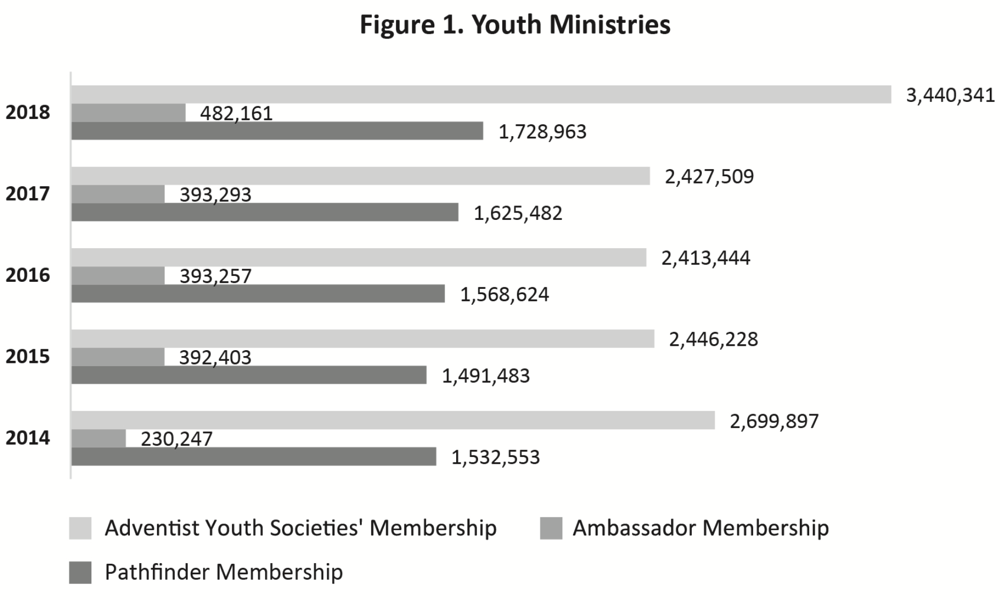

Why do the numbers drop so drastically after Pathfinder age? What happens with our adolescents? And how spiritually alive are our young adults? Does Adventist research show in what areas we should help our young people? This article will present some recent data on young people collected in 2017 and 2018 when the Adventist Church conducted the Global Church Member Survey (GCMS) commissioned by the GC for the 2015-2020 strategic planning. This research was supervised by the GC Office of Archives, Statistics, and Research (ASTR).2

### Global Church Member Survey: Subsamples of Young People

The 2017-2018 GCMS became the largest survey of its kind. It was conducted in all divisions with total N=63,756. Many young people (25,460 participants) also took part in it. They comprised 40 percent of the total sample: 12 percent (7,490) were adolescents up to 20 years of age (Generation Z), and 28 percent (17,970) were millennials or young adults aged 21-35. Who are these survey participants?

Almost all respondents (96 percent average) identified themselves as Adventists (87 percent of adolescents and 91 percent of young adults had been baptized). This is important to remember when we look at research data of their beliefs and practices, because these young people consider themselves Seventh-day Adventists and thus represent young Adventists in our churches. Most of them represent lay members who are not connected in everyday life with organized religion. Only 11 percent of adolescents and 28 percent of young adults are or have been working for an Adventist organization or church.

Both genders were well represented, with almost equal division in the young adults sample and with 12 percent more females in the adolescents’ group.

Their family history with the Adventist Church varied. More than a quarter (26 percent) of adolescents and a third (33 percent) of the young people were first-generation Adventists. This means they need additional care from the church. Moreover, 26 percent and 22 percent, respectively, are fourthand fifth+-generation Adventists. These generations can have tendencies to nominal religion if their parents’ religion has become just a tradition and not their faith. Combined numbers of first-, fourth-, and fifth+-generations comprise more than half in each sample. Will they make it or break it? Do their local churches recognize their spiritual needs?

Young people in our churches are busy people. While the adolescents were mostly single, half of the young adults were married (47 percent) or living together with their partner (3 percent); 42 percent of them had children, with at least one child or teenager living at home. Additionally, to complete the picture of challenges young people face in their private life, about 2 percent of the adolescents and 3 percent of the young adults have been already divorced; 2 percent of the young adults were separated, and 1 percent of them were widowed. Another small percent of the adolescents (about 2 percent) were also living together. So the picture is not homogeneous, and is more complicated than one can imagine.

Interestingly, a majority of the young adults (64 percent) had the whole household celebrating the Sabbath, while only slightly more than half (53 percent) of those up to 20 had the same favorable situation. This means that another half of the adolescents live in a household in which not all members celebrate the Sabbath. This can be challenging for the faith of a young person.

So what can we learn about devotional practices, church attendance, involvement in church life, and beliefs of these young Adventists?

### Family Worships and Devotional Practices

Unfortunately, the business of everyday life prevents many young people from regular family worship and daily personal devotions. Only 29 percent of the adolescents and 32 percent of the young adults have family worships daily. It seems very important to restore an Adventist tradition of regular family worships, especially in families with children.

The situation with daily devotional practices could also be better (see Figure 2). A majority of young people don’t have daily personal devotions, don’t read the Bible or writings of Ellen G. White (EGW) daily, and don’t study the Sabbath School lesson. In each of these categories, the adolescents scored lower. The largest gap (12 percent) is in personal devotions. What is even more sobering—almost half of the adolescents (48 percent) and two in five young adults (41 percent) don’t have daily personal prayers at times other than meals. How can they survive in this world of constant struggle between good and evil if they are not equipped and protected by personal prayers?

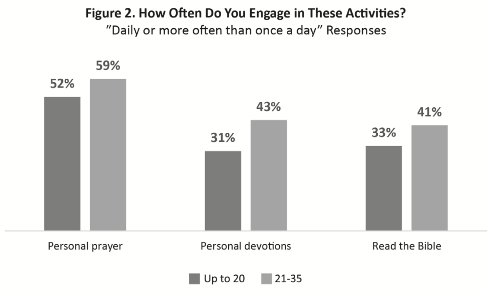

Although a majority of young people do not read EGW’s writings or study the Sabbath School lessons on a daily basis, it is encouraging that on a weekly basis more of them do this (see Figure 3).

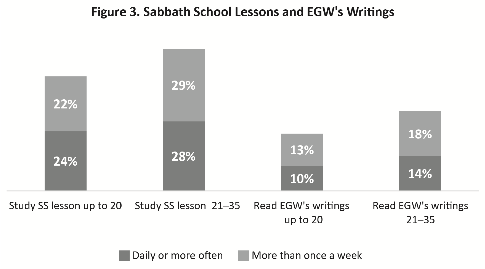

To increase these scores, we can inform them about available apps, audio, and video versions of the Sabbath School lessons, EGW’s writings, different Bible translations, and devotional materials. The findings show that about 48 percent of young adults and 36 percent of adolescents use their mobile devices for Bible study or personal devotions on a daily or weekly basis.

It is hard to overestimate the long-term value of daily personal devotions in the life of a young Christian. Let’s be intentional in our efforts to help them organize their life in such a way that they have regular time for their personal spiritual growth. EGW writes: “The reason why the youth, and even those of mature years, are so easily led into temptation and sin is that they do not study the Word of God and meditate upon it as they should.”3

Interestingly, one of the conclusions of the “Twenty-first Century Seventh-day Adventist Connection Study,” by Douglas Jacobs and his team from Southern Adventist University, was that there is a correlation between regular devotional life and commitment to Adventist lifestyle and Adventist doctrines.4

We need to help our young people strengthen their devotional life and grasp the importance of family worship in transmitting religious values to their children.

### Church Attendance, Locations, and Climate

In the modern world young people are not regular churchgoers. The GCMS asked participants about church attendance, sizes, and locations of their churches. Young people answered that perceived attendance in their congregations varied. About 74 percent of the adolescents most likely attend small (attendance of 50 or less) or medium-sized churches (attendance 51-400), 37 percent in each category. Only slightly more than a quarter (26 percent) attend large churches (attendance of 401 or more). As for the young adults, 29 percent attend small churches, while a majority (38 percent) attend medium-sized or large churches (33 percent).

Overall, about 60 percent of the young adults and 51 percent of the adolescents attend churches that are located in large cities, or suburbs, or smaller cities. They moved to urban settings to receive their education and/or to find jobs or schools for their children. However, speaking about youth retention, we need to remember that half of the adolescents still attend churches in rural areas, villages, or small towns. What can be done for young people in smaller churches?

About two thirds of Adventist young people can be called active churchgoers (see Figure 4), which is a very good although not perfect result. A majority (but less than 70 percent) attend church services and Sabbath School weekly or more often. Other church gatherings attract fewer people. We can keep in mind that many of them are married, are raising their kids, and many are involved in studies. Because of these or other reasons, about one third of the adolescents and half of the young adults don’t attend meetings provided by the Youth Ministries Department.

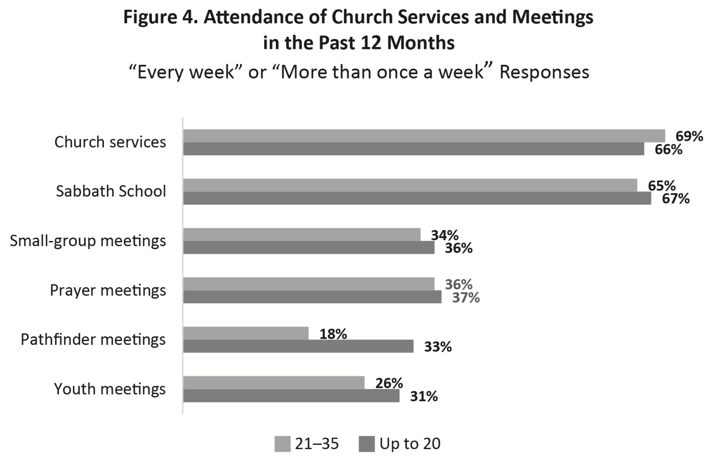

But how do they feel in the churches they attend? The Valuegenesis studies conducted in the United States and Europe consistently showed that the atmosphere in the congregation plays an important role in young people’s retention. The Valuegenesis Europe research concluded that young people experience the presence of God during worship more and grow in their understanding of God more when the church’s intellectual and warm climates are high.5

The GCMS results show that about half of the adolescents, when at church, feel free to be who they are, feel loved and cared and able to use their spiritual gifts (see Figure 5). But what about the other half? Additionally, a majority of the adolescents do not feel closeness and unity in their congregations and cannot voice their opinion. The older group of young adults has slightly different results but the same trend. These feelings could influence their response to the question about their satisfaction with their local church: only half of the adolescents and even fewer of the young adults were very satisfied with their local congregations (see Figure 6). Research also showed that there is a correlation between satisfaction with the local church and programs provided for all family members. This can be an important issue for young families with children. Nevertheless, 73 percent of the adolescents and 80 percent of the young adults said it is very likely that they will be attending a Seventh-day Adventist church for the rest of their life.

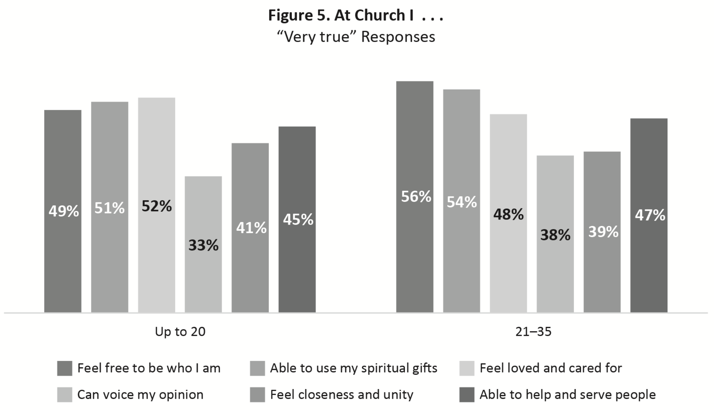

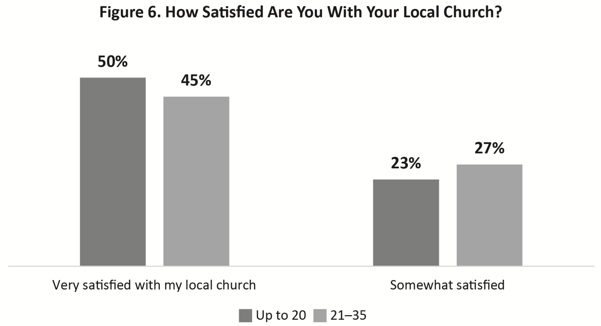

### Involvement in Church Ministries or Witnessing

Involvement is a crucial component in church member retention, especially when we talk about young people. Those who are involved in church life feel they are part of it. Sense of belonging is a very complex feeling, but without involvement—emotional and/or physical engagement—it is not possible to feel you are a part of anything.

Unfortunately, the data suggest that a majority of young people do not have any responsibilities in their local churches and are not involved in any church ministry during the week or on Sabbath. While some of them (37 percent of the adolescents and 41 percent of the young adults) hold an office in the local congregation, the results show that these responsibilities do not require their weekly involvement. Only 28 percent of the adolescents and 35 percent of the young adults were involved in a church ministry on the Sabbath during the last year. Even less of them (22 percent and 27 percent, respectively) helped with a church ministry during the week. However, the young adults were involved more in church ministries than the adolescents, although still not a majority.

The involvement of young people and their training for leadership are strategic objectives of the Adventist Church. A majority (66 percent average) of young people in each age group agreed or strongly agreed that they play an important role in decision-making in their local church, but less than a quarter strongly agreed. When asked if programs for preparing young people to become leaders exist in their local churches, conferences, or unions, a majority agreed. However, more people agreed that such programs exist on conference and union levels than on the level of their local churches. This is a point for local church leadership to think about.

The local church should be more intentional in involving young people in its ministry. It should create more opportunities for young people to serve with their talents, spiritual gifts, or professional knowledge. As other research shows, it is also important to teach them how to discover their calling and be a follower of Jesus in their workplaces using their gifts and skills to honor God.6 As Figure 5 shows, only slightly more than half of the young people said they were able to use their spiritual gifts in their local church, and less than half in both groups said they were able to help and serve people in a meaningful way. Valuegenesis research in Europe found that there is a correlation between the longtime commitment of young people to the Adventist Church and supportive congregation where they can use their spiritual gifts.7

The survey also asked participants about their involvement in the church mission. A majority (about 70 percent) agreed or strongly agreed that they are involved in carrying out the mission of their local church. But in reality, more than 70 percent were not involved weekly in meeting the needs of non-Adventists in the community or witnessing to non-Adventists (see Figure 7). However, more of them, although again not a majority, were involved in forming new friendships with people outside of their church, possibly because of their contacts with peers in school or workplaces.

Young people also answered the questions whether their involvement in evangelistic outreach to the community, efforts to meet the needs of the community, caring and nurturing church members, or reclaiming former members should increase. They agreed on all categories, but interestingly, reclaiming of former members scored higher than other categories in their response that it should increase greatly: 35 percent of the adolescents and 41 percent of the young adults said so.8 Possibly, they have friends or know people who stopped attending their congregations and care about them. Pastors should use this potential.

### Doctrines

The GCMS had some questions on the Seventh-day Adventist doctrines that helped understand how deeply rooted young people are in these fundamental beliefs. The results showed that:

- Overall, young people support Adventist doctrines. Total agreement ranged from 76 percent and up on most of the Adventist fundamental beliefs. These are very good results!
- Scores of the adolescents were lower compared with the responses of the young adults. In “strongly agree” responses the difference is 6-11 percent, a substantial difference.
- Although there has overall support for Adventist doctrines, scores in “strongly agree” responses varied (see Figures 8 and 9). The difference showed that young people were less confident in some fundamental beliefs than in others.
- There was confusion about the state of the dead.
- Overall, there was strong support for the Adventist lifestyle and biblical position on marriage.
- High acceptance of salvation through Jesus alone did not necessarily correspond with young people’s relationship with Him and understanding of His total merits in the salvation of humankind.

Interestingly, the most popular doctrine for the young people was an Adventist doctrine about the Sabbath. “The true Sabbath is the seventh day (Saturday)” received the highest score in both age groups in overall agreement (93 percent for the adolescents and 97 percent for the young adults) and in “strongly agree” responses (76 percent and 83 percent respectively). Three other doctrines that broke a 70 percent ceiling of strongly agree responses for adolescents and an 80 percent ceiling for the young adults were: God created the universe, the head of the church is Christ, and salvation is through Jesus Christ alone.

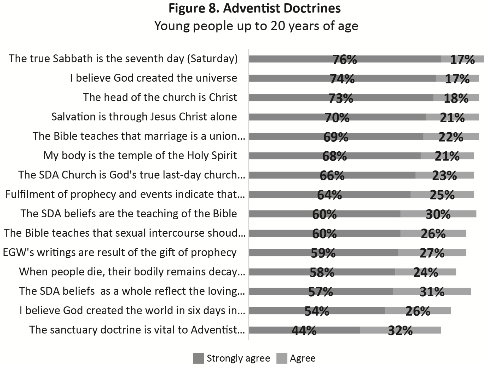

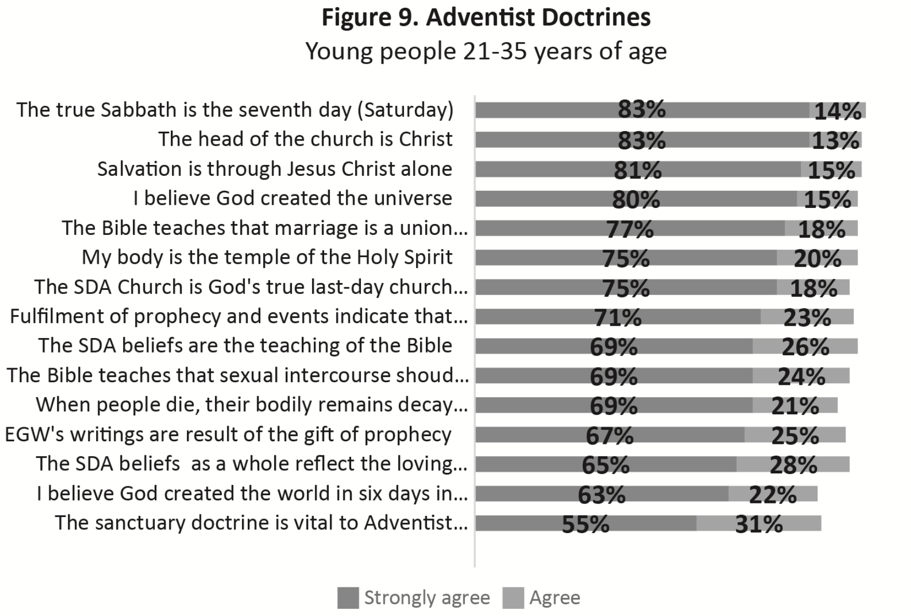

### Less-supported Doctrines

Adventist beliefs in the soon second coming of Jesus, the pre-Advent investigative judgment and heavenly sanctuary, Creation week, and the state of the dead received the least support in overall and strongly agree responses in both groups.

#### Jesus’ Second Coming

Overall, 89 percent of the adolescents and 94 percent of the young adults believed that fulfillment of prophecy and events in the world indicate that Christ’s coming is very near. Nevertheless, less than 40 percent strongly agreed that Jesus Christ would return in their lifetime. Interestingly, the adolescents were slightly more confident in that than were the young adults (see Figure 10).

#### Pre-Advent Judgment

The least-supported statement and perhaps the least-understood doctrine by young people is an Adventist doctrine about the heavenly sanctuary. The statement “The sanctuary doctrine is vital to Adventist theology” received 44 percent of “strongly agree” responses by the adolescents and 55 percent by the young adults. As we see, the difference in the strong agreement between these groups comprises 11 percent. There were also other questions on the heavenly sanctuary in the survey (see Figures 11 and 12). Young people in both groups were quite confident about Jesus’ role as our advocate, but not that many were sure regarding the beginning of the investigative judgment or its meaning.

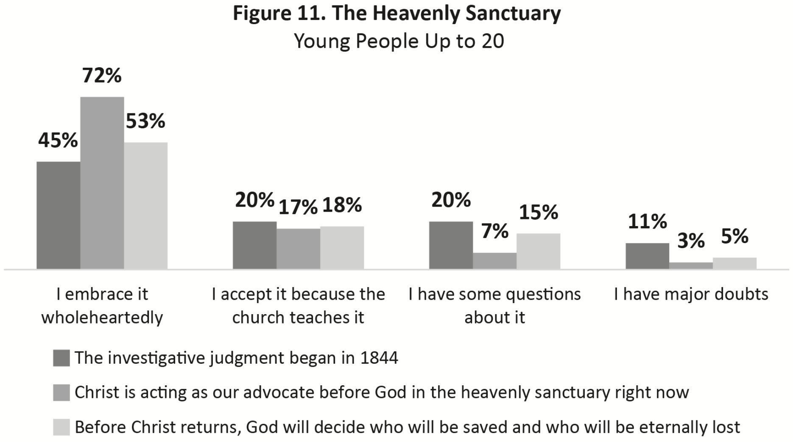

#### Creation Week

Although young people were pretty confident that God created the universe, they were not that sure about the Adventist position on “I believe God created the world in six days of 24 hours each in the relatively recent past.” The difference in “strongly agree” responses between these two statements is 17 percent in the young adults’ group and 20 percent in the adolescents group (see Figures 8 and 9).

The “Twenty-first Century Seventh-day Adventist Connection Study” on recent graduates also pointed out that our young people are more supportive of some doctrines than of others, such as “a six-day literal Creation, the inspiration of Ellen White, the sanctuary, the pre-Advent judgment, and the remnant identity doctrines.”9 It seems we need to share more information on these subjects, discuss them more with young people, and make sure they see them as sound, biblical, and relevant to their lives. Interestingly, in spite of this, the Sabbath doctrine, which is based on a six-day Creation week, was the leading doctrine for young Adventists.

#### State of the Dead

Research also revealed a lot of confusion on the state of the dead. Although a strong majority of both groups believe that when people die, their bodily remains decay and they have no consciousness or activity until they are resurrected (see Figures 8, 9, and 13), more than a third in both groups agreed or strongly agreed that the soul is a separate, spiritual part of a person and lives on after death. Additionally, more than 20 percent of the young people believe that people who have died believing in Christ are in heaven right now. Some of the young people also believe that Christians may go to witch doctors and that the dead have powers to communicate with and influence the living. This shows that cultural traditions and previous beliefs sometimes coexist. Additional research has shown that in the territories with a long history of the Adventist Church and Adventist education more young people share biblical positions on these questions.

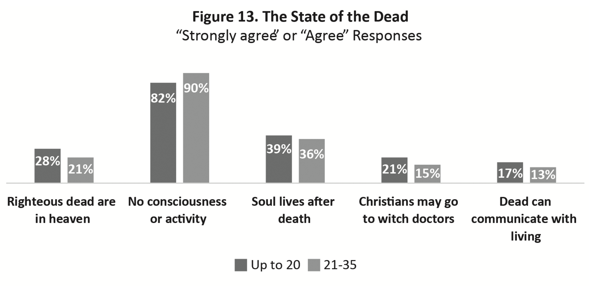

### Lifestyle Doctrines

#### Healthy Lifestyle and Amusement

Young people understand well the value of basic doctrine for Christian lifestyle: “My body is the temple of the Holy Spirit” (see Figures 8 and 9). Responses to additional questions on Adventist lifestyle show that 79 percent of the young adults wholeheartedly accept the Adventist position on abstinence from alcohol, tobacco, the irresponsible use of drugs, consumption of unclean food, and a need to follow a healthful diet. Many of them (75 percent) also wholeheartedly agreed that Adventists should avoid amusement and entertainment that are not in harmony with the Spirit of Christ. These responses echoed with those of the adolescents: 69 percent accept wholeheartedly the Adventist position on alcohol, tobacco, and drugs; 73 percent on food; and 65 percent on amusement. We can note the 10 percent difference in responses of these two groups on the first and last statements. Nevertheless, in practice, an overwhelming majority supported the Adventist position on abstinence from alcohol and tobacco: 87 percent of the adolescents and 89 percent of the young adults said that they had not used alcohol in the past 12 months, and 96 percent of the adolescents and 97 percent of the young adults had not used tobacco.

#### Biblical View on Marriage

As Figures 8 and 9 show overall, 91 percent of the adolescents and 95 percent of the young adults believe that marriage is a union between a man and a woman. Less but still a strong majority in both groups believe that the Bible teaches that sexual intercourse should be exclusively reserved for marriage. This gives hope that the majority of Adventist young people hold biblical positions on marriage, although the adolescents again scored lower in “strongly agree” responses.

### Salvation Through Jesus

In spite of the fact, that young people have a very strong opinion on salvation through Jesus Christ alone (see Figures 8 and 9), almost half of the adolescents and two in five of the young adults do not believe that every person is born with tendencies toward evil or has a sinful nature (see Figure 14). Additionally, about half in each group believe that following the health message ensures their salvation, and more than two thirds think that they will not get to heaven unless they obey God’s law perfectly. A majority of young people in both age groups also believe that if they are to be saved, they need to be baptized into the Seventh-day Adventist Church.

Similar to other questions, the younger group again scores lower in “strongly agree” responses to the question about salvation through Jesus or the character of God. This shows that adolescents have less confidence in God or Jesus than young adults. An overwhelming majority of both groups (89 percent of the adolescents and 94 percent of the young adults) believe in a personal God who seeks a relationship with human beings. However, the difference in “strongly agree” responses between these two groups is 10 percent (63 percent and 73 percent, respectively). The same trend is seen in questions about salvation through Jesus Christ alone, or that people have a sinful nature, that they are saved the moment they believe and accept what Jesus has done for them, and that Adventist beliefs reflect as a whole the loving character of God. The difference in “strongly agree” responses between these groups ranges from 6 to 11 percent.

There is also less certainty in the younger group that prayer in the name of Jesus is the only way to defeat evil powers or demonic spirits: strongly agree responses score 9 percent less (see Figure 15). Sadly, only 59 percent have such strong confidence in Jesus’ power over evil powers.

The conclusion is that we need to help young people to raise their confidence in Jesus as their personal Savior, and encourage them to have personal experience and daily connection with Him. Although this subject is very important for people of all ages, the research shows that Adventist high schooland college-age young people extremely need it.

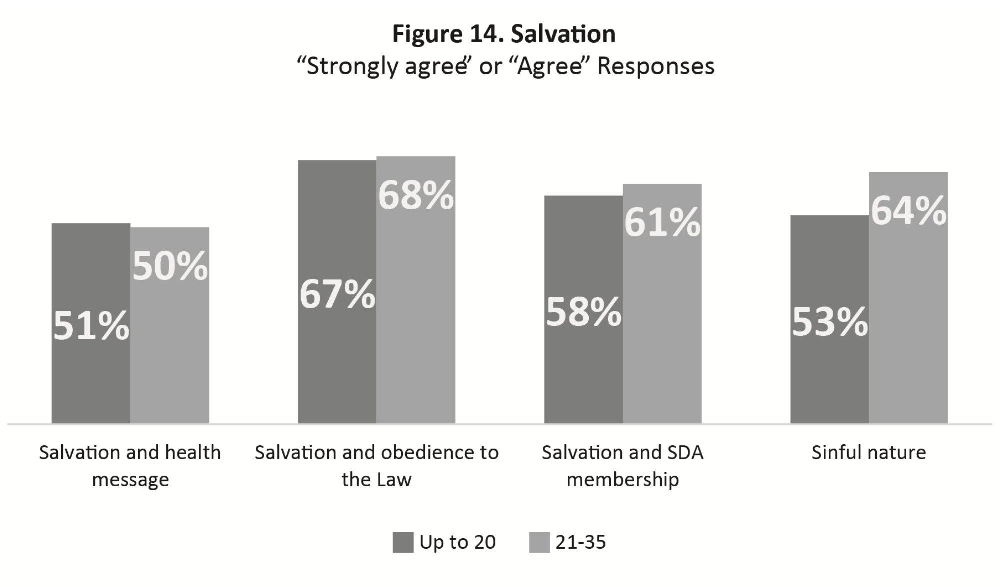

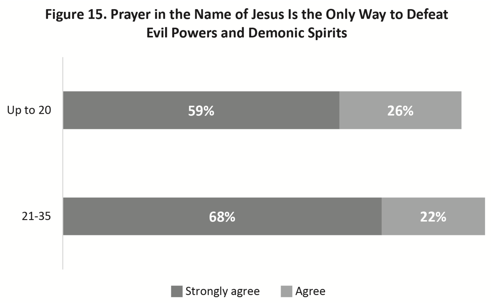

### Spiritual Struggles, Need of Support, and Reclamation

Many young people, looking back at the past 12 months, said that they have grown spiritually (Figure 16). But not all had this wonderful experience. Almost a third of the adolescents and more than a quarter of the young adults said that they had lost some important spiritual meaning that they had before or that they thought that they were in some way spiritually lost. Less of them but still about one in five said that their faith had been shaken and that now they were not sure what they believe. In times like these, young people need support from the church. However, a big percent (40 percent of the adolescents and 43 percent of the young adults) said that they had never received a visit from either of their pastor or an elder. This also shows a great need for having friends in the church. From another research on retention, we know that 62 percent of the young people said that they had drifted from the church gradually, half of them knew that they were drifting away, and the other half had not noticed.10

This means that most likely there was nobody close to them to note and rescue them from this gradual process until they drifted far away and became unchurched.

Thus, there is a group of young people in the church that needs support during their spiritual journey. And the church should help them make it! If they’ve stopped attending church, does it have a reclamation ministry? Are there members who are willing to visit them? As mentioned earlier, young people said that their involvement in reclaiming former members should increase. We need to use young people’s enthusiasm to love those people back. And in saving others, they might save themselves.

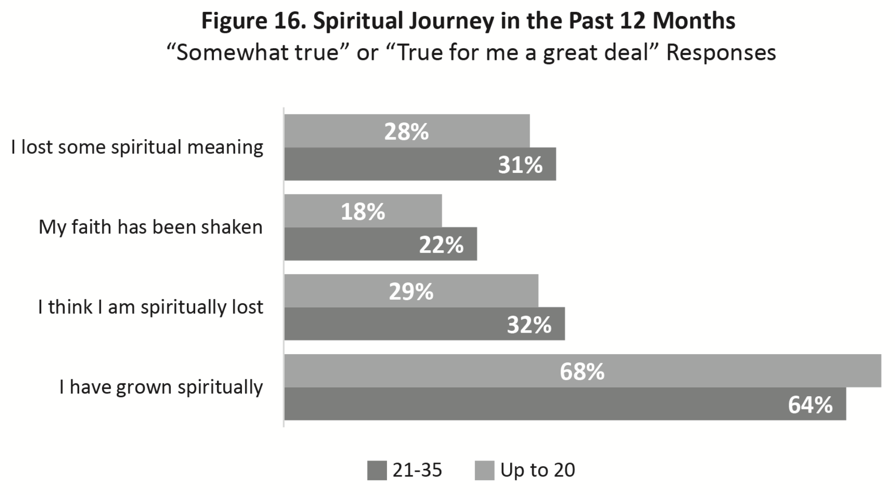

### Conclusions and Recommendations

1. The statistics and research data show that high school and college students are groups at risk. We need to focus on the retention of all young people, but especially on the 16-20 age group in all aspects of their spiritual life and service. This group, Ambassadors, is the smallest club in church clubs for young people. And their responses in the GCMS were lower than responses of young adults practically in all questions.

2. Young people need mentoring and support during their spiritual journey. There should be intentional discipleship of young people in local churches. Pastors and youth leaders should model their spiritual lives, and help them create regular devotional habits and a vital connection with Jesus.

3. Local churches need to purposely create a safe environment for young people to feel loved and needed, to safely voice their opinion, ask questions, and be involved in the decision-making process in their local church. Then they can call such church their home.

4. Involvement in church ministry is crucial for young people’s sense of meaning and belonging. Do we help them discover their spiritual gifts and give opportunities to apply them? Only if they feel they are making a valuable impact can they have this sense of belonging.

5. Belief in church doctrines should not be taken for granted if a young person has been baptized. The doctrines should be taught and discussed many times during young people’s personal and spiritual development. In the doctrines they should discover the loving and graceful character of God and Jesus, their personal Savior and Friend. Simply knowledge of doctrines cannot save; only Jesus can.

6. Young adults represent a unique group that is more mature than adolescents, more dedicated and more rooted in the church doctrines. However, their needs, especially those who have children, should not be neglected by the local church. Additionally, their professional skills and knowledge should be welcomed and applied in different areas of church life.

7. Reclamation is an important part of church ministry to young people. Its success depends on the intentional efforts of each local church to reconnect with those who are missing. Young people could be a vital force in this ministry to reach out to their inactive or missing peers and friends.

In conclusion, young people believe that the Seventh-day Adventist Church is God’s true last-day Church with a message to prepare the world for the second coming of Christ (see Figures 8 and 9). And fortunately, a majority see themselves attending a Seventh-day Adventist church for the rest of their life. Do you want to see them in your local churches, not just on pews but also on the podiums and at the pulpits being wholeheartedly involved? Do you want to see them leading the Adventist Church toward the second coming of Jesus? If yes, we need to help this happen. And we need to act now.

_Galina Stele was born in Russia and worked many years for the Euro-Asia Division in different capacities: as a professor at Zaoksky Theological Seminary, Shepherdess coordinator, and director of the Institute of Missiology. She holds a D.Min. from Andrews University and currently works as research and program evaluation manager at the General Conference Office of Archives, Statistics, and Research. She is happily married to Artur Stele, they have a son and a 6-year-old grandson. Her special interest is in research, small groups, and youth retention._

**Endnotes:**

1 General Conference of Seventh-day Adventists, Office of Archives, Statistics, and Research, _2019 Annual Statistical Report, New Series_ (Silver Spring, Md.: Office of Archives, Statistics, and Research, General Conference of Seventh-day Adventists, 2019), vol. 1, p. 7.

2 You can find the meta-analysis report on the 2017-2018 GCMS total sample at http://documents.adventistarchives.org/Resources/Global%20Church%20Membership%20Survey%20Meta-Analysis%20Report/GCMSMetaAnalysis%20Report_2019-08-19.pdf.

3 Ellen G. White, _Testimonies for the Church_ (Mountain View, Calif.: Pacific Press Publishing Association, 1948), vol. 8, p. 319.

4 Douglas Jacobs, Douglas Tilstra, Finbar Benjamin, Cheryl Des Jarlais, Mia Lindsey, Hollis James, Alan Parker, Sharon Pittman, and Octavio Ramirez, “Twenty-first Century Seventh-day Adventist Connection Study” _Research Report_ (Robert H. Pierson Institute of Evangelism and World Missions, Southern Adventist University, 2013), p. 17, retrieved from http://southern.libguides.com/ld.php?content_id=26011451.

5 Stephen Sigg, “A Spiritual Home for Young People? The Adventist Youth and Their Church as Seen From the Valuegenesis Europe Data,” _Spes Christiana: Valuegenesis Europe 24_ (2013): 148, 149.

6 David Kinnaman and Mark Matlock, _Faith for Exiles: 5 Faith for a New Generation to Follow Jesus in Digital Babylon_ (Grand Rapids: Baker Books, 2019), pp. 36, 37.

7 Sigg, pp. 179, 180.

8 ASTR Blog “Global Research on Adventist Young People: Involvement in Church Life and Ministries,” https://www.adventistresearch.org/blog/2019/11/global-research-adventist-young-people-involvement-church-life-and-ministries.

9 Jacobs et al.

10 “Leaving the Church: Why Some Seventh-day Adventist Members Leave the Church and Why Some Come Back” (Office of Archives, Statistics, and Research, General Conference of Seventh-day Adventists).