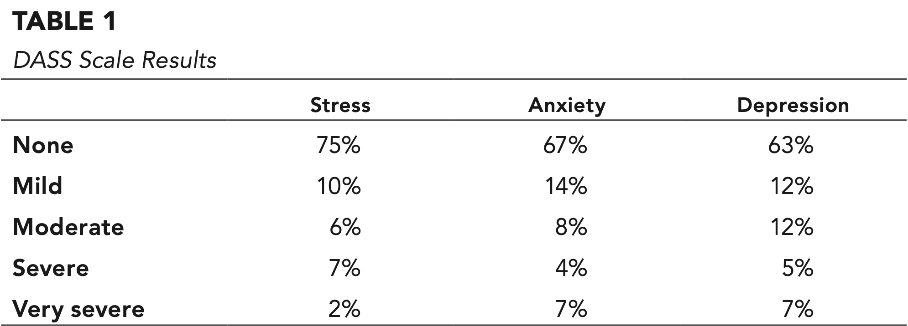
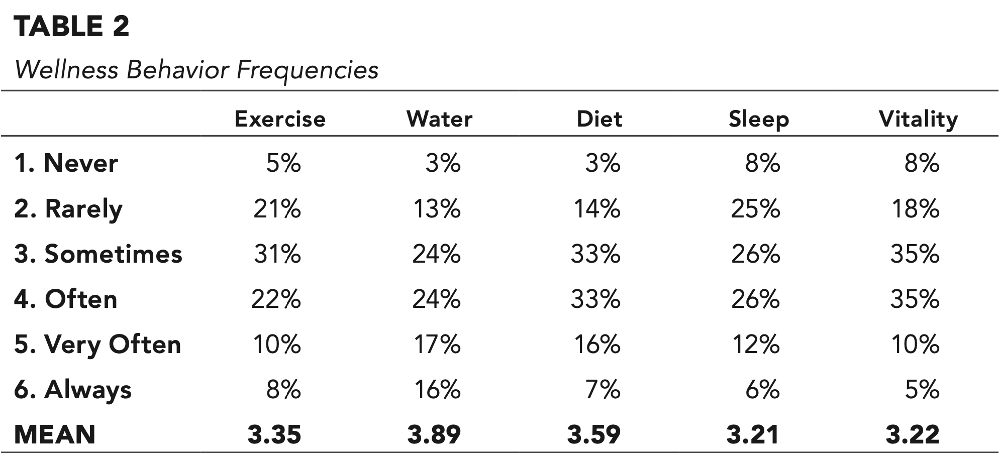
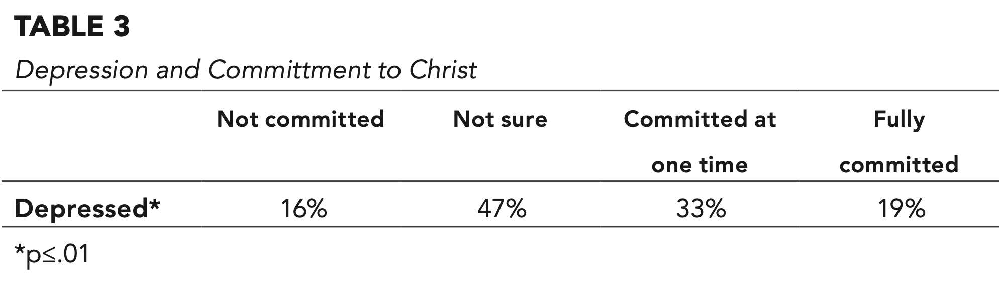
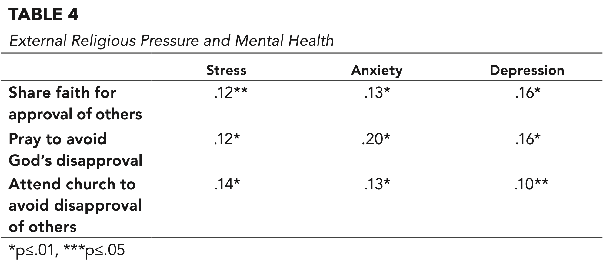
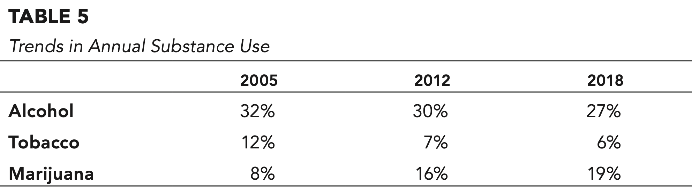

_Alina M. Baltazar, Ph.D., M.S.W., L.M.S.W., A.C.S.W., C.F.L.E., is an Associate professor and M.S.W. program director in the School of Social Work and co-associate director of the Institute for the Prevention of Addictions at Andrews University._

_Amanuel Dessie, B.S.W., M.S.W., is a student and graduate assistant in the School of Social Work at Andrews University._

_Duane C. McBride, M.A., Ph.D., is a professor of sociology in the School of Social and Behavioral Sciences and executive director of the Institute for the Prevention of Addictions at Andrews University._

### Introduction

Approximately a third of young adults (ages 18 to24 years) in the United States attend college.1 College students make a variety of health decisions usually made without parental supervision.2 Counseling centers on college campuses in the United States have reported increasing rates of depression and anxiety disorders.3 A high percentage of college students experience depression (41 percent), and 63 percent reported overwhelming anxiety in national surveys.4

There is considerable concern today about how college students manage their own health. Obesity is at an all-time high, and the demands of a college schedule often significantly interfere with sleep, diet, and physical activity.5 College students are generally healthy, so it can be difficult to be motivated to participate in these behaviors. Research has found negative health behaviors among college students are associated with having a mental illness.6 Monitoring the Future conducts annual surveys among college students to monitor trends of alcohol and drug use.7 They report that marijuana use is at its highest level in 35 years among college students with 43 percent reporting using during the past year. Alcohol consumption, especially getting drunk, has been going down for the same period of time.

A wide variety of research has also shown the protective effect of religion on substance use and other health behaviors.8 Religiousness is multidimensional in nature and may play an important role in moderating the effects of major life events.9 Research suggests that extrinsic religiousness relates to depressive symptoms, and intrinsic religiousness relates to lower levels of depression. As students enter their college years, there can be a transition period in how they relate to religiosity, as they may move from the beliefs of adolescents to their beliefs as emerging adults.10

This paper presents results from a youth health risk survey conducted on a Seventh-day Adventist college campus in 2018 and examines the positive and negative influence of religiosity on wellness behaviors.

### Method

A youth health risk survey has been distributed at Andrews University about every five years since 1990, using a purposive sample of representative classes through the university. The goal is to examine health risk behaviors. Risk and protective factors are also identified. This paper presents results from the survey conducted in 2018 with an N of 650. Trained student workers entered into the chosen classrooms at the beginning of class and wrote a link on the board for students to enter their answers into their chosen device. The study was approved by institutional IRB.

The 21-item Depression, Anxiety, and Stress Scale (DASS) was used to examine mental health. The scale questions were rated on a four-point Likert scale of frequency or severity of the participants’ experiences during the past week.11 The scale has been found to be reliable and valid in a wide variety of international populations.12 The scale identifies typical symptoms of these conditions.

Students answered questions about the frequency they engaged in a variety of health behaviors in a six-point scale from never to always. This study focused on four physical wellness behaviors known to affect mental health. Exercise was defined as moderate to vigorous cardiovascular exercise for 20 to 60 minutes a day. Water consumption was measured as eight cups of water per day and avoiding sugary drinks most of the time. Diet was defined as avoiding highly fatty, highly sugar, fried and processed foods majority of the time. For sleep, students were asked if they sleep, on average, seven to eight hours per night.

There were multiple questions regarding alcohol and substance use. This study will focus on annual reported use for the top two substances used by participants; alcohol and marijuana. For the purposes of this study, the answers were put into a binary of no and yes.

The religiosity internalization questions are from the Christian Religious Internalization Scale (CRIS).13 This scale measures two types of internalization of religion. Introjection represents a partial internalization of religious beliefs and is characterized by selfand other-approval-based pressure. Identification represents adoption of religious beliefs as personal values. The question regarding commitment to Christ is just one question in which the participant identifies their level of commitment to Christ from none to fully developed on a four-point scale.

Multiple focus groups were conducted to help understand the results from the youth health risk survey. The questions examined in the focus groups included physical health, mental health, and substance use of college students and the role that religiosity plays. Students were recruited to participate in the study as part of a course requirement for some School of Social and Behavioral Sciences general education courses. There were multiple studies the students could choose from. Students were each given $20 as an honorarium for their time and were fed a meal. There were five focus groups, with four to 10 participants in each one. Participants could leave at any time, but none did. Each group was audio-recorded. The principal investigator asked the open-ended questions, and the graduate assistant took notes of nonverbal communication. A total of 39 participants took part in the qualitative portion of the study. The focus group participants were restricted to be self-identifying as Seventh-day Adventist, single, living on campus, and aged 18 to 25 in order to get a more homogeneous group of college students.

### Analysis

Data from the survey was downloaded into Statistical Package for the Social Sciences (version 24) for analysis. Only respondents who were Seventh-day Adventists (89 percent) were analyzed for this paper. The Seventh-day Adventist participants were very ethnically diverse, reflecting the ethnic diversity of the campus.

All religiosity questions were examined with mental health, and alcohol and marijuana use as the dependent variables. The religiosity questions were categorized as measuring level of commitment to Christ and internal or externally motivated religiosity. Only the statistically significant results are reported.

The focus groups were audio recorded to allow transcription. The principal investigator and graduate assistant then reviewed the transcripts independently and came up with a codebook. The initial analysis was accomplished by coding participants’ themes throughout the data. The team used the classic constant comparison approach. This was facilitated with the qualitative software, QDA Miner. As the analysis progressed, researchers examined specific instances of the codes to clarify similarities and differences between the researchers’ use of these codes. Then the top themes were identified.

### Survey Results

#### Wellness and Religiosity

Adding the moderate to very severe levels of depression shows that about a quarter of the Seventh Adventist students were depressed, with just under 20 percent anxious. See Table 1.

Physical wellness behavior results are reported as averages on a fivepoint scale. The measured physical wellness behaviors averaged somewhere between sometimes and often regarding frequency (exercise M=3.35, water M=3.89, diet M=3.59, sleep M=3.21). The only physical wellness activity that was statistically significant with mental health was sleep. Pearson correlations revealed the strength and direction of the relationship. There was a very small, negative correlation: when students reported getting less sleep, they were more likely to report anxiety (-.11, p≤.01) and depression (-.15, p≤.01). See Table 2.

For those who were not committed to Christ, 16 percent were moderately to very severely depressed; not sure if they were committed to Christ, 47 percent were depressed; committed life to Christ at a specific time but were no longer committed, 33 percent were depressed; commitment to Christ developed, 19 percent were depressed. These data suggest that uncertainty and the loss of commitment to Christ was more strongly related to depression than certainty of commitment or lack of commitment. See Table 3.

Pearson correlations revealed the strength and direction of the relationship between religiosity and mental health. Three variables that represented external (imposed by others) religiosity were positively related to higher stress, anxiety, and depression levels. Sharing faith for approval of others had a very small but statistically significant relationship, with increasing anxiety (.13, p≤.01) and depression (.16, p≤.01). Praying to avoid God’s disapproval had a small statistically significant

relationship with increasing anxiety (.20, p≤.01) and depression (.16, p≤.01). Attending church to avoid disapproval of others had a very small statistically significant relationship with increasing anxiety (.13, p≤.01) and depression (.10, p≤.05). The mental health variables were not statistically significant with any of the other religiosity variables, so focus groups were used to better explain the results. See Table 4.

#### Substance Use and Religiosity

Annual usage levels of alcohol in 2005 was 32 percent; marijuana, 8 percent. In 2012 alcohol use was 30 percent; marijuana, 16 percent. In 2018 alcohol use was 27 percent; marijuana, 19 percent. Annual use of alcohol has gone down slightly; marijuana use has more than doubled. These trends reflect general society trends of use among college students.7 See Table 5.

Those who reported that they share their faith because God’s important to them were less likely to consume alcohol in the past year (-.21, p≤.01), though while inversely related to marijuana use, it was not statistically significant. Those who reported they share their faith because they would feel bad if they did not were also less likely to consume alcohol (-.22, p≤.01) and marijuana (-.13, p≤.01). Frequency of church attendance decreased the likelihood of consuming alcohol (-.30, p≤.01) and marijuana (-.23, p≤.01), Bible reading and its relationship to alcohol (-.28, p≤.01) and marijuana (-.21, p≤.01), Sabbath School attendance and its relationship to alcohol (-.32, p≤.01) and marijuana (-.18, p≤.01), and attending religious programs and its relationship to alcohol (-.33, p≤.01) and marijuana (-.23, p≤.01). Believing God wants me to take care of my body (body is the temple) decreased likelihood of consuming alcohol (-.28, p≤.01) and marijuana (-.12, p≤.01), agreeing that the SDA church is the true church and its relationship to alcohol (-.31, p≤.01) and marijuana (-.19, p≤.01), and having a plan to remain an SDA and its relationship to alcohol (-.31, p≤.01) and marijuana (-.22, p≤.01). See Table 6. Overall, the results are consistent with previous research and show that consistent significant protective effect of religious practice, personal devotions, and religious commitment in regard to substance use.

### Focus Group Results

#### Perception of Substance Use

There were multiple themes identified in relation to substance use. The participants reported alcohol use is happening more than one would think, especially in the dorm. Because the SDA Church sets the standard of alcohol and drug abstinence and students know it is wrong, it happens undercover.

Students admit there is a cultural norm that while in college they are expected to experiment with alcohol in order to: cope with stress, escape from emotional distress, or to have fun in order to relieve boredom. It often depends on an individual’s peer group. They didn’t report peer pressure, but admitted that if their friends were doing it, they were more likely to do it so they wouldn’t feel left out.

“I think one thing is although we are Adventists, we are also like 18 or 20 something, and generally people associate college with fun and a lot of the idea of college is like drinking and getting drunk, all these recreational activities, and some people maybe they wanna experiment, some people they are not necessarily set in their faith, so this isn’t something they can’t do.” FG3 participant quote summarizing perception of substance use.

#### Perception of Physical Health

Physical health can be a challenge for many stressed-out and overwhelmed college students. They associate physical health with going to the gym and know that is it important, but they are young and feel invincible. They know it is a good thing, but find it is challenging with everything else they have to do in college. Their peers can have a positive and a negative influence on whether or not they are physically active.

“I think the majority of us kinda almost like think it’s impossible, cause we are like drowned with work or school stuff, and we have to do this and that. We also wanna be socially active. So it’s kind of like at least the working-out part or like taking care of ourselves properly kinda gets pushed to the bottom.” FG2 participant summarizing the perception of physical health by the participants.

#### Perception of Mental Health

There were three major themes that were identified by the participants in relation to mental health. The most commonly identified theme was the knowledge that resources to address mental health challenges are available on campus. Another point raised was the promotion of the counseling and testing center on campus grounds. This was identified as beneficial for students by helping to create awareness of mental health. The third major theme that participants reported was the issue of stigma on campus. Even though resources are available on campus, participants reported that the stigma decreases the chances of them getting help.

“It’s something that I guess students kinda take for granted—they just expect you to go to class and be OK with everything that happens, and there is a lot of drama that happens in college, a lot more than what I would have liked to happen in college, but you have to be able, to nonetheless, and from personal experience I should have gone and talked to a counselor, not just for my own mental health but because of the student persona of, oh, you don’t need to do that, you’ll be OK, you’ll work through it. I didn’t, and I should have.” FG1 participant quote summarizing participants’ understanding of mental health.

#### Role of Religion

One of the major themes identified from the focus group discussions under the role of religion on wellness behaviors was that religion sets standards and helps to resist the temptation and to cope with stress. The participants further reported that if a student has internalized religion, it helps in setting a standard, which can help them make smart decisions living a healthy life.

The focus group participants identified the religion can cause guilt and/or lead to rebellion if a person has not internalized this value. Participants stated that if religion is not well understood and internalized by college students, it can often lead to a feeling of guilt and shame.

In addition to this, participants stated that the feeling of religion being pushed down on them can often have an oppressive feeling on college students. Thus, these types of feelings can further lead a student to rebel against or find coping in other activities that go against the standards set by religion.

“I think the church tends to shame people into doing things a lot of the time. It is not do this because it is good for you. It is more do this because if you don’t you aren’t doing good. . . . Instead of shaming someone into doing it, just encourage them to live a godly life.” FG4 participant.

### Discussion

In the United States, alcohol use is decreasing and marijuana use is increasing among college students.7 Participants in this study show the same trends in alcohol and marijuana use, with annual use of alcohol decreasing and marijuana use more than doubling over a 13-year period. Students at this SDA university have significantly lower rates of alcohol (74 percent of the average college students versus 27 percent of SDA college students) and marijuana use (43 percent of the average college students versus 19 percent of SDA college students), but the focus group participants report it still happens, though under cover, which makes it harder to keep students who do use safe from the dangers.

Physical health is not a high priority for college students. In the survey, participants reported on average that they “sometimes” exercised regularly, drank enough water, ate a healthy diet, and got enough sleep. Youth development and stress interferes with improving the physical health of college students. Since they are young and much less likely to suffer from chronic health conditions, their health is a low priority. Especially with the multiple stressors they are dealing with from school and having to maintain a social life.

Depression and anxiety rates are increasing among college students. A sizable amount of participants in this study report moderate to very severe levels of depression (24 percent) and 18 percent had anxiety (nearly one out of five), though these are almost half of national rates for college students.14 There is stigma against getting help for mental health challenges.

Though religiosity is typically seen to have a positive influence on mental health, there have been studies that have found some negative influence.15 This study supports both types of findings. External pressure is related to higher depression rates in this study. Religiosity does set standards as found in the focus group, but if those standards are not internalized, it can lead to an individual struggling to meet those standards, and when that does not happen, it could affect mental health. The higher the individual’s commitment was to Christ, the lower the depression rates, except for those who have no commitment at all. That group had the lowest depression rates (16 percent). According to research, nonbelievers typically have higher rates of suicide and depression, but a recent research study found that those who are nonbelievers for intellectual reasons, as opposed to emotional reasons, had lower rates of depression.16 In this study those who had doubts about their commitment to Christ had the highest levels of depression (47 percent). It is hard to know if the depression caused an individual to doubt their commitment to Christ or the doubts led to a lack of certainty about their world that could worsen depression. Among those who reported their commitment to Christ was developed, only 19 percent were depressed. Being committed to Christ could give a sense of purpose and certainty about their world, though still one out of five of them suffered from depression.

### Conclusions and Recommendations

Religious faith and belief can be helpful to wellness, but if it feels forced or the individual has doubts, this study found that there were higher rates of depression and anxiety, and that could lead to rebellion. The focus groups helped to shed light on the importance of internalizing religiosity. Though a lot of religiosity at a Seventh-day Adventist university is external with its expectations, those standards do help a person live a healthier lifestyle, according to the focus groups. That external pressure becomes a problem when the individual hasn’t completely internalized the beliefs that led to those standards and expectations.

Seventh-day Adventist health standards are clear, but college students have a hard time implementing them. Expectations are high from all sides: parents, peers, religion, and society. There is a normalization for even SDA college students to relieve that pressure and have fun through alcohol use, though at much lower rates than other colleges. They don’t see the need to spend the time and effort to take care of themselves physically. In working with this population to address these issues, it is important to keep these developmental and cultural issues in mind. Church leaders need to listen and hear what they are trying to tell us about the pressure they are under. We need to help them find a healthier balance with all of their responsibilities and look for better ways to cope with stress besides alcohol use, gaming, or Netflix.

Spiritual growth is a process that needs support and guidance. Young adults are trying to figure this out. Their generation is coming of age in a world with ever-increasing rates of those who do not have any religious affiliation (23 percent).17 They are trying to figure out where they fit in. Standards are important, but they need to understand where these standards come from and how they fit into today’s society.

As a church we need to be more supportive and understanding of those who struggle with depression and anxiety, and encourage them to get help from trained mental health professionals. The focus group participants felt Andrews University’s counseling center did a good job of that by talking about mental health issues openly. All church educational institutions and churches should do the same, because the stigma is still an issue that can be addressed by talking about it more openly in order to normalize the struggle, even for Christians.

_Alina M. Baltazar (Ph.D., M.S.W., L.M.S.W., A.C.S.W., and C.F.L.E.) is the Master of Social Work program director and associate professor in the Social Work Department, and the director of prevention education at the Institute for the Prevention of Addiction, at Andrews University. In addition she provides psychotherapy services in the community part-time at Life Coach Psychology in Berrien Springs, Michigan. She received her Ph.D. from Michigan State University in the area of human development and families studies, her Master of Social Work from the University of Michigan with a focus on aging, and her B.A. in psychology from Andrews University. She is also a certified family life educator. Baltazar currently teaches clinical social work classes and a personal relationships course at Andrews University. In the past she has taught in the areas of behavioral sciences and family studies. She has published and presented research in the areas of parental and religiosity’s influence on youth health risk behavior, parenting, pastoral family stress, domestic violence, and mental health. She has worked as a licensed clinical social worker for more than 23 years in the areas of medical and psychiatric social work, and psychotherapy. She has been happily married to her high school sweetheart for more than 25 years, and is the proud parent to three young men ages 21, 18, and 15._

**Endnotes:**

1 N. A. VanKim and T.F. Nelson, “Vigorous Physical Activity, Mental Health, Perceived Stress, and Socializing Among College Students,” _American Journal of Health Promotion 28_, no. 1 (2013): 7-15.

2 E. M. Glowacki, S. Kirtz, J. H. Wagner, J. D. Cance, D. Barrera, J. M. Bernhardt, “HealthyhornsTXT: A Text-Messaging Program to Promote College Student Health and Wellness,” _Health Promotion Practice 19_, no. 6 (2018): 844-855.

3 American College Health Association, “National Survey of Counseling Center Directors” (2014), International Association of Counseling Services, Inc., _Monograph Series No. 9V_, retrieved from http://0201.nccdn.net/1_2/000/000/088/0b2/NCCCS2014_v2.pdf.

4 M. E. Duffy, J. M. Twenge, and T. E. Joiner, “Trends in Mood and Anxiety Symptoms and Suicide-related Outcomes Among U.S. Undergraduates, 2007-2018: Evidence From Two National Surveys,” _Journal of Adolescent Health 65_, no. 10 (2019): 590-598.

5 J. Calestine, M. Bopp, C. M. Bopp, “College Student Work Habits Are Related to Physical Activity and Fitness,” _International Journal of Exercise Science 10_, no. 7 (2017): 1009-1017.

6 J. S. Young, C. S. Cashwell, and J. Shcherbakova, “The Moderating Relationship of Spirituality on Negative Life Events and Psychological Adjustment,” _Counseling and Values 45_, no. 1 (2011), doi.org/10.1002/j.2161-007X.2000.tb00182.x.

7 J. E. Schulenberg, L. D. Johnston, P. M. O’Malley, J. G. Bachman, R. A. Miech, and M. E. Patrick, “Monitoring the Future: National Survey Results on Drug Use, 1975–2018: Volume II, College Students and Adults Ages 19–60” (Ann Arbor, Mich.: Institute for Social Research, The University of Michigan, 2019), retrieved from http://monitoringthefuture.org/pubs.html#monographs.

8 M. Townsend, V. Kadder, H. Ayele, T. Mulligan, “Systematic Review of Clinical Trials Examining the Effects of Religion on Health (Review Article),” _Southern Medical Journal_, December 2002, pp. 1429+, Gale Academic Onefile, accessed 24 Nov. 2019.

9 G. W. Allport, “The Religious Context of Prejudice,” _Journal for the Scientific Study of Religion 5_ (1966): 447-457.

10 Center for College Mental Health Annual Report, “Annual Report” (2015), https://ccmh.psu.edu/files/2017/10/2015_CCMH_Report_1-18-2015-yq3vik.pdf.

11 Barney G. Glaser and Anselm L. Strauss, _The Discovery of Grounded Theory: Strategies for Qualitative Research_ (Aldine Publishing Company, 1967).

12 S. B. Oswalt, A. M. Lederer, K. Chestnut-Steich, C. Day, D. Ortiz, “Trends in College Students’ Mental Health Diagnoses and Utilization of Services 2009-2015,” _Journal of American College Health_ (2018), doi: 10.1080/07448481.2018.1515748.

13 R. M. Ryan, S. Rigby, and K. King, “Two Types of Religious Internalization and Their Relations to Religious Orientations and Mental Health,” _Journal of Personality and Social Psychology 65_, no. 1 (1993): 586-596.

14 Duffy, Twenge, and Joiner.

15 J. Levin, “Religion and Mental Health: Theory and Research,” International Journal of Applied Psychoanalytic Studies, doi: 10.1002/aps, 2010, retrieved from http://baylorisr.org/wp-content/uploads/levin_religion_mental_health.pdf.

16 J. O. Baker, S. Stroppe, and M. H. Walker, “Secularity, Religiosity, and Health: Physical and Mental Health Differences Between Atheists, Agnostics, and Nonaffiliated Theists Compared to Religiously Affiliated Individuals.” _Social Science Research 75_ (2018): 44-57.

17 Pew Research, “America’s Changing Landscape” (2016), https://www.pewforum.org/2015/05/12/chapter-1-the-changing-religious-composition-of-the-u-s/#atheists-and-agnostics-make-up-a-growing-share-of-the-unaffiliated.

### Tables

